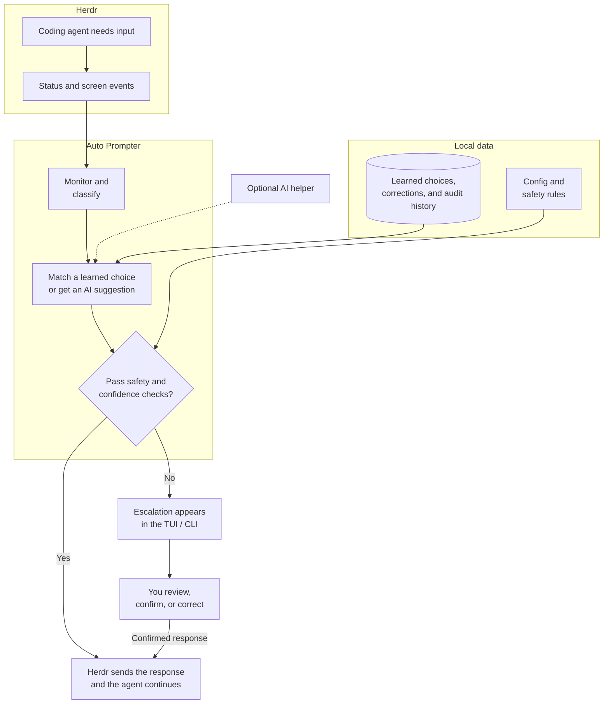

# Herd Auto Prompter

**Keep your [Herdr](https://herdr.dev) coding agents unblocked, hands-free.**

Herd Auto Prompter is a Herdr plugin that watches every agent session in your
herd, detects when an agent needs input — finished a step, waiting on an
approval, stuck on a multiple-choice question, or stalled on an error — and
automatically supplies the next prompt or the correct response, *the way you
would*. It learns from your own past decisions in a supervised shadow mode,
can follow task lists you explicitly configure, and can optionally consult an
LLM/agent CLI. Autonomous actions must clear the applicable confidence and
safety gates; uncertain ones escalate to you. Everything it does is audited
and correctable.

> [!IMPORTANT]
> **Agent compatibility:** Herd Auto Prompter is developed and extensively
> tested against **Claude Code** (`claude`) and the **OpenAI Codex CLI**
> (`codex`). These are the primary supported coding-agent types.
>
> Other coding agents are best-effort and have not received the same level of
> integration and regression testing. Their status events, prompts, menus, and
> terminal UI formats may differ, so agents such as **OpenCode** (`opencode`),
> **Antigravity CLI** (`agy`), and other types may be misclassified or may not
> work reliably. Keep shadow mode and conservative confidence thresholds in
> place while evaluating an additional agent type, and review its audit trail
> before allowing autonomous actions.

- **Learned rules, not guesses** — every action taken from a learned rule
  traces back to your confirmed decisions. Explicit task sources and the
  opt-in LLM helper are separate, clearly audited paths.
- **Confidence-gated** — learned rules and optional LLM suggestions use their
  own configured thresholds; below the applicable threshold they escalate.
- **Safety first** — never-auto patterns (force-push, destructive ops,
  deploys, credential changes, …), a global pause/kill switch, a runaway-loop
  guard, and an error-retry ceiling all veto automation.
- **Local by default** — learning data, history, and the audit log live in
  SQLite on your machine. Hap sends no telemetry and makes no cloud call of
  its own; an optional CLI you configure may use its provider's service.

## Quickstart

Requires: Herdr ≥ 0.7.0 and `curl`. **No Go toolchain needed** — the install
step downloads the prebuilt binary for your platform (Linux/macOS,
amd64/arm64) from the matching GitHub Release and verifies it against the
published SHA256SUMS. (Building from source instead needs Go ≥ 1.24; see
Development.)

```sh
herdr plugin install 0xGosu/herdr-auto-pilot
```

Pin a release (recommended for reproducible installs), or install
non-interactively:

```sh
herdr plugin install 0xGosu/herdr-auto-pilot --ref v0.4.0
herdr plugin install 0xGosu/herdr-auto-pilot --yes
```

The monitoring daemon starts automatically when an agent appears in the herd.
Use the following recommended setup to make the **Auto Prompter** pane (TUI)
and its CLI convenient to access from the host machine.

### Open the pane with a hotkey (recommended)

Herdr supports custom command keybindings, and the Auto Prompter pane can be
opened from the CLI. Add this recommended binding to
`~/.config/herdr/config.toml`:

```toml
[[keys.command]]
key = "prefix+a"
type = "shell"
command = "herdr plugin pane open --plugin herd-auto-prompter --entrypoint control"
description = "Open Auto Prompter pane"
```

Then apply it with `herdr server reload-config` (no restart needed). Now
`ctrl+b` (Herdr's default prefix) followed by `a` opens the pane.

Notes:

- The pane opens as a tab (the placement declared in the plugin manifest);
  override with `--placement split|overlay|zoomed` in the command if you prefer.
- `prefix+a` is unused by Herdr's default bindings. Direct (no-prefix) chords
  like `key = "ctrl+alt+a"` also work — ctrl+letter, function keys, and
  explicit modified chords are the most reliable.

### Make the CLI available from any shell

Open the **Auto Prompter** pane with the hotkey above, switch to the **Config**
tab, select **Create /usr/local/bin/hap symlink to this running binary** under
**Quick Shortcuts**, and press `enter` to confirm. This makes `hap` available
from any shell (provided `/usr/local/bin` is on your `PATH`).

After creating the symlink, you can also launch the TUI directly from any Bash
shell instead of opening the Herdr pane with the hotkey:

```sh
hap tui
```

Everything the TUI does is also a CLI verb on the same binary:

```sh
hap status         # from any shell after creating the symlink above
hap escalations
hap pause          # global kill switch
```

Run from any shell, `hap` operates on the same instance the daemon uses:
it honors the `HERDR_PLUGIN_CONFIG_DIR`/`HERDR_PLUGIN_STATE_DIR` env vars
Herdr injects, and without them auto-detects Herdr's plugin directories
(`~/.config/herdr/plugins/config/herd-auto-prompter`,
`~/.local/state/herdr/plugins/herd-auto-prompter`). Only when neither
exists — the plugin isn't installed — does it fall back to standalone
dirs (`~/.config/herd-auto-prompter`, `~/.local/state/herd-auto-prompter`).

To see exactly where those resolved — handy for tailing the daemon log,
inspecting the DB, or hand-editing `config.toml` — ask `hap`. These are
read-only, need no daemon, and print the bare path so they compose in
scripts:

```sh
hap state-dir            # state dir (DB, logs, socket, lock, match-index)
hap config path          # the config.toml path (printed even before it exists)
hap paths                # both, labeled
cd "$(hap state-dir)"    # e.g. jump into the state dir
```

## Architecture

Herd Auto Prompter is one Go binary (`hap`) used in several roles: a
long-running monitoring daemon, a TUI hosted in a Herdr pane, equivalent CLI
commands, an internal embedding worker, and an MCP server for optional LLM
consults. Herdr remains the source of truth for workspaces, panes, agents,
status events, screen contents, and keyboard input. Hap never attaches to or
sends input directly to an agent process; it observes and controls the agent's
pane through Herdr.



In the diagram, **Auto Prompter** includes the background daemon and the
user-facing TUI/CLI. The **optional AI helper** is any configured local LLM or
agent CLI, and it can only propose a response. **Local data** covers
`config.toml` plus the SQLite learning and audit database.

### Runtime flow

1. **Herdr starts the plugin daemon.** The plugin manifest registers hooks for
   `workspace.created` and `pane.agent_detected`. A hook runs
   `hap daemon --ensure`, which starts one version-checked, lock-guarded daemon
   for the whole herd and returns immediately.
2. **Herdr reports status and screen events.** The daemon subscribes to Herdr's
   local event socket for pane discovery and agent-status changes. When an
   agent becomes idle, blocked, done, or otherwise needs attention, the daemon
   waits for the agent interface to paint, then asks Herdr to read the pane
   and its metadata. Reconnects replay existing panes, so agents that predate
   the daemon are reconciled too.
3. **Auto Prompter monitors, classifies, and matches.** It classifies the
   captured situation as idle, approval, choice, or error; masks volatile text
   into a stable signature; and looks for a learned rule. Semantic lookup runs
   in the isolated `hap embed-worker`, with BM25 and exact matching as
   fallbacks.
4. **Every proposed response passes confidence and safety checks.** Learned
   confidence, graduation state, optional task sources, and any AI suggestion
   feed the same decision pipeline. Before delivery, every result passes the
   kill switch, never-auto patterns, suspected-irreversible check, rate/retry
   ceilings, audit-before-action rule, and live-pane staleness check.
5. **Herdr sends an approved response.** Hap calls Herdr's CLI to send text
   and Enter, or individual keystrokes for numbered and multi-tab forms. Herdr
   injects that input into the agent pane; the agent resumes, and later status
   changes begin the cycle again. A `@noop` decision is audited but sends no
   input.
6. **Uncertain decisions become escalations for you.** The daemon writes an
   audit row and escalation, then asks Herdr to show a notification. The TUI
   and CLI read the same local state. Confirming, correcting, dismissing,
   pausing, or changing config updates that local state. A confirmed/corrected
   reply is a human-initiated action, so the frontend records it and sends it
   through Herdr directly; it then sends a lightweight nudge to the daemon,
   which reloads the new learning/config state without restarting.

### Optional AI helper path

For an unknown situation, the daemon may launch the configured local
LLM/agent CLI. Consults attach a short-lived `hap mcp` server: the model reads
the staged context with `get_context` and returns a structured decision with
`submit_decision`. Pre-delivery action reviews and pre-send task reviews ride
the same consult round-trip; idle-task generation is a one-shot command
whose stdout is treated as a proposed result. In every case the daemon — not
the model or MCP process — owns the final decision, runs the proposal through
the same confidence, safety, and staleness checks, and either sends through
Herdr or escalates.

SQLite stores learned choices as signatures and decisions, along with audit
records, escalations, user corrections, and safety counters. `config.toml`
remains the hand-editable source for thresholds, safety rules, task sources,
embedding, LLM, and TUI settings. Both live under the local plugin directories
described in Quickstart; no learning state is stored in Herdr or in an agent's
context.

## How learned rules work (shadow mode)

A learned rule never acts on a situation before you have taught it. Explicit
task sources and opt-in LLM auto-actions are separate paths; they use their own
gates and remain visible in the same audit trail.

1. **Observe.** When an agent needs input, the plugin classifies the
   situation (idle / approval / choice / error), fingerprints it into a
   *situation signature* (volatile stuff like paths, hashes, and timestamps
   is masked), and — in shadow mode — **escalates with a suggestion**.
   Claude's AskUserQuestion and Codex `request_user_input` MCQ forms classify
   as `choice`. A Claude **multi-tab** form (plan-mode question series,
   `← ☐ … ✔ Submit →` header) is first
   swept tab-by-tab with arrow keystrokes so the escalation, the signature,
   and the LLM consult see **all** questions, not just the focused one. Its
   answer is a digit series, one digit per tab including Submit (e.g.
   `1 2 3 2 1`). Delivery adapts per tab: a digit commits a plain option, but
   on Claude's preview layout it only moves the caret, so hap re-reads the live
   form and presses Enter only after verifying the intended option is selected.
   Unexpected transitions fail closed, and a series that doesn't match the tab
   count is never partially delivered. Codex question series are likewise
   swept and aggregated, but their answer series contains one digit per
   question (no Submit pseudo-option); delivery verifies every live question
   transition and explicitly submits the completed form.
2. **Confirm or correct.** In the TUI's *Escalations* tab press `enter` to
   confirm the suggestion (and send it), or `c` to type the correct
   response — `v` shows the full record (trigger, rationale, LLM output,
   agent type, and the **matched rule** — the exact learned signature this
   situation resolved to, with its mode/streak/confidence/top action, or
   "none yet" for a first sighting) when the list line is truncated; it
   works on the *Agents*, *Audit*, and *Rules* tabs too, and pressing
   `tab`/`shift+tab` inside the detail view switches tabs directly (no
   `esc` needed). Escalation and audit list rows carry compact `rule=` and
   agent-type columns; the CLI `escalations`/`audit` listings show the
   same. From the CLI: `confirm <id> --send` or
   `resolve <id> --action TEXT --send`. Escalations you don't want to
   answer can be **deleted**: `space` marks one or more rows, `x` deletes
   the marked (or selected) ones right away (no confirmation — dismissing
   is safe, nothing is sent or learned), and `X` prunes everything older
   than an age you pick (default 360 minutes). Deleting dismisses without
   responding — the audit row is kept as `dismissed`. Deleting a learned
   rule still asks for confirmation, and audit entries can't be deleted
   individually (only the full clear-data reset removes them). CLI:

   `hap capture <agent-name-or-pane-id>` explicitly re-runs the daemon's
   normal delayed capture pipeline for a live `blocked`, `idle`, or `done`
   agent. This is useful for testing or re-reading a pane after a daemon
   restart; classification, MCQ sweeping, safety gates, duplicate handling,
   automation, and auditing are identical to a real Herdr status event, so a
   learned or LLM-approved response may be sent.

   `dismiss <id>...` and `escalations prune [minutes]`. Long lists scroll
   with the cursor and show a `… N more` line when rows are clipped, and
   `/` opens an incremental search on the *Agents*, *Tasks*, *Escalations*,
   *Audit*, and *Rules* tabs — case-insensitive substring over the visible
   columns. `esc`/`enter` closes the search input keeping the filter,
   backspacing the query to empty clears it, and while typing, every
   printable key goes into the query — action keys like `q`, `y`, and `x`
   can't fire mid-search. Action outcomes (confirm, resolve, delete, …)
   stay pinned in a status area (`✓`/`✗` plus timestamp) until the next
   mutating action starts, so results remain readable without lingering
   beside the next operation. Detail
   views always open at the top. Captured situations are collapsed to their
   title plus a trailing preview (three lines normally; ten for Escalations'
   Current Situation), and Audit's LLM output uses the same three-line
   preview. Press `v` again to expand or collapse all previews. Expanded
   content still retains its newest trailing lines when
   `tui.max_content_height` caps it (`0` keeps the full content).
3. **Graduate.** After **2 consecutive consistent confirmations** by default
   (configurable from 1–10) *and* confidence above the per-situation threshold,
   that signature becomes autonomous: next time, the plugin acts on its own
   and logs it. Confirmations carry extra confidence weight (3× by default),
   because an explicit operator answer is stronger evidence than an automated
   observation.
4. **Stay in control.** Correct any automated decision post-hoc (TUI *Audit*
   tab or `resolve <audit-id> --action ...`). The correction is recorded and
   immediately affects the rule's live confidence gate, but graduation is
   permanent: it does not silently change an autonomous rule back to shadow.
   To retrain one from a clean confidence/streak boundary, select it on the TUI
   *Rules* tab and press `0`, or run `hap signatures reset <prefix> --yes`.
   Reset keeps the audit and decision history (and the learned answer), but
   excludes pre-reset decisions from confidence and graduation; the rule must
   earn the configured confirmations again.

When the first operator response creates a rule, earlier LLM-only guesses for
that signature remain in history for audit but do not seed the new rule's
confidence. The rule begins with the operator evidence that actually taught it.

### Inspecting what it has learned

Every learned signature is visible on the TUI's *Rules* tab and via the
`signatures` CLI (alias `sigs`): mode, confirmation streak toward
graduation, confidence, and the action it learned. The Rules view and
`--min-conf` filter recompute live confidence from the current post-reset
decision history rather than using a stale stored snapshot. In rule, audit,
and escalation confidence fields, a `-` means that item has not been scored
yet; it is not a measured `0.00`. Press `enter`/`v` for
the full record — including the **original situation**, the pane snapshot
first captured for the rule, so you can see exactly what a rule answers,
not just the action it sends (rules learned before this feature pick it
up on their next sighting) — plus recent decisions and last audit
context. The list shows each rule's full signature id untruncated, ready
to copy into the CLI. `f`
filters by mode (composing with `/` search), and `x` deletes a signature
you no longer trust — deletion erases
its decision history too (audit rows are kept), so it re-learns from
scratch. Signatures are addressed by unique prefix, git-style:

```sh
hap signatures                      # list (--type, --mode, --agent-type, --min-conf)
hap signatures show approval:9f2c   # full detail by unique prefix
hap signatures reset approval:9f2c --yes # shadow + fresh streak/confidence; history kept
hap signatures delete approval:9f2c --yes
```

## Configuration

Config lives in the plugin config dir (`herdr plugin config-dir
herd-auto-prompter`) as hand-editable TOML; edits apply live (the daemon is
nudged, or picks them up on the next event). A complete annotated sample
covering every section (including `[safety]`, `[llm]`, and `[tui]`) ships
at [`sample/config.toml`](sample/config.toml) — copy it in and tune. The
highlights:

```toml
[confidence_thresholds]
minimum = 0.50             # variance guard: minimum learned-action agreement
idle = 0.65
approval = 0.70
choice = 0.70
error = 0.75
inferred_task_bar = 0.60   # higher bar for tasks inferred from pane history

[learning]
graduation_n = 2           # consecutive confirmations to graduate (1-10)
confirmation_weight = 3.0  # confidence weight for an operator confirmation (>=1)

[limits]
max_consecutive_auto_prompts = 10  # per agent, without human interaction
max_auto_prompts_per_minute = 5    # per agent
max_error_retries = 2              # per error signature

# Semantic rule matching: situations are matched to learned rules by
# embedding their masked salient content (llama.cpp, MiniLM by default) in an
# isolated worker and vector-searching stored signatures, so a paraphrased
# prompt reuses the rule instead of re-learning from zero. Worker/model
# failures degrade to normalized BM25 text matching, then exact hashes.
[embedding]
disabled = false
model_path = ""            # "" = bundled <plugin>/models/all-minilm-l6-v2-q8_0.gguf; any .gguf works
similarity_threshold = 0.90 # min cosine similarity to reuse a learned signature
bm25_min_score = 0.35       # min normalized BM25 similarity for the text fallback, (0,1]
gpu_layers = 0              # inert in official builds (GPU backends compiled out)
model_context_window = 0    # 0 = bundled-model default (512 tokens); input is
                            # truncated below this limit before embedding
# pane_salient_chars = 500  # fallback signature window for idle/unclassified
                            # situations (trailing N characters of pane content).
                            # Changing it re-keys idle/unclassified rules once,
                            # so they re-learn; structured approval/choice/error
                            # rules are unaffected.

# TUI appearance. `theme` picks a named palette: default, dark, light,
# high-contrast. Empty or unknown names resolve to default — the exact
# original look — so existing setups see no change.
[tui]
max_content_width = 0       # cap variable-width list columns; 0 = full width
max_content_height = 0      # expanded long-field lines; 0 = unlimited (collapsed previews use short tails)
theme = "high-contrast"

# Optional per-role color overrides, layered on top of the theme; unset
# roles inherit the theme's value. Values are terminal color strings
# lipgloss accepts: 256-color codes ("205") or hex ("#ff5faf"). Roles:
# title, section, error, ok, paused, running, warn, help. Edited in config.toml
# only (the TUI shows them read-only).
[tui.palette]
title = "205"
error = "#ff5f5f"

# Point agents/workspaces at a task list so idle agents get the next
# unchecked item. Without a declared source, the plugin falls back to
# inferring the next task from the agent's own native todo rendering — never
# free-form prose — held to the higher inferred_task_bar. If neither source
# exists, an optional llm.task_generate_command can propose tasks for you to
# approve. Inference is agent-type-specific: currently only `claude` is
# supported (Claude Code's ✔/■/□ todo widget; the in-progress item wins,
# else the first
# pending one). Other agent types skip inference entirely and escalate.
#
# The prompt sent to the agent is rendered from a template. The default steers
# the agent to manage its list through the hap CLI with its own name pre-filled
# (and a --path fallback for sources that aren't name-addressable):
#   "Your next task is {next_task_content}. Prefer the hap CLI to manage your
#    tasks: `hap task {agent_name} list` to view them, `hap task {agent_name}
#    start <n>` to mark one in-progress when you begin working on it, and
#    `hap task {agent_name} done <n>` to mark it complete as you go (if that
#    name isn't recognized, use `--path {task_list_path}` in place of
#    `{agent_name}`)."
# When every item is checked off, the templated prompt is never sent: the
# plugin escalates a confirmable @noop suggestion ("No more pending tasks")
# instead — unless BOTH llm.task_generate_command and
# llm.task_generate_command_start are configured, in which case it generates
# more tasks for the agent instead of escalating (see "Suggesting tasks when
# no source exists" below; the same generation flow refills an exhausted
# source, always via task_generate_command since a list already exists).
[[task_sources]]
agent = "brave-otter" # agent short name, pane id, or type ("" = any)
workspace = ""        # workspace name; "" or "*" = any, "*" wildcards work
                      # ("codex-*" = starts with, "*-vscode3" = ends with)
path = "/home/me/project/docs/tasks.md"
# Optional per-source prompt format ({next_task_content}, {task_list_path}, {agent_name}, {cwd}):
next_task_template = "Your next task is {next_task_content}. Read the full tasks list at {task_list_path}. Verify task dependencies before starting. When there is no task available, focus on improving the test coverage of this project."
# When an [llm].command is configured, each determined task is first reviewed by
# the LLM before it is sent (see "Reviewing tasks before they are sent" below).
# Default: on. Opt this source out with:
# enable_llm_review = false
```

The former `[thresholds]` table is accepted for compatibility. Loading it
preserves its values, and the next config save rewrites it as
`[confidence_thresholds]`.

### Agent short names

Every monitored agent automatically gets a short friendly two-word name
(e.g. `brave-otter`) the moment it appears in the herd — on detection, not
on its first blocked prompt — because pane ids like `w6:p1` are not
operator-friendly. The TUI's agent detail (`v`) also shows exactly where
the agent lives: workspace, tab, and pane, each with its number, label,
and id, plus the matching **task source** (if any). From that detail view,
`t` jumps to the *Tasks* tab at this agent's source, where its checklist —
and the source entry itself — can be managed. Use the name in task-source
selectors, and rename agents to whatever fits your workflow:

```sh
hap agents                      # short name, pane id, type, status, automation
hap rename brave-otter backend-dev
hap disable backend-dev         # stop automation for only this agent
hap enable backend-dev          # allow automation again
hap task-source --agent backend-dev ./docs/backend-tasks.md
hap task-source --agent backend-dev --template 'Do this next: {next_task_content} (full list: {task_list_path})' ./docs/backend-tasks.md
```

(Or in the TUI: select the agent and press `n` to rename it, `x` to disable
it behind a `Y/n` confirmation, or `e` to enable it again. A disabled live
agent remains in the list with `DISABLED` in its status column. HAP never
performs autonomous pane actions for it: would-be actions are audited as
`denied` with rationale `[agent_disabled]`, while would-be escalations are
written directly as `dismissed` with the same tag and never enter the pending
queue.)

### The Tasks tab

The TUI's *Tasks* tab aggregates the checklist items of **every** configured
task source into one list — a header row per source (with the live agent it
currently feeds, if any) and its checklist items underneath, done and pending
alike. Long source paths are display-truncated to their tail (`…/dir/file.md`,
the file name always preserved); the full path stays searchable and shows in
the task detail view. It's the same checklist state the `hap task` CLI edits,
so changes made either way stay in sync (the daemon re-reads the file live on
each idle event).

Manage items without leaving the pane:

- `enter`/`y` — send the pending task under the cursor to the live agent its
  source feeds, rendered through the source's next-task template, behind a
  `Y/n` confirmation. Only a truly pending `[ ]` task on a **cleanly idle**
  agent qualifies — done (`[x]`) and in-progress (`[-]`) tasks, and
  working/blocked agents, are refused (the daemon's own idle-only rule). The
  agent is re-checked idle *at the moment of delivery*, not just when the
  question is asked, so a confirmation left open while the agent picks up
  work refuses rather than interrupting it. The task is marked `[-]` in
  progress **before** it is delivered, which is what keeps the daemon from
  handing the same item out again; a delivery that fails returns it to
  `[ ]`. The CLI twin is `hap task <agent> send <n> [--yes]`.
- `v` — open a task's detail view: full multi-line text, status, the
  source's full path and selectors, and the live agents it feeds. `enter`/
  `y`, `e`, `x`, and `f` keep working inside the detail, acting on the item
  shown.
- `a` — add a task to the source under the cursor
- `e` — edit the text of the task under the cursor
- `d` — toggle a task done/undone
- `x` — delete a task; on a **source's header row**, retire the whole
  source (see below)
- `space` — mark a run of tasks, so `d`/`x` act on all of them at once
  (with nothing marked, they act on the row under the cursor)
- `f` — focus the live agent this source feeds, in herdr
- `/` — incremental search over the visible columns

The add and edit prompts accept multi-line task text: **Shift+Enter inserts
a line break** (Ctrl+J works on terminals that can't report Shift+Enter) and
the input box expands one line per break; **Enter submits**, Esc cancels.
A task always stays ONE checklist line: line breaks are stored as the
literal two-character sequence `\n` in tasks.md (hand-written `\n` works
too) and are converted back to real newlines when the task is sent to an
agent — which means backslash-n in task text always reads as a line break,
never as those two literal characters. The edit prompt decodes stored `\n`
back into real lines, and the detail view shows the task as the agent will
receive it.

The manual send is independent of the daemon, but marking the sent task
`[-]` keeps the two in step: the daemon's own idle-time declared-task flow
only ever picks the first still-pending `[ ]` item.

Edits are guarded against a checklist that changed underneath you: an action
captured against a row aborts (rather than mutating the wrong line) if that
task's text no longer matches when the write runs.

**Retiring a whole source.** Pressing `x` on a source's *header row* removes
its `[[task_sources]]` entry, behind a `y/n` confirmation — but only once the
source can no longer be serving anyone: either **no live agent matches** its
selectors, or **every task in it is finished**. A source that still feeds a
live agent and still has unfinished work refuses, naming the agent and what's
left. In-progress `[-]` tasks count as unfinished, so a source can't be pulled
out from under an agent that is mid-task. Both *unknowns* refuse too, since
neither is evidence of safety: an agent list herdr won't answer isn't an empty
herd, and a checklist that won't read isn't an empty checklist. (A source no
live agent matches stays retirable whatever its file says — that's what keeps
a broken entry cleanable from this tab.) Removal takes the config entry
only — **the checklist file stays on disk**, since sources are often
hand-written docs hap never created; re-adding the source brings the list back
untouched. (With items marked via `space`, `x` still deletes those items — the
selection wins.) To retire a source the guard refuses, use the *Config* tab's
`x` or `hap task-source remove <index>`, which are unguarded by design. To
point an agent at a source in the first place, use `hap task-source add` or
the *Config* tab's `t`.

### Suggesting tasks when no source exists, or a source runs out (optional)

If an idle agent has neither a matching `[[task_sources]]` entry nor an
inferable native todo, `llm.task_generate_command` can run a one-shot local
CLI to propose one or more next tasks. This is opt-in: without the command,
the safe default remains a `no_task_source` escalation and hap invents
nothing.

The same generation flow also refills a declared `[[task_sources]]` entry
once its checklist is fully checked off — but only when BOTH
`llm.task_generate_command` and `llm.task_generate_command_start` are
configured (stricter than the no-source case above, since it replaces content
in a source that already had operator-relevant tasks). Without both commands
set, an exhausted source escalates `task_source_exhausted` — a confirmable
@noop suggestion ("No more pending tasks") — instead of generating or sending
the old templated "none" prompt.

Refill is capped per source by `max_tasks` (default **20**): once a source's
file holds more than that many checklist items (done, in-progress, and pending
counted alike) and its pending items are exhausted, the daemon logs a warning
("Maximum number of tasks reached for agent … — clean up the task list to make
room for new tasks") and **skips** generation for that agent instead of piling
more onto an already-long list. The **same cap also gates manual creation** —
adding tasks (the Tasks tab's `a`, or `hap task … add`) to a registered source
is rejected once it would push the list past `max_tasks` — so a hand-added list
can't grow past what the daemon would then refuse to refill. Prune the checklist
(or raise `max_tasks` on the `[[task_sources]]` entry) to resume. Sending the
remaining pending items of a source under its cap is unaffected, and a `--path`
file that isn't a registered `[[task_sources]]` entry is never capped.

The command's stdout may be plain lines or a Markdown list/checklist. Hap
normalizes it and surfaces it as an escalation; it never auto-accepts a
generated task. Confirming the suggestion creates
`<state-dir>/tasks/<agent-name>.md`, marks the first task in progress,
registers the file as that agent's task source, and sends only the first task.
Later idle events consume the remaining tasks through the normal declared-task
flow. Dismiss it with `x`; if generation failed or timed out, press `l` to
retry. Suggestions are dropped or refused if the agent has started working, or
now has a task source with a real pending item, in the meantime.

```toml
[llm]
task_generate_command = [
  "claude", "-p",
  "Suggest concrete next tasks, most important first. Reply with only the tasks, one per line.\n\nAgent: {agent_name}\nCwd: {cwd}\n\nScreen:\n{pane_excerpt}",
  "--model", "haiku",
]
# Optional first generation for each agent this daemon lifetime:
# task_generate_command_start = [ ... ]
# task_generate_timeout_seconds = 60  # omitted: inherits timeout_seconds
```

Available placeholders are `{self}`, `{agent_name}`, `{agent_type}`,
`{pane_excerpt}`, and `{cwd}`. The first-generation state is tracked
independently from LLM consults and rewrites, and only applies to the
no-source-at-all case: `task_generate_command_start` bootstraps a list from
nothing, so refilling an already-exhausted declared source is never treated
as "first" — it always uses `task_generate_command`. (These keys were renamed
from `generate_task_command*`; the old spellings no longer load, so update an
existing config.)

### Task source info in every consult

Whenever an agent has a matching `[[task_sources]]` entry, `get_context`
carries `task_list_path` (the checklist file), `pending_task_count` (how many
items are still unchecked, `[ ]`) with `next_pending_task` (a truncated
preview of the first, only when at least one is pending), and
`in_progress_task_count` (how many items are marked `[-]` — this may be the
task the agent is currently working on) with `first_in_progress_task` (a
truncated preview of the first, only when at least one is in progress). This
is included on **every** LLM consult for that agent
(approval, choice, error, or idle), not just the pre-send task review below,
so the LLM always knows the
agent's backlog state.

### Reviewing tasks before they are sent (optional)

When an `[llm].command` is configured, each task determined from a
`[[task_sources]]` entry for an idle agent is first **reviewed** by that LLM
before it is sent. Using the same two MCP tools as an ordinary consult
(`get_context` / `submit_decision`), the LLM sees the live pane plus the queued
task (`proposed_task` / `current_task`), the checklist path (`task_list_path`),
and every remaining item (`pending_tasks`) — so it can also **pick a different
pending task** when the pane shows the current one is already done — and decides
what to send:

- **Send as-is** — `submit_decision` with `recommend_action` `@next_task:declared`;
  the daemon sends the queued task verbatim (no copying, no paraphrase drift).
- **Send edited / a different task** — `recommend_action` set to the literal
  instruction text (an edit, or the next unfinished item from `pending_tasks`
  when the current one is already done).
- **Decline** — `submit_decision` with `recommend_action` `@noop` (the agent is
  still busy, the task is already done, or the pane shows it should not run).

Both outcomes follow `auto_act_confidence_threshold` exactly like any consult,
and are re-gated by the same safety controls (kill switch, never-auto patterns,
irreversible heuristic, rate limits):

- **Confident (`confident_score ≥ threshold`)** — the LLM's resolution is applied
  automatically: a send delivers the task, a decline silently skips it.
- **Low-confidence (`< threshold`)** — surfaced for you to confirm. The
  escalation's suggestion is the LLM's exact recommendation (the possibly-edited
  task, or *no reply* for a decline), and the **original** queued task and the
  LLM's reasoning appear in the escalation detail.

Because the default threshold is `999` (never auto-act), every review is
surfaced for confirmation until you lower `auto_act_confidence_threshold`.

For learning, every accepted task-review send is stored symbolically as
`@next_task:declared`, whether the LLM approved the queued task verbatim,
copied it, edited it, or chose another pending item. The pane still receives
the real task text. This teaches the reusable decision “send the next declared
task” instead of treating each task's one-off wording as a different action;
an operator confirmation of a low-confidence review learns the same symbolic
action. The sentinel is rejected if an LLM submits it outside a task review
that actually carries a proposed task.

This is **on by default** whenever the LLM command exists; set
`enable_llm_review = false` on a `[[task_sources]]` entry to keep the plain
declared-task flow for that source. (The former `llm_review` key still loads
and migrates to the new name on the next config save.)

### Never-auto patterns

Irreversible operations are **never** automated, regardless of confidence.
The shipped seed covers force-pushes, destructive filesystem/database ops,
deploys/publishes, credential changes, and broader suspected-irreversible
language. The strict and heuristic seed rules are both controlled by
`safety.disable_never_auto_seed_patterns` and are regression-tested in
CI against a maintained corpus of irreversible-operation prompts
(`internal/domain/testdata/irreversible_corpus.txt`). Extend it with your own
regex patterns:

```toml
[safety]
never_auto_patterns = ['(?i)restart\s+the\s+payment\s+service']
```

(The pre-rename key `allowlist_patterns` still loads as a deprecated alias —
patterns are merged with a warning, and the next config save rewrites the
file under the new key.)

The pre-rename boolean `safety.disable_seed` also still loads with a warning;
the next config save rewrites it as
`safety.disable_never_auto_seed_patterns`.

or `hap rules add '<regex>'` / `rules remove <index>`, or press `a`/`x` on
the TUI's *Config* tab — which also lists the supported scalar config fields,
adds/removes task sources (`t`/`x`), and clears learned data (`X`).
Simple fields — numbers, booleans, and the `tui.theme` enum, including
`llm.pane_excerpt_chars`, `llm.task_generate_timeout_seconds`,
`embedding.model_context_window`, `safety.disable_never_auto_seed_patterns`,
`tui.max_content_width` / `tui.max_content_height`, and `tui.terminal_bell`
(on by default — rings the terminal bell on a new escalation, and when the
kill switch is paused by a *different* process than the TUI you're in) — edit
inline (`enter`) or via `hap config set <key> <value>`. Free-text fields (`llm.command`,
`llm.command_start`, `llm.rewrite_action_fallback_template`,
`llm.task_generate_command`,
`llm.task_generate_command_start`, `embedding.model_path`) show read-only in
the TUI, because a one-line
prompt mangles quoted argv values — edit them in `config.toml` or with
`config set`, which accepts every listed scalar key. Scoped never-auto rules
and `[[capture_delay]]` rules also display read-only on the tab. The
`[tui.palette]` overrides are edited directly in `config.toml`. Capture delays show the built-in defaults (10000
ms first event / 2000 ms after) when none are configured, and long values are
truncated to one line — the full value lives in `config.toml`. Prompts that
*look* destructive
but match no pattern are escalated by a suspected-irreversible heuristic
rather than automated. The heuristic needs corroboration to fire — a
destructive verb aimed at a data/infrastructure target, explicit no-undo
language, and the like — so everyday prompts ("remove the unused import")
don't trip it. It scans only the actionable region (the pending dialog near
the pane bottom, or the next-task prompt about to be sent when idle), so an
agent merely *talking about* destructive operations in its narration isn't
flagged, and the escalation rationale names the indicator and the text it
matched. Add operator regexes to `never_auto_patterns` in `[safety]` (all
agents), or scope a pattern to specific agent types:

```toml
[[safety.never_auto_rules]]
pattern = '(?i)compact\s+the\s+conversation'
agent_types = ["codex", "agy"]   # "*" or omit for all agent types
```

The legacy `irreversible_indicators` and `[[safety.indicator_rules]]` settings
still load with warnings and migrate to these unified never-auto forms on the
next config save.

### Daemon and semantic-matching health

`hap status` and the TUI share the same health assessment. They report a
stale or hung daemon, a runtime-degraded embedder, crash-looping, and the
crash-loop breaker's auto-disable/give-up states. The detached daemon's stderr
is captured at `<state-dir>/daemon.stderr.log` (rotated at 256 KiB); an
error-severity TUI banner offers `!` to open the last 16 KiB in a scrollable
detail view. The same path appears in `hap status` and `hap state-dir` makes it
easy to locate.

Llama.cpp runs in a persistent `hap embed-worker` child rather than inside the
daemon. A native abort or stalled embedding call therefore kills/restarts the
worker and degrades semantic matching to BM25/exact matching after repeated
failures while the monitoring daemon stays alive. The outer crash-loop breaker
is still a final safeguard: clustered daemon restarts first latch embeddings
off, then stop respawning if the daemon continues to crash. Changing any
`[embedding]` setting clears that latch and retries.

Embedding input is token-truncated before it reaches the model. The bundled
MiniLM uses `model_context_window = 0` (resolved to 512 positions); custom
models can set their real limit explicitly. Positive values below 256 are
clamped to 256. Never configure a value above the model's actual position
limit, because llama.cpp can abort the worker when that limit is exceeded.
The fallback idle/unclassified signature window defaults to 500 characters.

### Local LLM fallback (optional)

When no confident learned rule applies, the plugin can consult a local
LLM/agent CLI you already have installed. The model receives context and
submits its suggestion through the plugin's own MCP server
(`hap mcp` — tools `get_context` and `submit_decision`); its
stdout is captured for audit only. `submit_decision` enforces a
per-situation contract: `approval`/`choice` listing options must be
answered with `select_options` (the explicit answer: 1-based option
numbers — `[2]` for a single menu, one integer per tab for a multi-tab
form; a menu-less prompt such as a bare y/n takes `recommend_action`
literal text instead), while `idle`/`error` require `recommend_action`
(the literal reply text) and reject `select_options`;
`recommend_action "@noop"` ("no reply needed") is accepted for any
situation, and a `confident_score` (0-100) is shown on the
escalation entry so you can weigh the suggestion. Example for Claude
Code:

```toml
[llm]
# Claude Code: the prompt belongs immediately after -p (the plugin
# auto-repairs a prompt misplaced after other flags — see below).
command = [
  "claude", "-p",
  "Use the hap MCP tools: call get_context, decide what the operator would answer — or whether no reply is needed — then call submit_decision (select_options for multiple-choice, recommend_action '@noop' to do nothing).",
  "--mcp-config", '{"mcpServers":{"hap":{"command":"{self}","args":["mcp"],"env":{"HAP_REQUEST_ID":"{request_id}"}}}}',
  "--allowedTools", "mcp__hap__get_context,mcp__hap__submit_decision",
]
timeout_seconds = 120
auto_act_confidence_threshold = 999   # auto-act only when the LLM's confidence (0-100) is >= this; 999 = never (surface for your confirmation)
pane_excerpt_chars = 5000   # pane excerpt size in the consult context (default 5000)
```

An optional **`command_start`** runs *instead of* `command` on an agent's
**first consult** — the first time the plugin needs the LLM for that agent
this daemon lifetime. Every later consult uses `command`. A genuinely new
agent almost always starts in a new pane, so it primes on its own; a herdr
subscriber reconnect does **not** re-fire it, so a long-running agent's
kickoff prompt won't repeat mid-session. It takes the same placeholders and
MCP flow as `command`; use it for a priming/kickoff prompt or a stronger
model on the first touch. Omitting it (or leaving it empty) reuses
`command`, so the feature is opt-in — and `command_start` alone never
enables the fallback (`command` is what gates it):

```toml
[llm]
command       = [ "claude", "-p", "...ongoing consult prompt...", "--model", "haiku" ]
command_start = [ "claude", "-p", "...first-touch kickoff prompt...", "--model", "opus" ]
```

The preferred template also has a one-shot **fast-fail fallback**. If it
exits with an error in under one second without staging a decision, hap tries
the other template (`command` ↔ `command_start`) once. This works in both
directions, so a failed first-touch command can fall back to the ongoing one,
and a failed ongoing/resume command can try the start form. Timeouts, clean
exits without `submit_decision`, cancelled runs, and absent or identical
alternates are not retried automatically.

`get_context` hands the model the classified situation (type, options,
permission verb, error summary), a pane excerpt (the last
`pane_excerpt_chars` characters, read deeper than the classification
snapshot), the agent's herdr location (`workspace_id`, `tab_id`,
`pane_id`, `agent_id`), and the pane's working directory (`cwd`,
`foreground_cwd` — advisory: a deleted directory carries a
`" (deleted)"` suffix and either may be empty). The location ids let the
model run its own read-only `herdr` queries (`herdr pane read <pane_id>`,
`herdr pane get <pane_id>`, ...) — to allow that with Claude Code, extend
the tool allowlist, e.g.:

```toml
"--allowedTools", "mcp__hap__get_context,mcp__hap__submit_decision,Bash(herdr pane read:*),Bash(herdr pane get:*)",
```

OpenAI Codex CLI (MCP server passed inline via `-c` overrides; `exec` is
required for headless runs — the plugin inserts it if you forget). Codex's
approval policy auto-denies MCP tool calls in headless mode, so the bypass
flag is required; hap's own safety controls still re-gate every submission
before anything reaches an agent:

```toml
[llm]
command = [
  "codex", "exec", "--skip-git-repo-check",
  "--dangerously-bypass-approvals-and-sandbox",
  "-c", 'mcp_servers.hap.command="{self}"',
  "-c", 'mcp_servers.hap.args=["mcp"]',
  "-c", 'mcp_servers.hap.env.HAP_REQUEST_ID="{request_id}"',
  "-c", 'mcp_servers.hap.env.HAP_DB_PATH="{db}"',
  "-c", 'mcp_servers.hap.env.HAP_CONTROL_PATH="{control}"',
  "Use the hap MCP tools: call get_context, decide what the operator would answer — or whether no reply is needed — then call submit_decision (select_options for multiple-choice, recommend_action '@noop' to do nothing). Do not run any other commands.",
]
timeout_seconds = 180
```

(The `HAP_DB_PATH`/`HAP_CONTROL_PATH` entries matter: codex launches MCP
servers with a sanitized environment, so the hap server must be told its
database explicitly.)

Antigravity CLI (`agy`) has no per-invocation MCP flag — register hap once
in `~/.gemini/config/mcp_config.json` with the database path in `env` (the
hap MCP tools default to the current pending request, so no request id is
needed):

```json
{"mcpServers": {"hap": {"command": "/path/to/plugin/bin/hap", "args": ["mcp"],
  "env": {"HAP_DB_PATH": "~/.local/state/herdr/plugins/herd-auto-prompter/herd-auto-prompter.db"}}}}
```

```toml
[llm]
# agy, like claude, wants the prompt immediately after --print
# (auto-repaired if misplaced).
command = [
  "agy", "--print",
  "Use the hap MCP tools: call get_context, decide what the operator would answer — or whether no reply is needed — then call submit_decision (select_options for multiple-choice, recommend_action '@noop' to do nothing).",
  "--dangerously-skip-permissions",
]
timeout_seconds = 180
```

Placeholders: `{self}` (this plugin binary), `{request_id}`, `{db}`,
`{control}`, `{agent_name}` (the agent's short name). Common
misconfigurations of known CLIs are auto-repaired at
launch (claude/agy: prompt moved next to `-p`/`--print`; codex: missing
`exec` inserted) — an unrecognized shape is left untouched. Every LLM
suggestion is re-gated through the same never-auto patterns, kill switch, and rate
guards; it auto-acts only when the LLM's self-reported confidence meets
`auto_act_confidence_threshold` (0-100; default 999 = never) and the action
doesn't contradict your learned history — otherwise the suggestion is surfaced
for you to confirm. On timeout, CLI failure, or no submission the situation
escalates. For a retryable failed/timed-out consult, press `l` on its TUI
escalation; hap refreshes the agent's live pane and status before re-running
the consult, and disables retry while another consult is already in flight.

The model can also submit `recommend_action: "@noop"` (also accepted: `noop`,
`no_op`, `no-op`) to say **no reply is needed** — the agent finished or is
only reporting status, and any prompt would just nudge it into another
round trip. A noop is recorded in the audit trail and learned like any
other decision (an accepted "do nothing" escalation graduates into a rule
that silently stands down), but nothing is ever sent to the pane. Note: a
learned idle noop suppresses task sends for that signature until you
correct it or delete the signature.

### LLM review of literal replies (optional)

When a learned rule resolves to **literal free text** — an idle next-task
prompt, an error retry command, a free-text approval reply — the plugin can
have the consult LLM (`llm.command`) review and adapt that text to what's
actually on the agent's screen before sending. The review rides the same
`get_context`/`submit_decision` MCP round-trip as any consult: the context
carries `proposed_action` (the exact text about to be sent), and the model
submits the adapted text, `@proposed_action:send` to affirm the original, or
`@noop` to send nothing.

```toml
[llm]
command = [ ... ]              # required — the review uses the consult CLI
enable_rewrite_action = true   # default: false
# On review failure the ORIGINAL text is sent as-is; set this only to wrap it:
# rewrite_action_fallback_template = "You must act based on the following: {original_text}"
```

> Upgrading? The former dedicated rewrite CLI keys — `llm.rewrite_command`,
> `llm.rewrite_command_start`, `llm.rewrite_timeout_seconds` — were removed
> in favor of this consult-based review; they are ignored with a warning and
> dropped on the next config save. `llm.rewrite_fallback_template` was
> renamed to `llm.rewrite_action_fallback_template` (the old key migrates
> automatically). Rewriting stays OFF until you set
> `enable_rewrite_action = true`.

Invariants:

- **Numbered-menu answers are never reviewed** — a mapped digit reaches
  the menu untouched. Only literal free text goes through the review.
- **Declared tasks are never reviewed here** — a task from a
  `[[task_sources]]` entry is covered by that source's `enable_llm_review`
  gate, and a source that opted out delivers its tasks verbatim.
- **A review failure never blocks the send**: on error, timeout, or empty
  output the original text is delivered exactly as it was. Set
  `rewrite_action_fallback_template` (`{original_text}`, `{agent_name}`
  placeholders) to wrap it instead; empty or `{original_text}`-less
  templates fall back to the as-is default. The consult
  `auto_act_confidence_threshold` deliberately does NOT apply — the learned
  rule already earned the send, so an unsure review degrades to the
  original instead of escalating (the model's `confident_score` still lands
  on the audit row).
- **`@proposed_action:send` sends the original verbatim** — the model can
  reply with just this sentinel to affirm the instruction, bypassing any
  configured fallback template. All safety re-gates still run on the
  original.
- **`@noop` sends nothing at all** — the model judged that no reply is
  better than this send. The veto is audited as a `noop` row and the runaway
  counter still advances, but nothing is learned from it (the underlying
  rule is untouched). Bare spellings (`noop`, `no_op`, `no-op`) normalize to
  the sentinel, as on every consult.
- **Safety controls still apply to the reviewed text**: output matching
  the never-auto patterns or the irreversible-operation heuristic is
  discarded in favor of the original; if even that trips, the
  situation escalates instead of sending. Kill switch, rate guard, and a
  staleness re-check (the pane must still show the same situation) run
  again at delivery time.
- **Learning is unaffected**: decision history records the original
  learned action, never the adapted text, so rule confidence and the
  variance guard keep working.
- **Cost note**: every reviewed send is one full consult (an MCP
  round-trip), so latency and token spend are those of `llm.command`.

#### Troubleshooting the fallback

- **Escalations citing `not found in PATH`** — the daemon inherits herdr's
  environment, which can be narrower than your shell's; make sure the CLI
  is reachable from a non-login shell or use an absolute path in
  `llm.command`.
- **Escalations citing `ENOENT: Bun could not find a file` (≤ v0.1.10)** —
  the daemon was started from a workspace directory that has since been
  deleted, which kills the Bun-built `claude` CLI at startup. Fixed in
  v0.1.11; upgrading also requires replacing the running daemon (below).
- **Upgrades not taking effect** — the daemon is a singleton that outlives
  binary upgrades. Since v0.1.13, `hap daemon --ensure` (fired by herdr's
  event hooks) detects the version mismatch and replaces the old daemon
  automatically; `hap status` shows the running daemon's version and flags
  a stale one. On older versions run `pkill -f 'hap daemon'` once after
  upgrading.

## Pause/kill switch & audit

- `pause` / `resume` (CLI, TUI `p`/`r`, or Herdr plugin actions) toggle a
  global kill switch. It takes effect within a second — the daemon re-reads
  the latest kill event on every decision — and the full pause/resume history
  is kept for audit.
- Every automated action **and** every escalation writes an audit record:
  trigger, situation, action or escalation reason, confidence, rationale, and
  (for LLM decisions) captured output. `audit` / the *Audit* tab shows it;
  corrections keep their lineage to the original decision.
- Escalations whose target is no longer present in an authoritative Herdr
  agent snapshot are written directly as `dismissed` with `[agent_not_live]`.
  Disabled agents use `[agent_disabled]`; their suppressed autonomous actions
  are written as `denied`. These lifecycle outcomes remain visible without
  notifying the operator or creating a stale pending escalation.
- `clear-data --yes` resets all learned history and audit data (it never
  leaves your machine in the first place).

### Wiping plugin data

Two levels, depending on how much you want gone:

- **Reset learned data (the supported path):**

  ```sh
  hap clear-data --yes
  ```

  This empties every learning-related table in the SQLite database
  (signatures, decisions, audit log, corrections, rate/retry counters, LLM
  requests and decisions) and nudges the running daemon to reload — no
  restart needed. The `--yes` is mandatory; without it the command refuses.
  Your configuration (thresholds, never-auto rules, task sources) is kept.

- **Full factory reset (everything, including config):** there's no single
  CLI verb for this — stop the daemon and delete the plugin's two
  directories:

  ```sh
  pkill -f "hap daemon" 2>/dev/null                          # stop the daemon
  rm -rf ~/.local/state/herdr/plugins/herd-auto-prompter     # DB, log, socket, lock
  rm -rf ~/.config/herdr/plugins/config/herd-auto-prompter   # config.toml
  ```

  Both directories are recreated fresh automatically — the daemon restarts
  on the next `pane.agent_detected`/`workspace.created` event, or
  immediately via `hap daemon --ensure`.

Prefer `clear-data` unless you also want your config gone; it's the only
path that keeps the daemon running through the wipe.

## Development

```sh
go build ./...        # build
go test ./...         # unit, golden, safety-invariant, concurrency, integration

# develop against your local checkout: linking skips the release-download
# build step, so build the binary yourself first
go build -o bin/hap ./cmd/hap
herdr plugin link .
```

See [CONTRIBUTING.md](CONTRIBUTING.md). The specification this plugin
implements lives in [`docs/specs/herd-auto-prompter/`](docs/specs/herd-auto-prompter/).

## License

[MIT](LICENSE)
