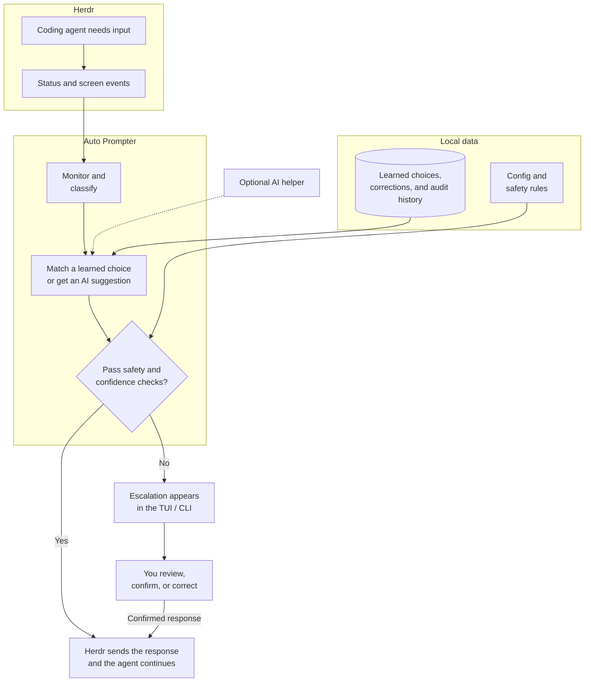

# Herd Auto Prompter

**Keep your [Herdr](https://herdr.dev) coding agents unblocked, hands-free.**

Herd Auto Prompter is a Herdr plugin that watches every agent session in your
herd, detects when an agent needs input — finished a step, waiting on an
approval, stuck on a multiple-choice question, or stalled on an error — and
automatically supplies the next prompt or the correct response, *the way you
would*. It learns from your own past decisions in a supervised shadow mode,
can follow task lists you explicitly configure, and can optionally consult an
LLM/agent CLI. Autonomous actions must clear the applicable confidence and
safety gates; uncertain ones escalate to you. Everything it does is audited
and correctable.

> [!IMPORTANT]
> **Agent compatibility:** Herd Auto Prompter is developed and extensively
> tested against **Claude Code** (`claude`) and the **OpenAI Codex CLI**
> (`codex`). These are the primary supported coding-agent types.
>
> Other coding agents are best-effort and have not received the same level of
> integration and regression testing. Their status events, prompts, menus, and
> terminal UI formats may differ, so agents such as **OpenCode** (`opencode`),
> **Antigravity CLI** (`agy`), and other types may be misclassified or may not
> work reliably. Keep shadow mode and conservative confidence thresholds in
> place while evaluating an additional agent type, and review its audit trail
> before allowing autonomous actions.

- **Learned rules, not guesses** — every action taken from a learned rule
  traces back to your confirmed decisions. Explicit task sources and the
  opt-in LLM helper are separate, clearly audited paths.
- **Confidence-gated** — learned rules and optional LLM suggestions use their
  own configured thresholds; below the applicable threshold they escalate.
- **Safety first** — never-auto patterns (force-push, destructive ops,
  deploys, credential changes, …), a global pause/kill switch, a runaway-loop
  guard, and an error-retry ceiling all veto automation.
- **Local by default** — learning data, history, and the audit log live in
  SQLite on your machine. Hap sends no telemetry. In its default configuration
  its only outbound call is a version check that asks GitHub for the newest
  release (at most every 6h, nothing about you is sent) so the TUI can flag an
  available update; switch it off with
  `hap config set tui.disable_check_for_update true`. Two things you can turn on
  do talk to a service: an optional CLI you configure may use its provider's
  service, and setting a task source's storage provider to `github_gist` puts
  that source's checklist in a gist you own (see *Where task lists are stored*)
  — its task text and nothing else. Both are off unless you configure them.

## Quickstart

Requires: Herdr ≥ 0.7.0 and `curl`. **No Go toolchain needed** — the install
step downloads the prebuilt binary for your platform (Linux/macOS,
amd64/arm64) from the matching GitHub Release and verifies it against the
published SHA256SUMS. (Building from source instead needs Go ≥ 1.25; see
Development.)

```sh
herdr plugin install 0xGosu/herdr-auto-pilot
```

Pin a release (recommended for reproducible installs), or install
non-interactively:

```sh
herdr plugin install 0xGosu/herdr-auto-pilot --ref v0.5.3
herdr plugin install 0xGosu/herdr-auto-pilot --yes
```

A newly tagged release takes about 15 minutes to build. Install during that
window and you get the newest earlier release instead of an error — the output
says plainly which version landed, and `hap update` picks up the intended one
once it publishes. A `--ref` pin normally names a release that already has its
assets, so it never reaches that path; if you need the substitution refused
outright, set `HAP_NO_FALLBACK` to any non-empty value and the install fails
instead.

### Update to the latest version

The TUI header flags a newer release next to the version
(`Herd Auto Prompter v0.5.3 ↑ v0.5.4 available`). It learns that from a GitHub
release check that runs at most every 6 hours while the TUI is open — the only
outbound call the plugin makes unless you configure one, and off with
`hap config set tui.disable_check_for_update true`. A locally built (`herdr
plugin link`) binary never shows the hint.

```sh
hap update                                           # install the newest release
```

It prints the `daemon --ensure` command to run next. That command names the
newly installed binary by absolute path whenever the `hap` on your PATH is
still the previous build — a plugin install does not repoint that symlink, so
a bare `hap daemon --ensure` could otherwise restart the version you just
replaced.

`hap update` runs the command below for you; run it directly if you prefer.
`--yes` skips the interactive confirmation. On a linked working-tree build
(`herdr plugin link`), `hap update` refuses without `--force` — installing a
release there would replace your checkout.

```sh
herdr plugin install 0xGosu/herdr-auto-pilot --yes   # download & install the latest release
```

The install hands a running daemon over to the new build itself, and a daemon
that somehow misses the handover notices its own binary is gone within ~10
seconds and starts the replacement. `hap daemon --ensure` still forces the swap
on demand, and `hap status` reports a daemon that could not hand over.

This matters because a plugin release installs into its own directory: the
previous binary is removed while the daemon is still running from it. Nothing
about the live process breaks, but every child it spawns by path does — the MCP
server your LLM CLI launches for `get_context`/`submit_decision`, and the
embedding worker — so consults would come back empty until the daemon is
replaced. Nothing on disk goes stale: the binary path is resolved at spawn
time, never stored in your config.

For a clean reinstall, uninstall first, then install:

```sh
herdr plugin uninstall herd-auto-prompter            # optional: only for a clean reinstall
herdr plugin install 0xGosu/herdr-auto-pilot --yes
hap daemon --ensure
```

`--ensure` starts a daemon only if none is running, and replaces one left by an
older binary (or a binary at a different path) — it is what herdr's event hook
runs, and how you pick up a rebuild. Adding `--replace-only` replaces a running
daemon but never starts one when none is running; the plugin's install step uses
it so installing hap does not bring a daemon up as a side effect.

The monitoring daemon starts automatically when an agent appears in the herd.
Use the following recommended setup to make the **Auto Prompter** pane (TUI)
and its CLI convenient to access from the host machine.

### Open the pane with a hotkey (recommended)

Herdr supports custom command keybindings, and the Auto Prompter pane can be
opened from the CLI. Add this recommended binding to
`~/.config/herdr/config.toml`:

```toml
[[keys.command]]
key = "prefix+a"
type = "shell"
command = "herdr plugin pane open --plugin herd-auto-prompter --entrypoint control"
description = "Open Auto Prompter pane"
```

Then apply it with `herdr server reload-config` (no restart needed). Now
`ctrl+b` (Herdr's default prefix) followed by `a` opens the pane.

Notes:

- The pane opens as a tab (the placement declared in the plugin manifest);
  override with `--placement split|overlay|zoomed` in the command if you prefer.
- `prefix+a` is unused by Herdr's default bindings. Direct (no-prefix) chords
  like `key = "ctrl+alt+a"` also work — ctrl+letter, function keys, and
  explicit modified chords are the most reliable.

### Hotkeys for pause / resume / status (optional)

The same `[[keys.command]]` mechanism can drive the CLI directly, so the
kill switch is one chord away without opening the pane:

```toml
[[keys.command]]
key = "prefix+p"
type = "shell"
command = "hap pause"
description = "Pause Auto Prompter (kill switch)"

[[keys.command]]
key = "prefix+o"
type = "shell"
command = "hap resume"
description = "Resume Auto Prompter"

[[keys.command]]
key = "prefix+h"
type = "shell"
command = "hap status"
description = "Show Auto Prompter status"
```

Reload with `herdr server reload-config`, then `ctrl+b p` pauses, `ctrl+b o`
resumes, and `ctrl+b h` prints the status.

Notes:

- These use the bare `hap` command, which needs the
  `/usr/local/bin/hap` symlink from the next section. Without it, use the
  full path to the installed binary instead (under
  `~/.config/herdr/plugins/<source>/herd-auto-prompter-*/bin/hap`).
- `hap pause` and `hap resume` are silent state changes; `hap status` prints
  output, so bind it to a key only if your Herdr build surfaces shell-command
  output (otherwise read status in the pane).

### Make the CLI available from any shell

Open the **Auto Prompter** pane with the hotkey above, switch to the **Config**
tab, select **Create /usr/local/bin/hap symlink to this running binary** under
**Quick Shortcuts**, and press `enter` to confirm. This makes `hap` available
from any shell (provided `/usr/local/bin` is on your `PATH`).

Each release installs into its own directory, so an upgrade leaves this symlink
pointing at a version that no longer exists. The row then reads **Repoint
/usr/local/bin/hap … (currently stale)** — select it again to fix the link. A
symlink pointing at anything that is not one of hap's own installs is never
touched; remove it by hand first if you want hap to own the name.

After creating the symlink, you can also launch the TUI directly from any Bash
shell instead of opening the Herdr pane with the hotkey:

```sh
hap tui
```

Nearly everything the TUI does is also a CLI verb on the same binary — the
exceptions are two interactive-only conveniences, the `/usr/local/bin/hap`
symlink shortcut on the Config tab and the daemon-stderr viewer (`!`):

```sh
hap status         # from any shell after creating the symlink above
hap escalations
hap pause          # global kill switch
```

The CLI documents itself — useful for humans and for the coding agents that
drive it:

```sh
hap help                 # every command, grouped, plus common workflows
hap help task            # one command in full: usage, every flag, details, examples
hap escalations --help   # the same page; --help works anywhere in the arguments
```

Most commands end with a **"Next steps"** footer naming what to run next, with
real ids filled in. Turn it off per invocation with `--no-hints`, per shell with
`HAP_NO_HINTS=1`, or permanently with
`hap config set cli.ai_agent_friendly_output false` (default `true`). None of
these affect the help pages, and `hap state-dir` / `hap config path` always print
a bare value.

Run from any shell, `hap` operates on the same instance the daemon uses:
it honors the `HERDR_PLUGIN_CONFIG_DIR`/`HERDR_PLUGIN_STATE_DIR` env vars
Herdr injects, and without them auto-detects Herdr's plugin directories
(`~/.config/herdr/plugins/config/herd-auto-prompter`,
`~/.local/state/herdr/plugins/herd-auto-prompter`). Only when neither
exists — the plugin isn't installed — does it fall back to standalone
dirs (`~/.config/herd-auto-prompter`, `~/.local/state/herd-auto-prompter`).

To see exactly where those resolved — handy for tailing the daemon log,
inspecting the DB, or hand-editing `config.toml` — ask `hap`. These are
read-only, need no daemon, and print the bare path so they compose in
scripts:

```sh
hap state-dir            # state dir (DB, logs, socket, lock, match-index)
hap config path          # the config.toml path (printed even before it exists)
hap paths                # both, labeled
cd "$(hap state-dir)"    # e.g. jump into the state dir
```

**Everything that writes `config.toml` is a `hap config` subcommand.** That is the
whole configuration surface — the file never has to be opened by hand:

```sh
hap config show                          # the effective config, defaults filled in
hap config fields                        # the authoritative key list `config set` takes
hap config set <key> <value>
hap config set-threshold approval 0.80   # minimum|idle|approval|choice|error
hap config rules ...                     # never-auto patterns, incl. --agent-type scoped ones
hap config task-source ...               # which checklist file feeds which agent
hap config classifier ...                # which situation a pane is showing
hap config capture-delay ...             # how long to wait before reading a pane
hap config env ...                       # the environment handed to the LLM CLI
```

The last five are topics rather than `set` keys because a list element is
addressed by position and a map entry by name, neither of which one dotted key
can name. Each has its own guide (`hap help config rules`, and likewise for the
rest). They were top-level verbs (`hap config rules …`) until this release; the old
spellings still work and print a note naming the new one on stderr, so a script
parsing their tab-separated output is unaffected.

`hap task` is deliberately *not* under `hap config`: it edits the checklist
items inside an agent's markdown file, which is not configuration.

Related, but not config writes:

```sh
hap version                        # the running build
hap capture <agent>                # re-run the capture pipeline for one agent now
hap kill-history                   # past kill-switch (pause/resume) activity
```

`hap config env` never prints a value — the tables hold API keys — and reads
one from stdin unless `--value` is passed, so a token stays out of shell
history and `ps`. Two tests (`TestEveryConfigKeyIsRegistered`,
`TestEveryConfigListHasACLICommand`) fail the build if a new config key or
section ever ships without a command.

## Architecture

Herd Auto Prompter is one Go binary (`hap`) used in several roles: a
long-running monitoring daemon, a TUI hosted in a Herdr pane, equivalent CLI
commands, an internal embedding worker, and an MCP server for optional LLM
consults. Herdr remains the source of truth for workspaces, panes, agents,
status events, screen contents, and keyboard input. Hap never attaches to or
sends input directly to an agent process; it observes and controls the agent's
pane through Herdr.


```mermaid
flowchart TB
    subgraph HR["Herdr"]
        direction LR
        A["Coding agent needs input"] --> H["Status and screen events"]
    end

    H --> M

    subgraph HP["Auto Prompter"]
        direction LR
        M["Monitor and<br/>classify"] --> D["Match a learned choice<br/>or get an AI suggestion"]
        D --> G{"Pass safety and<br/>confidence checks?"}
    end

    subgraph LS["Local data"]
        direction LR
        C["Config and<br/>safety rules"]
        L[("Learned choices,<br/>corrections, and audit history")]
    end

    AI["Optional AI helper"] -.-> D
    C --> G
    L --> D
    G -->|Yes| R["Herdr sends the response<br/>and the agent continues"]
    G -->|No| F["Escalation appears<br/>in the TUI / CLI"]
    F --> O["You review,<br/>confirm, or correct"]
    O -->|Confirmed response| R
```

In the diagram, **Auto Prompter** includes the background daemon and the
user-facing TUI/CLI. The **optional AI helper** is any configured local LLM or
agent CLI, and it can only propose a response. **Local data** covers
`config.toml` plus the SQLite learning and audit database.

### Runtime flow

1. **Herdr starts the plugin daemon.** The plugin manifest registers hooks for
   `workspace.created` and `pane.agent_detected`. A hook runs
   `hap daemon --ensure`, which starts one version-checked, lock-guarded daemon
   for the whole herd and returns immediately.
2. **Herdr reports status and screen events.** The daemon subscribes to Herdr's
   local event socket for pane discovery and agent-status changes. When an
   agent becomes idle, blocked, done, or otherwise needs attention, the daemon
   waits for the agent interface to paint, then asks Herdr to read the pane
   and its metadata. Reconnects replay existing panes, so agents that predate
   the daemon are reconciled too.
3. **Auto Prompter monitors, classifies, and matches.** It classifies the
   captured situation as idle, approval, choice, or error; masks volatile text
   into a stable signature; and looks for a learned rule. Semantic lookup runs
   in the isolated `hap embed-worker`, with BM25 and exact matching as
   fallbacks.
4. **Every proposed response passes confidence and safety checks.** Learned
   confidence, graduation state, optional task sources, and any AI suggestion
   feed the same decision pipeline. Before delivery, every result passes the
   kill switch, never-auto patterns, suspected-irreversible check, rate/retry
   ceilings, audit-before-action rule, and live-pane staleness check.
5. **Herdr sends an approved response.** Hap calls Herdr's CLI to send text
   and Enter, or individual keystrokes for numbered and multi-tab forms. Herdr
   injects that input into the agent pane; the agent resumes, and later status
   changes begin the cycle again. A `@noop` decision is audited but sends no
   input.
6. **Uncertain decisions become escalations for you.** The daemon writes an
   audit row and escalation, then asks Herdr to show a notification. The TUI
   and CLI read the same local state. Confirming, correcting, dismissing,
   pausing, or changing config updates that local state. A confirmed/corrected
   reply is a human-initiated action, so the frontend records it and sends it
   through Herdr directly; it then sends a lightweight nudge to the daemon,
   which reloads the new learning/config state without restarting.

### Optional AI helper path

For an unknown situation, the daemon may launch the configured local
LLM/agent CLI. Consults attach a short-lived `hap mcp` server: the model reads
the staged context with `get_context` and returns a structured decision with
`submit_decision`. Pre-delivery action reviews and pre-send task reviews ride
the same consult round-trip; idle-task generation is a one-shot command
whose stdout is treated as a proposed result. In every case the daemon — not
the model or MCP process — owns the final decision, runs the proposal through
the same confidence, safety, and staleness checks, and either sends through
Herdr or escalates.

SQLite stores learned choices as signatures and decisions, along with audit
records, escalations, user corrections, and safety counters. `config.toml`
remains the hand-editable source for thresholds, safety rules, task sources,
embedding, LLM, and TUI settings. Both live under the local plugin directories
described in Quickstart; no learning state is stored in Herdr or in an agent's
context.

## How learned rules work (shadow mode)

A learned rule never acts on a situation before you have taught it. Explicit
task sources and opt-in LLM auto-actions are separate paths; they use their own
gates and remain visible in the same audit trail.

1. **Observe.** When an agent needs input, the plugin classifies the
   situation (idle / approval / choice / error), fingerprints it into a
   *situation signature* (volatile stuff like paths, hashes, and timestamps
   is masked), and — in shadow mode — **escalates with a suggestion**.
   Claude's AskUserQuestion and Codex `request_user_input` MCQ forms classify
   as `choice`. A Claude **multi-tab** form (plan-mode question series,
   `← ☐ … ✔ Submit →` header) is first
   swept tab-by-tab with arrow keystrokes so the escalation, the signature,
   and the LLM consult see **all** questions, not just the focused one. Its
   answer is a digit series, one digit per tab including Submit (e.g.
   `1 2 3 2 1`). Delivery adapts per tab: a digit commits a plain option, but
   on Claude's preview layout it only moves the caret, so hap re-reads the live
   form and presses Enter only after verifying the intended option is selected.
   Unexpected transitions fail closed, and a series that doesn't match the tab
   count is never partially delivered. Codex question series are likewise
   swept and aggregated, but their answer series contains one digit per
   question (no Submit pseudo-option); delivery verifies every live question
   transition and explicitly submits the completed form.
2. **Confirm or correct.** In the TUI's *Escalations* tab press `enter` to
   confirm the suggestion **and send it**, `y` to confirm **without sending**
   (the rule is learned exactly the same way, but nothing reaches the agent —
   the TUI half of `hap confirm <id>` with no `--send`), or `c` to type the
   correct response. `y` also acts on a whole `space`-marked batch, which
   `enter` deliberately does not: recording agreement touches no agent, while
   one keypress firing keystrokes into several live panes would. Two things `y`
   does *not* do: it does not answer the agent — the escalation leaves the
   queue but a blocked pane stays blocked until something replies — and on a
   **generated-task** suggestion it still queues the tasks to the agent's list
   and registers its task source (only the pane delivery is skipped). `v` shows
   the full record (trigger, rationale, LLM output,
   agent type, and the **matched rule** — the exact learned signature this
   situation resolved to, with its mode/streak/confidence/top action, or
   "none yet" for a first sighting) when the list line is truncated; it
   works on the *Agents*, *Audit*, and *Rules* tabs too, and pressing
   `tab`/`shift+tab` inside the detail view switches tabs directly (no
   `esc` needed). `t` jumps straight to that matched rule on the *Rules*
   tab. Escalation and audit list rows carry compact `rule=` and
   agent-type columns; the CLI `escalations`/`audit` listings show the
   same. From the CLI: `confirm <id> --send` or
   `resolve <id> --action TEXT --send`. Escalations you don't want to
   answer can be **deleted**: `space` marks one or more rows, `x` deletes
   the marked (or selected) ones right away (no confirmation — dismissing
   is safe, nothing is sent or learned), and `X` prunes everything older
   than an age you pick (default 360 minutes). Deleting dismisses without
   responding — the audit row is kept as `dismissed`. Deleting a learned
   rule still asks for confirmation, and audit entries can't be deleted
   individually (only the full clear-data reset removes them). CLI:

   `hap capture <agent-name-or-pane-id>` explicitly re-runs the daemon's
   normal delayed capture pipeline for a live `blocked`, `idle`, or `done`
   agent. This is useful for testing or re-reading a pane after a daemon
   restart; classification, MCQ sweeping, safety gates, duplicate handling,
   automation, and auditing are identical to a real Herdr status event, so a
   learned or LLM-approved response may be sent.

   `dismiss <id>...` and `escalations prune [minutes]`. Long lists scroll
   with the cursor and show a `… N more` line when rows are clipped, and
   `/` opens an incremental search on the *Agents*, *Tasks*, *Escalations*,
   *Audit*, and *Rules* tabs — case-insensitive substring over the visible
   columns. `esc`/`enter` closes the search input keeping the filter,
   backspacing the query to empty clears it, and while typing, every
   printable key goes into the query — action keys like `q`, `y`, and `x`
   can't fire mid-search. Action outcomes (confirm, resolve, delete, …)
   stay pinned in a status area (`✓`/`✗` plus timestamp) until the next
   mutating action starts, so results remain readable without lingering
   beside the next operation. Detail
   views always open at the top. Captured situations are collapsed to their
   title plus a trailing preview (three lines normally; ten for Escalations'
   Current Situation), and Audit's LLM output uses the same three-line
   preview. Press `v` again to expand or collapse all previews. Expanded
   content still retains its newest trailing lines when
   `tui.max_content_height` caps it (`0` keeps the full content).
3. **Graduate.** After **1 consistent confirmation** by default
   (configurable from 1–10) *and* confidence above the per-situation threshold,
   that signature becomes autonomous: next time, the plugin acts on its own
   and logs it. Confirmations carry extra confidence weight (2× by default),
   because an explicit operator answer is stronger evidence than an automated
   observation.
4. **Stay in control.** Correct any automated decision post-hoc (TUI *Audit*
   tab or `resolve <audit-id> --action ...`). The correction is recorded and
   immediately affects the rule's live confidence gate, but graduation is
   permanent: it does not silently change an autonomous rule back to shadow.
   To retrain one from a clean confidence/streak boundary, select it on the TUI
   *Rules* tab and press `0`, or run `hap signatures reset <prefix> --yes`.
   Reset keeps the audit and decision history (and the learned answer), but
   excludes pre-reset decisions from confidence and graduation; the rule must
   earn the configured confirmations again.

When the first operator response creates a rule, earlier LLM-only guesses for
that signature remain in history for audit but do not seed the new rule's
confidence. The rule begins with the operator evidence that actually taught it.

### Inspecting what it has learned

Every learned signature is visible on the TUI's *Rules* tab and via the
`signatures` CLI (alias `sigs`): mode, confirmation streak toward
graduation, confidence, and the action it learned. The Rules view and
`--min-conf` filter recompute live confidence from the current post-reset
decision history rather than using a stale stored snapshot. In rule, audit,
and escalation confidence fields, a `-` means that item has not been scored
yet; it is not a measured `0.00`. Press `enter`/`v` for
the full record — including the **original situation**, the pane snapshot
first captured for the rule, so you can see exactly what a rule answers,
not just the action it sends (rules learned before this feature pick it
up on their next sighting) — plus recent decisions and last audit
context. The list shows each rule's full signature id untruncated, ready
to copy into the CLI. `f`
filters by mode (composing with `/` search), and `x` deletes a signature
you no longer trust — deletion erases
its decision history too (audit rows are kept), so it re-learns from
scratch. Signatures are addressed by unique prefix, git-style:

```sh
hap signatures                      # list (--type, --mode, --agent-type, --min-conf)
hap signatures show approval:9f2c   # full detail by unique prefix
hap signatures reset approval:9f2c --yes # shadow + fresh streak/confidence; history kept
hap signatures delete approval:9f2c --yes

# Find a rule without knowing its id — substring by default, or by MEANING
# with --semantic (embeds the query with the same model the matcher uses):
hap signatures search "force push"
hap signatures search "asking to overwrite the branch" --semantic \
    --limit 20 --min-score 0.3

# Re-compute stored embeddings, e.g. after switching embedding model.
# `hap status` reports model drift when a re-embed is due; the TUI offers it
# on `R`.
hap signatures reembed [--force]
```

## Configuration

Config lives in the plugin config dir (`herdr plugin config-dir
herd-auto-prompter`) as hand-editable TOML; edits apply live (the daemon is
nudged, or picks them up on the next event). A complete annotated sample
covering every section (including `[safety]`, `[llm]`, and `[tui]`) ships
at [`sample/config.toml`](sample/config.toml) — copy it in and tune. The
highlights:

```toml
[confidence_thresholds]
minimum = 0.50             # variance guard: minimum learned-action agreement.
                           # Also gates a task inferred from the agent's own
                           # todo widget — a trustworthy signal, so no higher bar.
idle = 0.65
approval = 0.70
choice = 0.70
error = 0.75

[learning]
graduation_n = 1           # consecutive confirmations to graduate (1-10)
confirmation_weight = 2.0  # confidence weight for an operator confirmation (>=1)

[limits]
max_consecutive_auto_prompts = 30  # per agent, without human interaction
max_auto_prompts_per_minute = 5    # per agent
max_error_retries = 2              # per error signature

# Auto-accept aged escalations — OFF by default, see the section below.
[escalations.auto_accept]
enabled = false            # master switch; false ignores every threshold below
approval = "5m"            # how long an escalation waits before hap answers it
choice = "5m"
error = "5m"
idle = "0"                 # "0" disables that situation type
unclassifiable = "0"

# Semantic rule matching: situations are matched to learned rules by
# embedding their masked salient content (llama.cpp, MiniLM by default) in an
# isolated worker and vector-searching stored signatures, so a paraphrased
# prompt reuses the rule instead of re-learning from zero. Normalized BM25 text
# matching takes over whenever that search does not match — worker/model
# failures, and equally a search that found nothing similar enough — then
# exact hashes.
[embedding]
disabled = false
model_path = ""            # "" = bundled <plugin>/models/all-minilm-l6-v2-q8_0.gguf; any .gguf works
similarity_threshold = 0.90 # min cosine similarity to reuse a learned signature
bm25_min_score = 0.35       # min normalized BM25 similarity for the text fallback, (0,1].
                            # The fallback runs whenever the vector search did not match:
                            # the embedder being unavailable or errored, and also a search
                            # that ran cleanly but found nothing above similarity_threshold.
bm25_highbar_score = 0.70   # the stricter bar used instead of bm25_min_score for a
                            # pane-tail salient at/above min_salient_chars once an
                            # embedding search has RUN and refused the pair. Approval,
                            # choice and error rules refused by cosine are not retried by
                            # text at all — BM25 scores a changed approval TARGET and a
                            # harmless rewording alike, so no bar can separate them.
min_salient_chars = 0       # 0 = 100. Below this many characters a situation is
                            # matched by BM25 instead of embedding — short text
                            # embeds indiscriminately, which is how one
                            # almost-empty rule comes to answer everything. Applies
                            # to stored rules too: a rule below the floor is
                            # excluded from vector search and served by text
                            # matching and exact hash only. Approval/choice/error
                            # rules are exempt at any length (short by design).
model_context_window = 0    # 0 = bundled-model default (512 tokens); input is
                            # truncated below this limit before embedding
embed_timeout_ms = 0        # 0 = 2000ms stall guard per warm embed call (max 600000)
warm_timeout_ms = 0         # 0 = 30000ms for the first call (model load; max 600000)
# (the failure count that latches the BM25 text fallback is a fixed internal
#  constant and is no longer configurable)
# pane_salient_chars = 500  # fallback signature window for idle/unclassified
                            # situations (trailing N characters of pane content).
                            # Changing it re-keys idle/unclassified rules once,
                            # so they re-learn; structured approval/choice/error
                            # rules are unaffected.

# TUI appearance. `theme` picks a named palette: default, dark, light,
# high-contrast. Empty or unknown names resolve to default — the exact
# original look — so existing setups see no change.
[tui]
max_content_width = 0       # cap variable-width list columns; 0 = full width
max_content_height = 0      # expanded long-field lines; 0 = unlimited (collapsed previews use short tails)
theme = "high-contrast"     # illustrative; the DEFAULT is "" (= the default palette)
terminal_bell = true        # ring the bell on a new escalation, and on a pause
                            # caused by a different process. Also the fallback
                            # when a herdr notification is not displayed
herdr_notification = true   # raise a herdr desktop notification on those same
                            # two events, when the TUI runs inside herdr
disable_check_for_update = false  # true turns off the GitHub release check

# Optional per-role color overrides, layered on top of the theme; unset
# roles inherit the theme's value. Values are terminal color strings
# lipgloss accepts: 256-color codes ("205") or hex ("#ff5faf"). Roles:
# title, section, error, ok, paused, running, warn, help. Edited in config.toml
# only (the TUI shows them read-only).
[tui.palette]
title = "205"
error = "#ff5f5f"

# Point agents/workspaces at a task list so idle agents get the next
# unchecked item. Without a declared source, the plugin falls back to
# inferring the next task from the agent's own native todo rendering — never
# free-form prose. Because that comes from the agent's own todo widget it is
# trustworthy, gated only by confidence_thresholds.minimum. If neither source
# exists, an optional llm.task_generate_command can propose tasks for you to
# approve. Inference is agent-type-specific: currently only `claude` is
# supported (Claude Code's ✔/■/□ todo widget; the in-progress item wins,
# else the first
# pending one). Other agent types skip inference entirely and escalate.
#
# The prompt sent to the agent is rendered from a template. The default points
# the agent at its own list with its name pre-filled (and a task-source-index
# fallback for sources that aren't name-addressable — the index works under
# every storage provider, unlike --path, which reads a local file):
#   "Your next task is {next_task_content}. Prefer the hap CLI to manage your
#    tasks (start/done), run bash `hap task {agent_name} list` to view them
#    (if that name isn't recognized, use the task-source index
#    `{task_source_index}` in place of `{agent_name}`)."
# The full instructions — `start <n>`, `done <n>`, how `<n>` is addressed, and
# the index fallback — are printed by `hap task <agent> list` itself, so they
# are stated once beside the real task numbers rather than re-sent with every
# prompt.
# When every item is checked off, the templated prompt is never sent: the
# plugin escalates a confirmable @noop suggestion ("No more pending tasks")
# instead — unless BOTH llm.task_generate_command and
# llm.task_generate_command_start are configured, in which case it generates
# more tasks for the agent instead of escalating (see "Suggesting tasks when
# no source exists" below; the same generation flow refills an exhausted
# source, always via task_generate_command since a list already exists).
[[task_sources]]
agent = "brave-otter" # agent short name, pane id, or type ("" = any)
workspace = ""        # workspace name; "" or "*" = any, "*" wildcards work
                      # ("codex-*" = starts with, "*-vscode3" = ends with)
path = "/home/me/project/docs/tasks.md"
# Optional per-source prompt format ({next_task_content}, {task_list_path},
# {task_list_path_quoted} — the path as one shell word, for commands the agent
# runs — {agent_name}, {cwd}):
next_task_template = "Your next task is {next_task_content}. Read the full tasks list at {task_list_path}. Verify task dependencies before starting. When there is no task available, focus on improving the test coverage of this project."
# When an [llm].command is configured, the LLM can review — and revise — this
# list immediately before the daemon auto-sends a task from it (see "Reviewing
# the task list before a task is sent" below). Default: OFF. Opt this source in:
# enable_llm_review_before_auto_send = true
# Also hand out tasks on a timer, not only on a herdr attention event (see
# "Keeping idle agents working" below). Default: off. Composes with the review
# above.
# enable_auto_send_task_when_idle = true
```

#### Where task lists are stored

By default a checklist is a file on the machine hap runs on, and nothing about
it leaves that machine. `[task_source_provider]` changes where lists are kept:

```toml
[task_source_provider]
provider = "github_gist"                     # "local_fs" (default) | "github_gist"
env_file = "~/.config/hap/task_source.env"   # holds GITHUB_TOKEN; read at use time

[task_source_provider.github_gist]
gist_id = "3f2a1b9c4d5e6f708192a3b4c5d6e7f8"
```

This section is a **default**, not a global switch. Every `[[task_sources]]`
entry may override it, so one agent can keep a local checklist while another's
lives in a gist:

```toml
[[task_sources]]          # inherits github_gist; no path, so this agent gets
agent = "brave-otter"     #   its own "brave-otter.md" inside the gist

[[task_sources]]          # overrides back to a file on this machine
agent = "legacy-fox"
provider = "local_fs"
path = "/home/me/project/docs/tasks.md"

[[task_sources]]          # inherits the provider, but uses a different gist
agent = "secret-badger"
gist_id = "aa11bb22cc33dd44ee55ff6677889900"
```

A source that sets no `provider` **keeps inheriting** it: change the default and
every inheriting source moves with it. hap never writes the inherited value back
into a source.

Three things stay exactly as they were. A `[[task_sources]]` entry is still what
opts an agent in — the provider only changes *where* that entry's list lives,
never *which* agents have one. Every safety control still applies at delivery.
And `local_fs` is still the default, so an install that never touches this
section behaves identically.

Under `github_gist`, `path` names a file **inside** the gist rather than a
filesystem path. Set it and every agent the source matches shares one list;
leave it out and each matched agent gets its own `<agent-name>.md`, created the
first time it is handed a task.

hap never creates the gist. Create a **secret** gist on github.com, copy the hex
id out of its URL, and paste it into `gist_id`; hap creates and updates the files
inside it. The token lives in the file `env_file` names, never in `config.toml` —
its contents are read when hap reaches the store, so rotating it needs no
restart, and a save can never copy it into your config. Give the token the
`gist` scope and keep the file mode `0600`.

`hap config task-source provider` shows what is in force — the provider, the gist, and
whether the credential file resolved — without ever printing the token.

**Privacy.** Enabling this sends the task lists of the sources using it to
GitHub. That is the only thing it sends: no pane content, no learned rules, no
audit history. The default configuration still makes no outbound call beyond the
opt-out release check.

#### Keeping idle agents working

A declared task normally reaches an agent when herdr reports it parked, and
each idle episode is driven exactly once — so an agent that finishes its work
and sits there without a further event waits for you.

Set `enable_auto_send_task_when_idle = true` on a source — or add the source
with `hap config task-source add --auto-send-when-idle <checklist.md>`, type
`--auto-send-when-idle` in the *Config* tab's `t` prompt, or flip it on an
existing source with `hap config task-source set <index> auto-send-when-idle true`
(the *Config* tab's `enter` on a task-source row does the same) — and the daemon also
polls once a minute: any agent that source matches which has been idle for
more than a minute is handed its next pending `[ ]` item. Delivery goes
through the normal pipeline, so the kill switch, never-auto patterns, rate
limits and per-agent disable all still apply, and every send is audited
(trigger `auto-idle-send`).

Every option a source takes can be set at creation time, in any combination:

```sh
hap config task-source add --agent brave-otter --workspace 'codex-*' \
    --template 'Your next task is {next_task_content} (cwd {cwd})' \
    --auto-send-when-idle --enable-llm-review-before-auto-send \
    --max-tasks 40 ./docs/tasks.md
```

Flags must come **before** the path — Go stops parsing flags at the first
positional argument, so one written after it would be silently ignored (hap
detects that and refuses instead).

This **composes** with the pre-delivery LLM review
(`enable_llm_review_before_auto_send`): the hand-out decides *that* a task
goes, the review decides *which* task and in what shape. The two were once
mutually exclusive — the review used to escalate when it declined, and at the
time any pending escalation stopped the idle poll for that agent, so a reviewed
auto-send source silently switched itself off. The review never escalates now,
and ordinary escalations no longer stop the poll either, so the restriction is
gone twice over.

An escalation waiting for you does **not** withhold queued work from an agent.
It is a question about what to answer on the agent's screen, not a judgement
that the agent cannot take its next task — so the hand-out goes out and you
answer the escalation when you get to it. What stops an undeliverable task from
being retried forever is a limit on the *task*, not on the agent: an item that
fails to deliver three times is left `[-]` and escalated, and the agent moves on
to the next one.

An agent whose episodes keep resolving to something other than a send — typically
one sitting behind an escalation you have not answered yet — is re-checked on a
widening interval (1, 2, 4 … up to 15 minutes) rather than every minute, so it
does not cost a pane read a minute indefinitely. Any delivered task resets it, so
this only delays recovery, never prevents it.

**The task goes out without waiting for hap to learn anything.** Turning the flag
on is your instruction, so a declared task from that source skips shadow mode and
the idle confidence threshold, and a learned "do nothing" rule cannot park it —
otherwise the feature would need you to confirm it into autonomy first, which is
the attention it exists to remove. Sources *without* the flag are unchanged: they
are attended by definition, so a new signature still suggests rather than acts.

Three rules keep unattended hand-out safe:

- **One task, one agent.** Agents matched by the same source in one poll are
  paired with *different* pending items, and the delivered item is marked
  `[-]` in the file as it is sent — so neither another agent nor the next poll
  can pick it up. A failed send returns it to `[ ]`. Reserving is a property of
  the *source*, so ordinary event-driven sends from it are marked `[-]` too;
  the agent's own `hap task <name> start <n>` then simply becomes a no-op.
- **Nothing jumps the queue.** An agent that is disabled, rate-paused,
  blocked, or has an escalation still waiting on you is skipped. *Any* open
  escalation parks that agent's poll, which is the first thing to check when
  auto-send appears to do nothing: `hap escalations`.
- **Every sweep decides from current state, not from the last send.** A
  successful `agent send` only proves herdr accepted the keystrokes — text
  typed into a CLI that is restarting or unfocused is silently lost, and the
  item would sit `[-]` forever. So each hand-out is recorded in a durable
  ledger and confirmed only when herdr reports that agent *working*. An
  unconfirmed hand-out whose agent is parked again after ~2 minutes is
  returned to `[ ]` (audit trigger `auto-send-reclaim`) and re-offered in the
  same sweep, to that agent or any other idle one. After **3** hand-outs that
  were never started, hap escalates instead of resending forever. A `[-]` hap
  did not write itself — yours, or one an agent marked — is never touched.

The former `[thresholds]` table is accepted for compatibility. Loading it
preserves its values, and the next config save rewrites it as
`[confidence_thresholds]`.

### Agent short names

Every monitored agent automatically gets a short friendly two-word name
(e.g. `brave-otter`) the moment it appears in the herd — on detection, not
on its first blocked prompt — because pane ids like `w6:p1` are not
operator-friendly. The TUI's agent detail (`v`) also shows exactly where
the agent lives: workspace, tab, and pane, each with its number, label,
and id, plus the matching **task source** (if any). From that detail view,
`t` jumps to the *Tasks* tab at this agent's source, where its checklist —
and the source entry itself — can be managed. Use the name in task-source
selectors, and rename agents to whatever fits your workflow:

```sh
hap agents                      # short name, pane id, type, status, automation, working dir
hap rename brave-otter backend-dev
hap disable backend-dev         # stop automation for only this agent
hap enable backend-dev          # allow automation again
hap config task-source --agent backend-dev ./docs/backend-tasks.md
hap config task-source --agent backend-dev --template 'Do this next: {next_task_content} (full list: {task_list_path})' ./docs/backend-tasks.md
hap config task-source --agent backend-dev --auto-send-when-idle ./docs/backend-tasks.md
hap config task-source --agent backend-dev --max-tasks 40 ./docs/backend-tasks.md
```

`hap agents` output is tab-separated and now carries seven columns. The sixth is
the agent's working directory, `-` when herdr cannot report one, so two agents on
the same repo from different checkouts are distinguishable. The seventh is the
agent's permission mode (see `hap mode`), `-` when it could not be read or the
agent type has none. New columns are appended, so existing field positions never
move; scripts that split on tabs keep working, and only ones that assumed an
exact field count need updating. Both values appear in the TUI agent detail view,
as `Working dir` and `Mode`.

(Or in the TUI: select the agent and press `n` to rename it, `x` to disable
it behind a `Y/n` confirmation, or `e` to enable it again. A disabled live
agent remains in the list with `DISABLED` in its status column. HAP never
performs autonomous pane actions for it: would-be actions are audited as
`denied` with rationale `[agent_disabled]`, while would-be escalations are
written directly as `dismissed` with the same tag and never enter the pending
queue.)

### The Tasks tab

The TUI's *Tasks* tab aggregates the checklist items of **every** configured
task source into one list — a header row per source (with the live agent it
currently feeds, if any) and its checklist items underneath, done and pending
alike. Long source paths are display-truncated to their tail (`…/dir/file.md`,
the file name always preserved); the full path stays searchable and shows in
the task detail view. It's the same checklist state the `hap task` CLI edits,
so changes made either way stay in sync (the daemon re-reads the file live on
each idle event).

Manage items without leaving the pane:

- `enter`/`y` — send the pending task under the cursor to the live agent its
  source feeds, rendered through the source's next-task template, behind a
  `Y/n` confirmation. Only a truly pending `[ ]` task on a **cleanly idle**
  agent qualifies — done (`[x]`) and in-progress (`[-]`) tasks, and
  working/blocked agents, are refused (the daemon's own idle-only rule). The
  agent is re-checked idle *at the moment of delivery*, not just when the
  question is asked, so a confirmation left open while the agent picks up
  work refuses rather than interrupting it. The task is marked `[-]` in
  progress **before** it is delivered, which is what keeps the daemon from
  handing the same item out again; a delivery that fails returns it to
  `[ ]`. The CLI twin is `hap task <agent> send <n> [--yes]`.
- `v` — open a task's detail view: full multi-line text, status, the
  source's full path and selectors, and the live agents it feeds. `enter`/
  `y`, `e`, `x`, and `f` keep working inside the detail, acting on the item
  shown.
- `a` — add a task to the source under the cursor
- `e` — edit the text of the task under the cursor
- `d` — toggle a task done/undone
- `x` — delete a task; on a **source's header row**, retire the whole
  source (see below)
- `space` — mark a run of tasks, so `d`/`x` act on all of them at once
  (with nothing marked, they act on the row under the cursor)
- `K` / `J` (or `shift+↑` / `shift+↓`) — move the task under the cursor up or
  down among its siblings; its nested detail lines and sub-tasks travel with it
- `f` — focus the live agent this source feeds, in herdr
- `/` — incremental search over the visible columns

The same CRUD is available from the CLI, addressed either by the agent whose
source it is or by `--path <file>` for any checklist:

```sh
hap task backend-dev list [--status pending|done|all]
hap task backend-dev get 3.4          # <n> is a task REFERENCE (id), '#3' is a position
hap task backend-dev add "wire up retries"
hap task backend-dev start 2          # [-] in progress
hap task backend-dev done 2 / undone 2
hap task backend-dev update 2 "new text"
hap task backend-dev remove 2
hap task backend-dev move 5 2         # or: up | down — reorders among siblings
hap task --path ./docs/tasks.md list  # any checklist file, no source needed
```

Aliases mirror the obvious spellings: `ls`, `show`, `create`, `wip`, `check`,
`uncheck`/`reopen`, `edit`, `rm`/`delete`, `mv`/`reorder`.

The add and edit prompts accept multi-line task text: **Shift+Enter inserts
a line break** (Ctrl+J works on terminals that can't report Shift+Enter) and
the input box expands one line per break; **Enter submits**, Esc cancels.
A task always stays ONE checklist line: line breaks are stored as the
literal two-character sequence `\n` in tasks.md (hand-written `\n` works
too) and are converted back to real newlines when the task is sent to an
agent — which means backslash-n in task text always reads as a line break,
never as those two literal characters. The edit prompt decodes stored `\n`
back into real lines, and the detail view shows the task as the agent will
receive it.

The manual send is independent of the daemon, but marking the sent task
`[-]` keeps the two in step: the daemon's own idle-time declared-task flow
only ever picks the first still-pending `[ ]` item.

Edits are guarded against a checklist that changed underneath you: an action
captured against a row aborts (rather than mutating the wrong line) if that
task's text no longer matches when the write runs.

**Retiring a whole source.** Pressing `x` on a source's *header row* removes
its `[[task_sources]]` entry, behind a `y/n` confirmation — but only once the
source can no longer be serving anyone: either **no live agent matches** its
selectors, or **every task in it is finished**. A source that still feeds a
live agent and still has unfinished work refuses, naming the agent and what's
left. In-progress `[-]` tasks count as unfinished, so a source can't be pulled
out from under an agent that is mid-task. Both *unknowns* refuse too, since
neither is evidence of safety: an agent list herdr won't answer isn't an empty
herd, and a checklist that won't read isn't an empty checklist. (A source no
live agent matches stays retirable whatever its file says — that's what keeps
a broken entry cleanable from this tab.) Removal takes the config entry
only — **the checklist file stays on disk**, since sources are often
hand-written docs hap never created; re-adding the source brings the list back
untouched. (With items marked via `space`, `x` still deletes those items — the
selection wins.) To retire a source the guard refuses, use the *Config* tab's
`x` or `hap config task-source remove <index>`, which are unguarded by design. To
point an agent at a source in the first place, use `hap config task-source add` or
the *Config* tab's `t`.

Every field of an existing source is editable in place — no remove-and-re-add:

```sh
hap config task-source list                              # every source, with its index
hap config task-source set brave-otter path /new/tasks.md   # which list it reads
hap config task-source set brave-otter agent swift-heron    # which agent it feeds
hap config task-source set brave-otter workspace 'codex-*'
hap config task-source set brave-otter template 'Do: {next_task_content}'  # "" = default
hap config task-source set brave-otter auto-send-when-idle true
hap config task-source set brave-otter enable-llm-review-before-auto-send true
hap config task-source set brave-otter max-tasks 40
hap config task-source set brave-otter provider github_gist   # or "inherit"
hap config task-source set brave-otter gist-id aa11bb22       # or "inherit"
```

`set` and `remove` take either the **agent name** the source feeds, as above, or
the **index** `list` prints (`0`, or the copy-pasteable `#0`). Prefer the name:
the index is positional, so removing a source renumbers every one after it and a
number you remembered silently means a different entry. A name matching no
source — or more than one — is refused, naming the indexes that disambiguate it;
a workspace-scoped source has no agent to be addressed by, so it takes an index.

The first three re-point the source, so each reports what it changed *from* and
warns: the next hand-out then comes from a different list, or goes to a
different agent. Nothing is copied or removed either way. An empty `agent` or
`workspace` matches **any** of them — the widest re-point there is, so it is
called out when you do it. A relative `path` is resolved against your shell's
working directory (the daemon runs from the state dir, so a path stored
verbatim would name a different file); an empty `path` is refused under a local
provider and means "one list per agent" under a remote one.

### Suggesting tasks when no source exists, or a source runs out (optional)

If an idle agent has neither a matching `[[task_sources]]` entry nor an
inferable native todo, `llm.task_generate_command` can run a one-shot local
CLI to propose one or more next tasks. This is opt-in: without the command,
the safe default remains a `no_task_source` escalation and hap invents
nothing.

The same generation flow also refills a declared `[[task_sources]]` entry
once its checklist is fully checked off — but only when BOTH
`llm.task_generate_command` and `llm.task_generate_command_start` are
configured (stricter than the no-source case above, since it replaces content
in a source that already had operator-relevant tasks). Without both commands
set, an exhausted source escalates `task_source_exhausted` — a confirmable
@noop suggestion ("No more pending tasks") — instead of generating or sending
the old templated "none" prompt.

Refill is capped per source by `max_tasks` (default **20**): once a source's
file holds more than that many checklist items (done, in-progress, and pending
counted alike) and its pending items are exhausted, the daemon logs a warning
("Maximum number of tasks reached for agent … — clean up the task list to make
room for new tasks") and **skips** generation for that agent instead of piling
more onto an already-long list. The **same cap also gates manual creation** —
adding tasks (the Tasks tab's `a`, or `hap task … add`) to a registered source
is rejected once it would push the list past `max_tasks` — so a hand-added list
can't grow past what the daemon would then refuse to refill. Prune the checklist
(or raise `max_tasks` — `hap config task-source set <index> max-tasks 40`, the *Config*
tab's `enter` on the source row, or the `[[task_sources]]` entry) to resume. The
cap can also be chosen when the source is created: `hap config task-source add
--max-tasks 40 <checklist.md>`, or `--max-tasks 40` in the *Config* tab's `t`
prompt. Sending the
remaining pending items of a source under its cap is unaffected, and a `--path`
file that isn't a registered `[[task_sources]]` entry is never capped.

The command's stdout may be plain lines or a Markdown list/checklist. Hap
normalizes it and surfaces it as an escalation; it never auto-accepts a
generated task. When the output contains a list, only the list items become
tasks and the surrounding prose is kept as the escalation's rationale. When it
contains **several** lists — the options a model weighed, then the work it
settled on — only the **last** list becomes tasks; the others go to the
rationale behind an `ignored N other list(s):` note, so a discarded option is
never queued as work. A list ends at a Markdown heading, or at prose separated
from it by a blank line; prose flush against the bullets, a lone blank line, an
indented continuation line, anything inside a fenced code block, and a
paragraph between consecutively numbered steps (`1.` … `2.`) all leave one list
intact. A fenced *example* list never outranks a real one. The trade-off runs
one way: a reply that groups a single task list under several headings, or
appends a `Notes:` list, keeps only its final group — the rest shows up in the
rationale, on an escalation nothing auto-accepts, so ask the prompt for one
final flat list if your model likes sections. Confirming the suggestion
creates
`<state-dir>/tasks/<agent-name>.md`, marks the first task in progress,
registers the file as that agent's task source, and sends only the first task.
Later idle events consume the remaining tasks through the normal declared-task
flow. Dismiss it with `x`; if generation failed or timed out, press `l` to
retry. Suggestions are dropped or refused if the agent has started working, or
now has a task source with a real pending item, in the meantime.

The command can also decline: replying with `@noop` (also accepted: `noop`,
`no_op`, `no-op`, in any case, optionally bulleted or in a code span) means "no
new task is needed". When that is the *whole* reply it escalates as a
confirmable `do nothing (no reply needed)`, and confirming it learns a `@noop`
rule that parks the situation. Tell the model about the sentinel in your
prompt, or it will never use it.

The sentinel line is always stripped, so `@noop` is never written into the task
list — and so can never be typed into an agent's pane by a later
`confirm --send`. Anything the model puts *beside* it is still treated as work,
so a reply like `@noop` followed by a line of explanation queues that
explanation as a task; ask for the sentinel alone.

An *empty* reply is not a decline: it is indistinguishable from a crashed or
misconfigured CLI, so it stays a retryable failure. Output that parses to no
task at all (a bare `---`, punctuation only) is treated the same way.

```toml
[llm]
task_generate_command = [
  "claude", "--permission-mode", "auto", "-p",
  "Suggest concrete next tasks, most important first. Reply with only the tasks, one per line. If no new task is needed, reply with exactly @noop and nothing else.\n\nAgent: {agent_name}\nCwd: {cwd}\n\nScreen:\n{pane_excerpt}",
  "--model", "haiku",
]
# Optional first generation for each agent this daemon lifetime:
# task_generate_command_start = [ ... ]
# task_generate_timeout_seconds = 60  # omitted: inherits timeout_seconds
```

Available placeholders are `{self}`, `{agent_name}`, `{agent_type}`,
`{pane_excerpt}`, `{cwd}`, and `{session_id}`. The first-generation state is tracked
independently from LLM consults and rewrites, and only applies to the
no-source-at-all case: `task_generate_command_start` bootstraps a list from
nothing, so refilling an already-exhausted declared source is never treated
as "first" — it always uses `task_generate_command`. (These keys were renamed
from `generate_task_command*`; the old spellings no longer load, so update an
existing config.)

### Task source info in every consult

Whenever an agent has a matching `[[task_sources]]` entry, `get_context`
carries `task_list_path` (the checklist file), `pending_task_count` (how many
items are still unchecked, `[ ]`) with `next_pending_task` (a truncated
preview of the first, only when at least one is pending), and
`in_progress_task_count` (how many items are marked `[-]` — this may be the
task the agent is currently working on) with `first_in_progress_task` (a
truncated preview of the first, only when at least one is in progress). This
is included on **every** LLM consult for that agent
(approval, choice, error, or idle), not just the pre-send task review below,
so the LLM always knows the
agent's backlog state.

### Reviewing the task list before a task is sent (optional)

When an `[llm].command` is configured, a source can have its **task list
reviewed by that LLM immediately before the daemon auto-sends a task from it**.
The review reads the whole list but acts on the task at hand: it can fix the
list *and* choose which task actually ships, so the agent receives work that is
valid, correctly scoped and current — instead of a stale task sent verbatim.

Using the same two MCP tools as an ordinary consult (`get_context` /
`submit_decision`), the LLM sees the live pane, the queued task
(`proposed_task` / `current_task`), the checklist path (`task_list_path`) and
`tasks` — every item with the reference used to address it (its declared id like
`3.4`, else a position like `#3`), its position and its status. It answers in
**one** `submit_decision` call:

```jsonc
submit_decision({
  "task_actions": [                              // ordered; applied in sequence
    {"op": "done",   "task": "3.1"},             // already finished
    {"op": "delete", "task": "3.2"},             // no longer valid
    {"op": "edit",   "task": "3.3", "text": "…"},// stale or wrong
    {"op": "move",   "task": "4",   "to": 9},    // should run later
    {"op": "add",    "text": "…", "as": "n1"}    // scope too big — break it up
  ],
  "send_task": "3.3",                            // a REFERENCE, or "@noop"
  "confident_score": 92,
  "rationale": "…"
})
```

Each action resolves against the list the previous ones produced, exactly as if
they had been typed as consecutive `hap task` commands — so a declared id is
safer than a position, which shifts under a preceding `delete` or `move`. A
newly added task has no id yet, so `add` carries a handle (`"as": "n1"`) that
`send_task` and later actions can name. `move` reorders among siblings and the
destination is always a position; a task keeps its own id when it moves.

**`send_task` is an id, never text.** The daemon renders the outbound prompt
from the list itself — the item plus its folded detail, through the source's
template — so the LLM never copies task wording into its submission and cannot
paraphrase it into something the checklist does not say. "Send the queued task
unchanged" needs no sentinel: it is just `send_task` naming the task under
review, with no actions.

There is no `start` operation. Marking a task in progress is the *agent's* job
(`hap task <agent> start <n>`), once it actually begins. That is distinct from
the auto-send **reservation** `[-]`, which the daemon still writes at delivery.

Everything is applied **atomically**: validating every reference, applying every
action, resolving `send_task` and reserving it all happen inside one locked
read-modify-write on the checklist. If anything is invalid — an unresolvable or
ambiguous reference, an operation that cannot apply, a `send_task` naming a
done or deleted task — the whole submission is discarded and the checklist is
left byte-identical.

#### It always sends something, and it never escalates

This feature is for the **unattended** case: nobody is watching, so there is no
one to escalate to. Every non-ideal outcome resolves the same way — **the
original task is sent, unchanged**:

- **Review unusable** — spawn failure, timeout, no submission, malformed
  output, a bad reference.
- **Review not confident enough** — `confident_score` below
  `auto_act_confidence_threshold` discards the review's actions *and* its
  choice of task. Deliberately all-or-nothing: a review your threshold says
  shouldn't be trusted does not get to half-edit your checklist.
- **Reviewed task trips a safety gate** — an edited or newly added task is
  re-scanned by the never-auto patterns and the suspected-irreversible
  heuristic over the *folded* delivery text, like any other LLM-authored
  outbound.

`send_task: "@noop"` is legal in exactly one case: after the actions are
applied, no pending task remains — a genuinely exhausted source. Anything else
falls back to the original task.

None of this creates an escalation, so a review can never bar its own agent
from the idle poll. **Every outcome is audited** under the `llm-task-review`
trigger with a distinct reason, so a silent fallback never looks like an
ordinary send — and the low-confidence row carries the score plus the discarded
proposal, so you can see what your threshold is currently rejecting. Mutations
are recorded with before/after text, so `hap audit` answers *"why is task 4
gone?"*.

For learning, an accepted review still records the symbolic
`@next_task:declared` — the reusable decision is "send the next declared task",
not this task's one-off wording — so a signature graduated to autonomous keeps
acting, with the review shaping what it delivers.

#### Scope and opt-in

The review applies only to sends the **daemon** initiates: an idle hand-out, or
a learned autonomous rule resolving to the next declared task. A task you send
by hand — `hap task <agent> send <n>`, or the TUI — is never reviewed; you
already decided.

This is **off by default**; set `enable_llm_review_before_auto_send = true` on a
`[[task_sources]]` entry to opt that source in, either by hand, at creation time
with `hap config task-source add --enable-llm-review-before-auto-send <checklist.md>`
(or that flag in the *Config* tab's `t` prompt), on an existing source with
`hap config task-source set <index> enable-llm-review-before-auto-send true`, or from
the *Config* tab's `enter` on a task-source row. `hap config task-source list` and the
*Config* tab always print the resolved value, so a source that never named the
key still shows `enable_llm_review_before_auto_send=false` rather than leaving
you to guess.

It **composes with `enable_auto_send_task_when_idle`** — see "Keeping idle
agents working" above.

> The former `enable_llm_review` key still loads and migrates to the new name on
> the next config save (with a warning); the CLI refuses that spelling. The
> older `llm_review` spelling is no longer recognized.

### Never-auto patterns

Irreversible operations are **never** automated, regardless of confidence.
The shipped seed covers force-pushes, destructive filesystem/database ops,
prod deploys/publishes, cloud-resource deletion, credential changes, and
broader suspected-irreversible language. It is deliberately scoped to
MAJOR-risk, hard-to-recover operations: routine, locally recoverable work
(removing a build dir, a local git history reset, `terraform apply`, merging
a PR…) is not in the shipped set — though recursive deletion of `/` or the
whole home directory still is — add your own `safety.never_auto_patterns`
for anything you want escalated anyway. The strict and heuristic seed rules
are regression-tested in CI against a maintained corpus of
irreversible-operation prompts
(`internal/domain/testdata/irreversible_corpus.txt`).

Turn the whole shipped set off with `safety.disable_never_auto_seed_patterns`,
or — when just one seed rule is too aggressive for a repo — silence that one by
id and keep the rest of the safety net:

```sh
hap config rules list                # each shipped rule carries a stable `seed <id>`
hap config rules disable-seed <id>   # writes safety.disabled_seed_patterns
hap config rules enable-seed <id>    # restore it
```

The id is a hash of the pattern, so it names the same rule across upgrades (and
is rejected if that pattern no longer ships). One seed rule is a single regex
that may cover several phrasings — disabling it silences all of them.

In the TUI you can do the same without leaving the escalation it blocked: on the
Escalations tab (or inside an escalation's `v` detail), **`b` disables the one
builtin rule that forced the selected escalation**, after a confirmation naming
the rule and its id. It is offered only while that escalation was actually
raised by a builtin rule, and it never touches any other rule — the detail view
shows the id under `Builtin rule` either way.

Extend the set with your own regex patterns:

```toml
[safety]
never_auto_patterns = ['(?i)restart\s+the\s+payment\s+service']
```

(The pre-rename key `allowlist_patterns` still loads as a deprecated alias —
patterns are merged with a warning, and the next config save rewrites the
file under the new key.)

The pre-rename boolean `safety.disable_seed` also still loads with a warning;
the next config save rewrites it as
`safety.disable_never_auto_seed_patterns`.

or `hap config rules add '<regex>'` / `rules remove <index>`, or press `a`/`x` on
the TUI's *Config* tab — which also lists the supported scalar config fields,
adds/removes task sources (`t`/`x`), and clears learned data (`X`).
Simple fields — numbers, booleans, and the `tui.theme` enum, including
`llm.task_generate_timeout_seconds`,
`embedding.model_context_window`, `safety.disable_never_auto_seed_patterns`,
`tui.max_content_width` / `tui.max_content_height`, `tui.terminal_bell`
(on by default — rings the terminal bell on a new escalation, and when the
kill switch is paused by a *different* process than the TUI you're in),
`tui.herdr_notification` (on by default — raises a herdr desktop notification
for those same two events when the TUI is running as a herdr pane; the bell
still rings if herdr reports it did not display the toast), and
`tui.disable_check_for_update` (off by default — see *Update to the latest
version*) — edit
inline (`enter`, or `e`) or via `hap config set <key> <value>`. Free-text fields (`llm.command`,
`llm.command_start`,
`llm.task_generate_command`,
`llm.task_generate_command_start`, `embedding.model_path`) show read-only in
the TUI, because a one-line
prompt mangles quoted argv values — edit them in `config.toml` or with
`config set`, which accepts every listed scalar key. The advanced fields are
not listed on the tab at all, so the settings you actually change stay
findable: `llm.pane_excerpt_chars`, `llm.enable_rewrite_action`,
`llm.rewrite_action_fallback_template`, `llm.run_in_agent_cwd`, the five `llm.*env_file` paths,
`embedding.pane_salient_chars`, `embedding.warm_timeout_ms`, and the eight
`tui.palette.*` color roles. They are
hidden only from the TUI — `hap config fields` still lists them, `hap config
set` still sets them, and `config.toml` still reads them. Scoped never-auto rules
and `[[capture_delay]]` rules also display read-only on the tab. Capture delays show the built-in defaults (10000
ms first event / 2000 ms after) when none are configured, and long values are
truncated to one line — the full value lives in `config.toml`, and both lists
are editable from the CLI (`hap config rules add --agent-type` / `remove-scoped`, and
`hap config capture-delay set` / `remove`). Prompts that
*look* destructive
but match no pattern are escalated by a suspected-irreversible heuristic
rather than automated. The heuristic needs corroboration to fire — a
destructive verb aimed at a data/infrastructure target, explicit no-undo
language, and the like — so everyday prompts ("remove the unused import")
don't trip it. It scans only the actionable region (the pending dialog near
the pane bottom, or the next-task prompt about to be sent when idle), so an
agent merely *talking about* destructive operations in its narration isn't
flagged, and the escalation rationale names the indicator and the text it
matched. Add operator regexes to `never_auto_patterns` in `[safety]` (all
agents), or scope a pattern to specific agent types:

```toml
[[safety.never_auto_rules]]
pattern = '(?i)compact\s+the\s+conversation'
agent_types = ["codex", "agy"]   # "*" or omit for all agent types
```

or, equivalently, from the CLI:

```sh
hap config rules add --agent-type codex,agy '(?i)compact\s+the\s+conversation'
hap config rules remove-scoped <index>   # scoped rules have their own index space
```

The legacy `irreversible_indicators` and `[[safety.indicator_rules]]` settings
still load with warnings and migrate to these unified never-auto forms on the
next config save.

### Daemon and semantic-matching health

`hap status` and the TUI share the same health assessment. They report a
stale or hung daemon, a runtime-degraded embedder, crash-looping, and the
crash-loop breaker's auto-disable/give-up states. The detached daemon's stderr
is captured at `<state-dir>/daemon.stderr.log` (rotated at 256 KiB — checked
both when a daemon is spawned and on the running daemon's heartbeat, so a
process that never restarts is bounded too); an error-severity TUI banner offers
`!` to open the last 16 KiB in a scrollable detail view, and `hap status
--stderr` prints the same captured tail. The path appears in `hap status`
either way, and `hap state-dir` makes it easy to locate.

### Disk usage

`hap status` prints a `disk:` line with the state directory's total, its
largest component, and the excerpt retention in force. Three things grow there:

| File | Bounded by |
|---|---|
| `herd-auto-prompter.log` | `[logging] max_size_mb` (default 16 MiB), plus one `.old` sibling |
| `daemon.stderr.log` | 256 KiB, plus one `.old` sibling |
| `herd-auto-prompter.db` | `[logging] audit_excerpt_retention_days` (default 14) |

The database is the one that grows fastest. Most of it is the pane excerpt
captured with each audit row — about 3.8 KiB of a 5.0 KiB row — so retention
**blanks that column and keeps the row**: `hap audit` history, rationales and
statuses all survive.

`audit_excerpt_retention_days` takes three kinds of value:

| Value | Meaning |
|---|---|
| omitted | the default, 14 days |
| `0` | keep **no** excerpts — blank every eligible row |
| negative (e.g. `-1`) | never prune; keep every excerpt forever |

`0` means what it says — retain for zero days — so it is the most aggressive
setting, not the off switch. Negative is the off switch.

Rows the daemon may still read are never touched, whatever the retention says:
pending escalations at any age, rows with an unprocessed LLM retry, and recently
answered asks. That is a safety rule rather than a nicety — auto-accept reads a
pending escalation's excerpt as the proof that a menu was standing, and without
it an unreadable pane would fall through to a literal send.

The daemon sweeps once a day. `hap gc` runs it now and reports what it
reclaimed; `hap gc --dry-run` shows the window without changing anything, and
`hap gc --days N` overrides it for one run (`--days 0` blanks every eligible
excerpt, matching the config value). Because SQLite frees pages *inside* the
file, `hap gc` also vacuums — which is what actually returns the space.

To turn the log itself down, set `[logging] level` to `warn`. It applies to
`hap tui` as well, which writes to the same file. `HAP_DEBUG=1` still forces
debug for one run and outranks the config. Unlike most settings, `level` and
`max_size_mb` are read once when a process starts — a running daemon keeps its
current level through a config reload, so restart it with `hap daemon --ensure`
to apply a change.

Llama.cpp runs in a persistent `hap embed-worker` child rather than inside the
daemon. A native abort or stalled embedding call therefore kills/restarts the
worker and degrades semantic matching to BM25/exact matching after repeated
failures while the monitoring daemon stays alive. The outer crash-loop breaker
is still a final safeguard: clustered daemon restarts first latch embeddings
off, then stop respawning if the daemon continues to crash. Changing any
`[embedding]` setting clears that latch and retries.

Embedding input is token-truncated before it reaches the model. The bundled
MiniLM uses `model_context_window = 0` (resolved to 512 positions); custom
models can set their real limit explicitly. Positive values below 256 are
clamped to 256. Never configure a value above the model's actual position
limit, because llama.cpp can abort the worker when that limit is exceeded.
The fallback idle/unclassified signature window defaults to 500 characters.

**Larger models need larger budgets.** Each embed call is bounded by a stall
guard — 2s once the model is warm, 30s for the first call including the model
load — and five back-to-back failures latch semantic matching onto text
matching for the rest of the daemon's life. A model bigger than the bundled
MiniLM can exceed those defaults on every call, which looks exactly like a
broken embedder. `hap status` distinguishes the two: a degrade whose failures
were all stall-guard expiries reports the budgets in force and points at the
keys to raise, instead of suggesting you disable embeddings.

```
embedder health:     DEGRADED at runtime — degraded (every embed hit the stall guard; raise …)
  embedder failures: 5 (5 timeouts), latch at 5 consecutive
  embedder budgets: embed 2000ms, warm 30000ms
  embedder last error: embed call exceeded 2s stall guard (raise `embedding.embed_timeout_ms` …)
```

Raise them with `hap config set embedding.embed_timeout_ms 8000` (and
`embedding.warm_timeout_ms` for slow model loads). Any `[embedding]` change
rebuilds the embedder, which also clears the degraded latch — so the fix takes
effect without restarting the daemon by hand. (The number of back-to-back
failures that trips the latch is a fixed internal constant, not a setting.)

### Local LLM fallback (optional)

When no confident learned rule applies, the plugin can consult a local
LLM/agent CLI you already have installed. The model receives context and
submits its suggestion through the plugin's own MCP server
(`hap mcp` — tools `get_context` and `submit_decision`); its
stdout is captured for audit only. `submit_decision` enforces a
per-situation contract: `approval`/`choice` listing options must be
answered with `select_options` (the explicit answer: 1-based option
numbers — `[2]` for a single menu, one integer per tab for a multi-tab
form; a menu-less prompt such as a bare y/n takes `recommend_action`
literal text instead), while `idle`/`error` require `recommend_action`
(the literal reply text) and reject `select_options`;
`recommend_action "@noop"` ("no reply needed") is accepted for any
situation, and a `confident_score` (0-100) is shown on the
escalation entry so you can weigh the suggestion. Example for Claude
Code:

```toml
[llm]
# Claude Code: the prompt belongs immediately after -p (the plugin
# auto-repairs a prompt misplaced after other flags — see below).
command = [
  "claude", "--permission-mode", "auto", "-p",
  "Use the hap MCP tools: call get_context, decide what the operator would answer — or whether no reply is needed — then call submit_decision (select_options for multiple-choice, recommend_action '@noop' to do nothing).",
  "--mcp-config", '{"mcpServers":{"hap":{"command":"{self}","args":["mcp"],"env":{"HAP_REQUEST_ID":"{request_id}"}}}}',
  "--allowedTools", "mcp__hap__get_context,mcp__hap__submit_decision",
  # hap's MCP server is the COMPLETE set: the consult runs in the agent's own
  # project (llm.run_in_agent_cwd), so without this claude would also start the
  # servers that project's .mcp.json names. hap appends this automatically to a
  # claude command carrying --mcp-config; it is spelled out here to be visible.
  "--strict-mcp-config",
]
timeout_seconds = 120
auto_act_confidence_threshold = 85   # auto-act only when the LLM's confidence (0-100) is >= this; default 85 (high confidence); >100 e.g. 999 = never (surface for your confirmation)
pane_excerpt_chars = 5000   # pane excerpt size in the consult context (default 5000)
run_in_agent_cwd = true     # run the CLI in the agent's own project directory (default true)
```

### Where the CLI runs

By default hap launches the LLM CLI **in the monitored agent's own working
directory** (`herdr pane get`, preferring `foreground_cwd`), so it reads that
project's `CLAUDE.md` / `AGENTS.md`, sees its local tool config, and can resolve
repo-relative paths. Set `run_in_agent_cwd = false` to keep the historical
behavior — the CLI runs where hap runs.

When the agent's directory is unknown or has been deleted, the run falls back to
hap's own directory rather than failing: a consult answered from the wrong
directory is better than a refused spawn.

Two consequences worth knowing. First, the directory is chosen by the **agent** —
which can `cd` anywhere, including a repo it just cloned — so that project's
instruction file is read by the very CLI whose answer and confidence drive
auto-answering. Turn the key off where your agents work in repos you don't trust.
It cannot bypass a safety control: the kill switch, never-auto patterns, the rate
guard and `auto_act_confidence_threshold` all still gate delivery, so an injected
answer meets the same gates as any other. Second, CLIs store conversations per
directory, so a session minted before this setting changed resumes from a
different directory than it started in.

**MCP servers are pinned to the ones hap names.** A project directory also
carries a `.mcp.json`, and claude would start those servers for the consult. So
hap appends **`--strict-mcp-config`** to any `claude` command that passes
`--mcp-config` — making hap's server list the complete set rather than a
starting point. Note what that also removes: MCP servers from your user-level
`~/.claude.json`, from `--settings`, and from enabled plugins stop reaching the
consult too. To keep one, move it into the `--mcp-config` JSON, where it
survives.

hap only appends the flag to a template that already passes `--mcp-config` —
asserting no MCP set is not the same as asking for an empty one, so a command
without it is left alone rather than silently stripped of your user-level
servers. The shipped recipes therefore spell `--strict-mcp-config` out
literally, including `task_generate_command` and `learn_from_user_command`,
which pass no `--mcp-config` and need no MCP server at all (the flag alone means
the empty set). That matters most for `learn_from_user_command`: it always runs
in the agent's directory, and it runs with `--permission-mode acceptEdits`.

**`codex` needs no equivalent** (verified against codex-cli 0.146.0). It has no
`--strict-mcp-config` — the similarly named `--strict-config` just rejects
unrecognized `config.toml` fields — and it has nothing to make strict: every MCP
source it reads is `$CODEX_HOME`-rooted, so a project directory cannot add
servers to a codex run. Run from a directory holding both a `.mcp.json` and a
`.codex/config.toml` declaring servers, `codex mcp list` reports none, while a
server in `$CODEX_HOME` is listed. `agy` is likewise left alone.

`learn_from_user_command` is not governed by this key — it edits a project's own
memory file, so it always runs in the agent's directory and refuses to run when
there is none.

### Session ids

Every LLM invocation is given a session id, and that id is recorded on the audit
row the invocation produced (`llm_session_id`). It is what the CLI names its
transcript file, so a decision can be traced back to the conversation behind it.

- **`claude`** — hap appends `--session-id {session_id}` automatically. Write
  `{session_id}` in your `command` yourself only if you need it somewhere else;
  doing so turns the automatic injection off, so the id is never passed twice.
- **`codex`** — has no such flag: it mints its own id and prints it in its
  startup banner, which hap reads back.
- **anything else** — nothing is added. hap does not guess a flag name, because
  a wrong one is an argv error that would fail every consult.

The id is recorded for failed consults too — a timeout or a no-submit still
wrote a transcript, and still raises an escalation. It is bookkeeping only:
nothing decides anything from it, and an empty value simply means unknown.

Where the transcript lands differs per CLI, so anything looking one up cannot
assume claude's layout:

| CLI | Transcript path |
|---|---|
| `claude` | `<CLAUDE_CONFIG_DIR>/projects/<slugified-cwd>/<session-id>.jsonl` |
| `codex` | `<CODEX_HOME>/sessions/<YYYY>/<MM>/<DD>/rollout-<ISO-ts>-<session-id>.jsonl` |

codex therefore needs a suffix match rather than an exact filename.

An optional **`command_start`** runs *instead of* `command` on an agent's
**first consult** — the first time the plugin needs the LLM for that agent
this daemon lifetime. Every later consult uses `command`. A genuinely new
agent almost always starts in a new pane, so it primes on its own; a herdr
subscriber reconnect does **not** re-fire it, so a long-running agent's
kickoff prompt won't repeat mid-session. It takes the same placeholders and
MCP flow as `command`; use it for a priming/kickoff prompt or a stronger
model on the first touch. Omitting it (or leaving it empty) reuses
`command`, so the feature is opt-in — and `command_start` alone never
enables the fallback (`command` is what gates it):

```toml
[llm]
command       = [ "claude", "--permission-mode", "auto", "-p", "...ongoing consult prompt...", "--model", "haiku" ]
command_start = [ "claude", "--permission-mode", "auto", "-p", "...first-touch kickoff prompt...", "--model", "opus" ]
```

#### A separate environment per command

Each of the four command templates — `command`, `command_start`,
`task_generate_command`, `task_generate_command_start` — can be spawned with
its own environment, so one CLI can run against a different key, provider,
model, or proxy than another. Set the variables inline, or keep them in a
`.env` file:

```toml
[llm]
env_file = "~/.config/hap/llm.env"                              # shared by all four
command_env_file = "/path/to/claude_consult.env"
task_generate_command_env_file = "/path/to/claude_task_generate.env"
# command_start_env_file / task_generate_command_start_env_file likewise

# Inline tables must come after every plain `key = value` in [llm]:
[llm.env]
ANTHROPIC_BASE_URL = "https://proxy.internal"
[llm.command_env]
ANTHROPIC_MODEL = "opus"
[llm.task_generate_command_env]
ANTHROPIC_MODEL = "haiku"                                       # cheaper for task ideas
```

Both halves are editable from the CLI: the file paths with
`hap config set llm.env_file <path>` (and the four `…_env_file` keys), and the
inline tables with `hap config env`:

```sh
hap config env list                                          # names only, never values
echo -n "$ANTHROPIC_API_KEY" | hap config env set command ANTHROPIC_API_KEY
hap config env unset command ANTHROPIC_API_KEY
```

The scopes are `shared`, `command`, `command_start`, `task_generate_command`,
`task_generate_command_start` and `learn_from_user_command`. No read path in
hap ever prints a value, and `set` reads it from stdin unless `--value` is
passed — a token on the command line lands in shell history and in every other
user's `ps` output.

The `.env` format is the usual one: `KEY=VALUE` per line, `#` comments, an
optional `export` prefix, and single/double quotes (`\n`, `\t`, `\"`, `\\`
escapes inside double quotes). The configured file *path* expands a leading
`~`/`~/…` and `$VAR`/`${VAR}`. In an *unquoted* value a
` #` starts a comment, so quote any value that contains one; a value that
opens a quote without closing it (a pasted multi-line key) is rejected
rather than passed on truncated. **Secrets belong in the file, not in
`config.toml`**: it is read when the CLI is *spawned*, so its contents never
pass through the config, and editing it applies to the next run with no
restart.

Layering, last wins: the daemon's own environment → `env_file` → `env` →
the command's `…_env_file` → the command's `…_env`. Names starting with
`HAP_` or `HERDR_` are reserved and ignored with a warning (they wire the
MCP handshake and the plugin's own directories, so redirecting them would
point a nested `hap`/`herdr` at another installation). Values accept the
same placeholders as the command template, except `{pane_excerpt}`
(untrusted pane text is never put in a child's environment).

A `PATH` set this way is honoured for finding the CLI itself: the command is
resolved against the environment the child will actually run with, not the
daemon's. An inline key that is not a valid variable name (TOML lets you
quote anything) fails the run rather than being reinterpreted.

A configured env file that cannot be read, has a malformed line, or defines
no variables at all **fails that run** — it escalates instead of launching
the CLI without its credentials, which would otherwise surface much later as
an opaque authentication error. The failure names the file and the line
number, never the line's content. And because these values are credentials,
`hap config` prints variable **names** and file paths only; no value is ever
displayed or logged.

The preferred template also has a one-shot **fast-fail fallback**. If it
exits with an error in under one second without staging a decision, hap tries
the other template (`command` ↔ `command_start`) once. This works in both
directions, so a failed first-touch command can fall back to the ongoing one,
and a failed ongoing/resume command can try the start form. Timeouts, clean
exits without `submit_decision`, cancelled runs, and absent or identical
alternates are not retried automatically.

`get_context` hands the model the classified situation (type, options,
permission verb, error summary), a pane excerpt (the last
`pane_excerpt_chars` characters, read deeper than the classification
snapshot), the agent's herdr location (`workspace_id`, `tab_id`,
`pane_id`, `agent_id`), and the pane's working directory (`cwd`,
`foreground_cwd` — advisory: a deleted directory carries a
`" (deleted)"` suffix and either may be empty). The location ids let the
model run its own read-only `herdr` queries (`herdr pane read <pane_id>`,
`herdr pane get <pane_id>`, ...) — to allow that with Claude Code, extend
the tool allowlist, e.g.:

```toml
"--allowedTools", "mcp__hap__get_context,mcp__hap__submit_decision,Bash(herdr pane read:*),Bash(herdr pane get:*)",
```

OpenAI Codex CLI (MCP server passed inline via `-c` overrides; `exec` is
required for headless runs — the plugin inserts it if you forget). Codex's
approval policy auto-denies MCP tool calls in headless mode, so the bypass
flag is required; hap's own safety controls still re-gate every submission
before anything reaches an agent:

```toml
[llm]
command = [
  "codex", "exec", "--skip-git-repo-check",
  "--dangerously-bypass-approvals-and-sandbox",
  "-c", 'mcp_servers.hap.command="{self}"',
  "-c", 'mcp_servers.hap.args=["mcp"]',
  "-c", 'mcp_servers.hap.env.HAP_REQUEST_ID="{request_id}"',
  "-c", 'mcp_servers.hap.env.HAP_DB_PATH="{db}"',
  "-c", 'mcp_servers.hap.env.HAP_CONTROL_PATH="{control}"',
  "Use the hap MCP tools: call get_context, decide what the operator would answer — or whether no reply is needed — then call submit_decision (select_options for multiple-choice, recommend_action '@noop' to do nothing). Do not run any other commands.",
]
timeout_seconds = 180
```

(The `HAP_DB_PATH`/`HAP_CONTROL_PATH` entries matter: codex launches MCP
servers with a sanitized environment, so the hap server must be told its
database explicitly.)

Antigravity CLI (`agy`) has no per-invocation MCP flag — register hap once
in `~/.gemini/config/mcp_config.json` with the database path in `env` (the
hap MCP tools default to the current pending request, so no request id is
needed):

```json
{"mcpServers": {"hap": {"command": "/path/to/plugin/bin/hap", "args": ["mcp"],
  "env": {"HAP_DB_PATH": "~/.local/state/herdr/plugins/herd-auto-prompter/herd-auto-prompter.db"}}}}
```

```toml
[llm]
# agy, like claude, wants the prompt immediately after --print
# (auto-repaired if misplaced).
command = [
  "agy", "--print",
  "Use the hap MCP tools: call get_context, decide what the operator would answer — or whether no reply is needed — then call submit_decision (select_options for multiple-choice, recommend_action '@noop' to do nothing).",
  "--dangerously-skip-permissions",
]
timeout_seconds = 180
```

Placeholders: `{self}` (this plugin binary), `{request_id}`, `{db}`,
`{control}`, `{agent_name}` (the agent's short name). Common
misconfigurations of known CLIs are auto-repaired at
launch (claude/agy: prompt moved next to `-p`/`--print`; codex: missing
`exec` inserted) — an unrecognized shape is left untouched. Every LLM
suggestion is re-gated through the same never-auto patterns, kill switch, and rate
guards; it auto-acts only when the LLM's self-reported confidence meets
`auto_act_confidence_threshold` (0-100; default 85, >100 e.g. 999 = never) and the action
doesn't contradict your learned history — otherwise the suggestion is surfaced
for you to confirm. On timeout, CLI failure, or no submission the situation
escalates. For a retryable failed/timed-out consult, press `l` on its TUI
escalation or run `hap escalations retry <id>`; hap refreshes the agent's live
pane and status before re-running the consult, and the TUI disables retry while
another consult is already in flight.

The model can also submit `recommend_action: "@noop"` (also accepted: `noop`,
`no_op`, `no-op`) to say **no reply is needed** — the agent finished or is
only reporting status, and any prompt would just nudge it into another
round trip. A noop is recorded in the audit trail and learned like any
other decision (an accepted "do nothing" escalation graduates into a rule
that silently stands down), but nothing is ever sent to the pane. Note: a
learned idle noop suppresses task sends for that signature until you
correct it or delete the signature.

### LLM review of literal replies (optional)

When a learned rule resolves to **literal free text** — an idle next-task
prompt, an error retry command, a free-text approval reply — the plugin can
have the consult LLM (`llm.command`) review and adapt that text to what's
actually on the agent's screen before sending. The review rides the same
`get_context`/`submit_decision` MCP round-trip as any consult: the context
carries `proposed_action` (the exact text about to be sent), and the model
submits the adapted text, `@proposed_action:send` to affirm the original, or
`@noop` to send nothing.

```toml
[llm]
command = [ ... ]              # required — the review uses the consult CLI
enable_rewrite_action = true   # default: false
# On review failure the ORIGINAL text is sent as-is; set this only to wrap it:
# rewrite_action_fallback_template = "You must act based on the following: {original_text}"
```

> Upgrading? The former dedicated rewrite CLI keys — `llm.rewrite_command`,
> `llm.rewrite_command_start`, `llm.rewrite_timeout_seconds` — were removed
> in favor of this consult-based review; they are ignored with a warning and
> dropped on the next config save. `llm.rewrite_fallback_template` was
> renamed to `llm.rewrite_action_fallback_template` (the old key migrates
> automatically). Rewriting stays OFF until you set
> `enable_rewrite_action = true`.

Invariants:

- **Numbered-menu answers are never reviewed** — a mapped digit reaches
  the menu untouched. Only literal free text goes through the review.
- **Declared tasks are never reviewed here** — a task from a
  `[[task_sources]]` entry is covered by that source's
  `enable_llm_review_before_auto_send` gate, and a source that did not opt in
  delivers its tasks verbatim.
- **A review failure never blocks the send**: on error, timeout, or empty
  output the original text is delivered exactly as it was. Set
  `rewrite_action_fallback_template` (`{original_text}`, `{agent_name}`
  placeholders) to wrap it instead; empty or `{original_text}`-less
  templates fall back to the as-is default. The consult
  `auto_act_confidence_threshold` deliberately does NOT apply — the learned
  rule already earned the send, so an unsure review degrades to the
  original instead of escalating (the model's `confident_score` still lands
  on the audit row).
- **`@proposed_action:send` sends the original verbatim** — the model can
  reply with just this sentinel to affirm the instruction, bypassing any
  configured fallback template. All safety re-gates still run on the
  original.
- **`@noop` sends nothing at all** — the model judged that no reply is
  better than this send. The veto is audited as a `noop` row and the runaway
  counter still advances, but nothing is learned from it (the underlying
  rule is untouched). Bare spellings (`noop`, `no_op`, `no-op`) normalize to
  the sentinel, as on every consult.
- **Safety controls still apply to the reviewed text**: output matching
  the never-auto patterns or the irreversible-operation heuristic is
  discarded in favor of the original; if even that trips, the
  situation escalates instead of sending. Kill switch, rate guard, and a
  staleness re-check (the pane must still show the same situation) run
  again at delivery time.
- **Learning is unaffected**: decision history records the original
  learned action, never the adapted text, so rule confidence and the
  variance guard keep working.
- **Cost note**: every reviewed send is one full consult (an MCP
  round-trip), so latency and token spend are those of `llm.command`.

#### Troubleshooting the fallback

- **Escalations citing `not found in PATH`** — the daemon inherits herdr's
  environment, which can be narrower than your shell's; make sure the CLI
  is reachable from a non-login shell or use an absolute path in
  `llm.command`.
- **Escalations citing `ENOENT: Bun could not find a file` (≤ v0.1.10)** —
  the daemon was started from a workspace directory that has since been
  deleted, which kills the Bun-built `claude` CLI at startup. Fixed in
  v0.1.11; upgrading also requires replacing the running daemon (below).
- **Upgrades not taking effect** — the daemon is a singleton that outlives
  binary upgrades. Since v0.1.13, `hap daemon --ensure` (fired by herdr's
  event hooks) detects the version mismatch and replaces the old daemon
  automatically; `hap status` shows the running daemon's version and flags
  a stale one. On older versions run `pkill -f 'hap daemon'` once after
  upgrading.
- **After an upgrade, every LLM consult comes back empty** — the daemon is
  running from a binary the upgrade removed, so it can no longer launch the
  hap MCP server for its LLM CLI. `hap status` reports
  `BINARY REMOVED (upgraded underneath it)`; `hap daemon --ensure` fixes it.
  The install step and the daemon's own 10-second check normally handle this
  without you noticing.
- **`hap: command not found`, or `hap` runs an old version, after an upgrade**
  — `/usr/local/bin/hap` points into the previous install directory. Open the
  TUI **Config** tab and select the **Repoint /usr/local/bin/hap** row under
  **Quick Shortcuts**.

### Learning from your corrections (optional)

When you **correct** an escalation — answer it with something other than what
hap suggested — hap can run a one-shot CLI **in the agent's own working
directory** and ask the agent to write the lesson into that project's memory
file (`CLAUDE.md` for claude, `AGENTS.md` for codex).

```toml
[llm]
learn_from_user_command = [
  "claude", "--model", "opus", "--permission-mode", "acceptEdits", "-p",
  "You are recording a lesson for yourself. Read the operator's correction below, then update CLAUDE.md in the current directory so you do not repeat the mistake. ... If the correction carries no durable lesson, change nothing.\n\nAgent: {agent_name} ({agent_type})\nCwd: {cwd}\nSituation: {situation_type}\n\nScreen:\n{pane_excerpt}\n---\nYou were about to answer: {suggestion}\nThe user corrected this to: {correction}",
]
# learn_from_user_timeout_seconds = 300   # omitted: inherits timeout_seconds
```

`sample/config.toml` carries the full prompt and a commented codex recipe.

Why it exists: hap already learns from a correction, but that learning is keyed
on the **signature of one screen**. A lesson written into the project's memory
file survives a screen that hashes differently, and survives the agent process
itself. The two are complementary — the statistical learning still happens
exactly as before.

Placeholders: `{self}`, `{agent_name}`, `{agent_type}`, `{cwd}`,
`{situation_type}`, `{pane_excerpt}`, `{suggestion}` (what hap was about to
answer), `{correction}` (what you answered instead), `{session_id}`.

Invariants:

- **Only corrections trigger it.** Confirming hap's suggestion means hap was
  right, so there is no lesson and no CLI run — confirmations never spend one.
  Accepting a **generated task suggestion** does not count either: that is you
  approving a checklist edit, not answering anything on the agent's screen.
- **Only a standing escalation teaches.** Correcting an old row from the
  **audit** tab still feeds the normal learning, but runs no CLI: herdr recycles
  pane ids, so on a historical row the agent's "current directory" can belong to
  a different agent entirely, and the lesson would land in someone else's
  project. (For the same reason, a correction whose bookkeeping fails and gets
  retried drops its lesson rather than risk running twice — the correction
  itself is never lost.)
- **It runs in the agent's cwd**, which is what makes it edit the right
  project's memory file. If that directory cannot be resolved, or no longer
  exists, the run is **refused** rather than redirected — the CLI has write
  permission and is told to edit "the current directory", so a fallback would
  write your lesson into an unrelated project (or your global `~/CLAUDE.md`).
  The refusal is recorded as `learn:failed`, and a successful run names the
  directory it edited on its audit row.
- **It never touches the pane**, never creates or changes a hap rule, and
  **never escalates**. Every run leaves exactly one `hap audit` row
  (`llm-learn-from-user`), either `learn:recorded` or `learn:failed`.
- **Nothing is parsed out of the reply.** hap takes no decision from this CLI,
  so the prompt needs no sentinel and no output shape — write it however suits
  your agent. Whatever it prints (stdout *and* stderr) is captured verbatim on
  the audit row: open the row in the TUI's **Audit** tab and press `v` to read
  it. That is also how you diagnose a failure.
- **A failed run is retryable.** Open its row in the **Audit** tab and press
  `l`, or run `hap escalations retry <id>`. The retry rebuilds the request from
  the row and re-resolves the agent's
  working directory live, so it still edits the right project — or refuses
  again if it cannot tell. Each attempt writes its own audit row. A retry is
  refused (with a toast) when the agent's pane is gone, when that pane now runs
  a different agent type, or when automation is paused — in the last case
  `hap resume` first, then press `l` again, so a paused pause never turns into a
  file edit you did not expect.
- **It runs only after your correction is committed**, so a broken CLI here can
  never cost you the correction — and a correction retried after a transient
  error still runs the CLI exactly once.
- **`hap pause` suppresses it** like every other automated action, and only one
  run per agent is in flight at a time so a burst of corrections cannot race
  two CLIs editing the same file.
- **No `_start` variance.** Unlike `command` and `task_generate_command` there
  is no `learn_from_user_command_start`: `*_start` marks an agent's *first*
  interaction, and "the first correction" means nothing different from the
  tenth.
- **The CLI needs write access** to edit the memory file — note
  `--permission-mode acceptEdits` above, which the read-only consult recipe
  does not use.
- **Cost note**: one CLI run per correction. Corrections are human-paced, so
  this is far cheaper than the consult path.

### Answering escalations you never got to (optional)

An escalation waits for you. If you are asleep, in a meeting, or simply
elsewhere, every agent behind one stays blocked until you come back — even when
hap already worked out the answer and is only waiting for a nod (a rule still
one confirmation short of graduating, a score just under its threshold, a
shadow-mode suggestion hap generated itself).

`[escalations.auto_accept]` turns that queue from a hard stop into a slow lane:
an escalation that has waited past its threshold, and whose situation is still
demonstrably on screen, is answered automatically.

```toml
[escalations.auto_accept]
enabled = true
approval = "5m"
choice = "5m"
error = "5m"
idle = "0"                 # disabled
unclassifiable = "0"       # disabled
```

**It is off by default and upgrading does not turn it on.** The *threshold*
defaults to 5 minutes; the *feature* defaults to off. Each duration is a
`time.ParseDuration` string (`"15m"`, `"1h30m"`); `"0"` disables that situation
type. A value below one minute — the sweep's granularity — is rejected at load
rather than quietly rounded, and so is anything unparseable: the whole section
is then ignored, so a typo can never start sending on your behalf.

Before anything is delivered, all of this must hold:

- the kill switch is off and the agent is neither paused nor disabled;
- the agent still exists and is parked (`blocked` / `idle` / `done`);
- the pane still shows **the same situation** the escalation was raised for —
  re-read and re-classified, and compared against the signature stored on the
  audit row using the same staleness check a deferred LLM send uses.

If any of that cannot be *evaluated* — an unreadable pane, an unreachable herdr
— nothing happens and the escalation simply waits. Only a check that ran and
came back negative retires one.

That last check is strongest for approvals, choices and errors, whose stored
signature is a distilled identity (the permission verb and option set, the
option set, the error summary). Situations whose signature falls back to raw
screen text — idle and unclassifiable, and the rarer approval with no
recognisable verb — cannot be compared as confidently, so they are neither
delivered nor dismissed on that comparison: they stay in your queue. It is
another reason `idle` and `unclassifiable` ship disabled.

What it deliberately does **not** do:

- **It never learns from itself.** An auto-accept delivers the suggestion but
  writes no correction, so it contributes no confidence and no graduation
  progress. A machine's decision to stop waiting is not evidence the suggestion
  was right — otherwise the feature would slowly promote its own guesses.
- **It never touches an escalation a ceiling or a safety rule raised.**
  `never_auto_match` and `suspected_irreversible` always reach a human, and so
  do `retry_exhausted` and `rate_limited` — each means automation has already
  done this as often as it is allowed to, and a timeout is not a human checking
  in. These exclusions are in code and cannot be configured away.
- **It never types the "do nothing" sentinel at an agent.** An escalation whose
  suggestion is "no reply needed" is left for you rather than answered with
  literal text.
- **At most one escalation per agent per sweep**, so two ageing out together
  can never fire into the same pane back to back.

Outcomes are visible in `audit` / the *Audit* tab: `auto-sent` for a delivered
one, and `dism:stale` / `dism:gone` / `dism:failed` when hap retired one
instead (the situation moved on, the agent disappeared, or delivery kept
failing). None of these read as `resolved` — that stays yours.

**Escalations raised before you upgrade can never auto-accept.** The comparison
needs a signature baseline that older audit rows do not carry, and it is not
backfilled, so the backlog stays yours to confirm — or to clear with
`escalations prune`. The daemon logs this once per run so it is not mistaken
for a broken feature.

Two accepted trade-offs, recorded so they are not mistaken for oversights.
There is **no global per-tick ceiling**: the one-per-agent rule bounds the
blast radius per pane, and a large herd can still produce several sends in one
sweep. And the irreversible-content scan is **not re-run at delivery time** —
the exclusion above plus the scan performed when the escalation was raised are
what stand between an auto-accept and a destructive command, with the
still-on-screen check closing most of the remaining gap (content that changed
materially fails it).

### Full Self-Prompting mode (optional)

Timed auto-accept is the slow lane; full self-prompting is the fast one. When it is on,
every escalation that carries a proposed answer is accepted **immediately** —
answered the moment it is raised, with the sweep as catch-up — instead of
waiting out a threshold. Everything else about auto-accept holds unchanged:
the same safety exclusions reach a human (`never_auto_match`,
`suspected_irreversible`, `retry_exhausted`, `rate_limited`, and anything
without a suggestion), the same still-on-screen check runs before delivery,
nothing acts while paused, and nothing is ever learned from a machine's own
accept.

It also refuses an agent that has **gone back to work**. The agent's status is
re-read from herdr immediately before the answer is delivered, rather than
trusted from the moment the escalation was raised — in between, the agent may
have answered its own question, timed out its form, or been resumed by you, and
typing an answer then injects text into whatever it is doing now. The pane
comparison does not cover this on its own: a resumed agent can still be painting
the old menu in its scrollback while it works below it. Such an escalation stays
in your queue rather than being retired.

Unlike timed auto-accept, a full self-prompting delivery **counts against the `[limits]`
runaway ceilings** — with no waiting threshold there is no other frequency
bound, so an agent that keeps re-raising escalations is answered only until
`max_auto_prompts_per_minute` / `max_consecutive_auto_prompts` trip, and then
waits for a human check-in like any other runaway.

```toml
[full_self_prompting]
enabled = true
```

Toggle it with a double-press of `r` in the TUI, or
`config set full_self_prompting.enabled true`. A single `r` keeps
its own meaning — resume — and is simply delayed by the double-press window,
so a double never resumes on its way to the toggle; while automation is
paused, `rr` resumes instead of toggling, since enabling is refused then
anyway. (Capital `R` is unchanged: re-compute embeddings, immediately.) Enabling is refused — with an
error naming exactly what is missing — until the daemon has earned it: at
least **10 graduated (autonomous) rules** in the database and a configured
`[llm].command`, and never while the kill switch is active. Disabling always
succeeds.

The preconditions stay live: delete rules below the minimum or clear
`[llm].command` and the mode goes inactive (escalations queue for you again)
without your config being rewritten — `status` and the TUI banner then read
`ON but INACTIVE` with the reason until you fix the precondition or turn the
mode off.

## Pause/kill switch & audit

- `pause` / `resume` (CLI, TUI `p`/`r`, or Herdr plugin actions) toggle a
  global kill switch. It takes effect within a second — the daemon re-reads
  the latest kill event on every decision — and the full pause/resume history
  is kept for audit.
- Every automated action **and** every escalation writes an audit record:
  trigger, situation, action or escalation reason, confidence, rationale, and
  (for LLM decisions) captured output. `audit` / the *Audit* tab shows it;
  corrections keep their lineage to the original decision.
- Escalations whose target is no longer present in an authoritative Herdr
  agent snapshot are written directly as `dismissed` with `[agent_not_live]`.
  Disabled agents use `[agent_disabled]`; their suppressed autonomous actions
  are written as `denied`. These lifecycle outcomes remain visible without
  notifying the operator or creating a stale pending escalation.
- With `[escalations.auto_accept]` enabled, an escalation that waited past its
  threshold can be answered by the daemon: the row becomes `auto_accepted`
  (shown as `auto-sent`) and **no correction is recorded**, so nothing is
  learned from it. Retired ones stay `dismissed` with their reason in the
  rationale (`[auto_dismiss_stale]`, `[auto_dismiss_agent_gone]`,
  `[auto_accept_failed]`), surfaced inline so a machine dismissal is never
  mistaken for yours.
- `clear-data --yes` resets all learned history and audit data (it never
  leaves your machine in the first place).

### Wiping plugin data

Two levels, depending on how much you want gone:

- **Reset learned data (the supported path):**

  ```sh
  hap clear-data --yes
  ```

  This empties every learning-related table in the SQLite database
  (signatures, decisions, audit log, corrections, rate/retry counters, LLM
  requests and decisions) and nudges the running daemon to reload — no
  restart needed. The `--yes` is mandatory; without it the command refuses.
  Your configuration (thresholds, never-auto rules, task sources) is kept.

- **Full factory reset (everything, including config):** there's no single
  CLI verb for this — stop the daemon and delete the plugin's two
  directories:

  ```sh
  pkill -f "hap daemon" 2>/dev/null                          # stop the daemon
  rm -rf ~/.local/state/herdr/plugins/herd-auto-prompter     # DB, log, socket, lock
  rm -rf ~/.config/herdr/plugins/config/herd-auto-prompter   # config.toml
  ```

  Both directories are recreated fresh automatically — the daemon restarts
  on the next `pane.agent_detected`/`workspace.created` event, or
  immediately via `hap daemon --ensure`.

Prefer `clear-data` unless you also want your config gone; it's the only
path that keeps the daemon running through the wipe.

## Roadmap

Planned features for future releases:

- **Full-Self Prompting mode (FSP)** — a fully autonomous mode where the plugin
  drives agents end-to-end with zero operator involvement.
- **OpenCode support** — extend LLM-consult and agent monitoring to the
  OpenCode CLI alongside the current Claude Code / Codex integrations.
- **HAP Cloud** — optional sync of local data (rules, signatures, audit) to the
  cloud for backup and cross-machine storage.
- **HAP Web — Remote Control** — a web UI to monitor and remotely control the
  herd from anywhere.

## Development

```sh
go build ./...        # build
go test ./...         # unit, golden, safety-invariant, concurrency, integration

# develop against your local checkout: linking skips the release-download
# build step, so build the binary yourself first
go build -o bin/hap ./cmd/hap
herdr plugin link .
```

See [CONTRIBUTING.md](CONTRIBUTING.md). The architecture this plugin
implements is documented in [`docs/architect/herd-auto-prompter-architecture.md`](docs/architect/herd-auto-prompter-architecture.md).

## License

[MIT](LICENSE)
