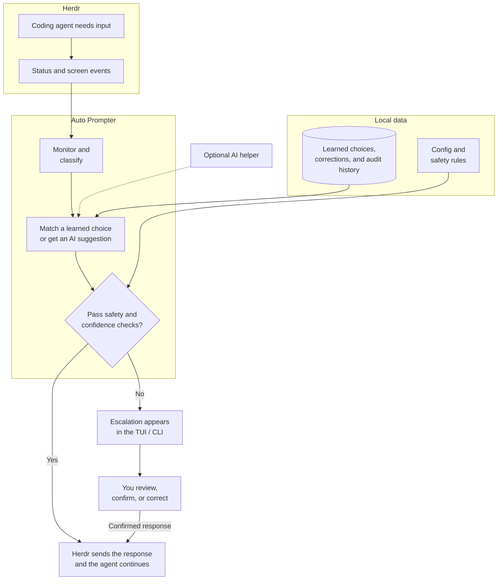

# Herd Auto Prompter

**Keep your [Herdr](https://herdr.dev) coding agents unblocked, hands-free.**

Herd Auto Prompter is a Herdr plugin that watches every agent session in your
herd, detects when an agent needs input — finished a step, waiting on an
approval, stuck on a multiple-choice question, or stalled on an error — and
automatically supplies the next prompt or the correct response, *the way you
would*. It learns from your own past decisions in a supervised shadow mode, can
follow task lists you explicitly configure, and can optionally consult an
LLM/agent CLI. Autonomous actions must clear the applicable confidence and
safety gates; uncertain ones escalate to you. Everything it does is audited and
correctable.

- **Learned rules, not guesses** — every action taken from a learned rule traces
  back to your confirmed decisions. Explicit task sources and the opt-in LLM
  helper are separate, clearly audited paths.
- **Confidence-gated** — learned rules and optional LLM suggestions use their
  own configured thresholds; below the applicable threshold they escalate.
- **Safety first** — never-auto patterns (force-push, destructive ops, deploys,
  credential changes, …), a global pause/kill switch, a runaway-loop guard, and
  an error-retry ceiling all veto automation.
- **Local by default** — learning data, history, and the audit log live in
  SQLite on your machine. Hap sends no telemetry. Its only outbound call in the
  default configuration is a version check asking GitHub for the newest release
  (at most every 6h, nothing about you is sent), so the TUI can flag an
  available update; switch it off with
  `hap config set tui.disable_check_for_update true`. Two things you can turn on
  do talk to a service: an LLM CLI you configure may use its provider, and
  setting a task source's storage provider to `github_gist` puts that source's
  checklist in a gist you own — its task text and nothing else.

> [!IMPORTANT]
> **Agent compatibility.** Herd Auto Prompter is developed and extensively
> tested against **Claude Code** (`claude`) and the **OpenAI Codex CLI**
> (`codex`). Other agents are best-effort: **OpenCode** (`opencode`),
> **Antigravity CLI** (`agy`) and others may have different status events,
> prompts, menus and terminal UI, and may be misclassified. Keep shadow mode and
> conservative thresholds in place while evaluating an additional agent type,
> and review its audit trail before allowing autonomous actions.

## Quickstart

Requires Herdr ≥ 0.7.0 and `curl`. **No Go toolchain needed** — the install step
downloads the prebuilt binary for your platform (Linux/macOS, amd64/arm64) from
the matching GitHub Release and verifies it against the published SHA256SUMS.

```sh
herdr plugin install 0xGosu/herdr-auto-pilot

herdr plugin install 0xGosu/herdr-auto-pilot --ref v0.6.20   # pin a release
herdr plugin install 0xGosu/herdr-auto-pilot --yes           # non-interactive
```

The monitoring daemon starts automatically when an agent appears in the herd.

A newly tagged release takes about 15 minutes to build. Install during that
window and you get the newest *earlier* release instead of an error — the output
says which version landed, and `hap update` picks up the intended one once it
publishes. Set `HAP_NO_FALLBACK` to any non-empty value to have the substitution
refused outright instead.

### Update

The TUI header flags a newer release next to the version
(`Herd Auto Prompter v0.6.19 ↑ v0.6.20 available`), learned from a GitHub
release check that runs at most every 6 hours while the TUI is open. A locally
built (`herdr plugin link`) binary never shows the hint.

```sh
hap update            # installs the newest release, then prints the command below
hap update --force    # required on a linked working tree, which an install would replace
```

It prints a `daemon --ensure` follow-up to run next. **That command names the
new binary by absolute path on purpose** — a plugin install does not repoint the
`hap` on your `PATH`, so a bare `hap daemon --ensure` could restart the version
you just replaced.

The install hands a running daemon over to the new build itself, and a daemon
that misses the handover notices its own binary is gone within ~10 seconds and
starts the replacement. `hap status` reports one that could not hand over. This
matters because a release installs into its own directory: the old binary is
removed while the daemon still runs from it, so every child it spawns by path —
the MCP server, the embedding worker — would break until it is replaced. Nothing
on disk goes stale; the binary path is resolved at spawn time, never stored.

For a clean reinstall, `herdr plugin uninstall herd-auto-prompter` first.

### Open the pane with a hotkey (recommended)

Add to `~/.config/herdr/config.toml`, then apply with
`herdr server reload-config` (no restart needed):

```toml
[[keys.command]]
key = "prefix+a"
type = "shell"
command = "herdr plugin pane open --plugin herd-auto-prompter --entrypoint control"
description = "Open Auto Prompter pane"
```

`ctrl+b` (Herdr's default prefix) then `a` opens the pane as a tab; override
with `--placement split|overlay|zoomed`. Direct chords like `key = "ctrl+alt+a"`
work too. The same mechanism can drive the CLI — bind `hap pause`, `hap resume`
and `hap status` if you want the kill switch one chord away.

### Make the CLI available from any shell

Open the pane, switch to the **Config** tab, and select **Create
/usr/local/bin/hap symlink to this running binary** under **Quick Shortcuts**.

Each release installs into its own directory, so an upgrade leaves the symlink
pointing at a version that no longer exists; the row then reads **Repoint
/usr/local/bin/hap … (currently stale)**. A symlink pointing at anything that is
not one of hap's own installs is never touched.

Run from any shell, `hap` operates on the same instance the daemon uses: it
honors the `HERDR_PLUGIN_CONFIG_DIR` / `HERDR_PLUGIN_STATE_DIR` vars Herdr
injects, and without them auto-detects Herdr's plugin directories. Only when
neither exists does it fall back to standalone dirs.

```sh
hap state-dir     # state dir (DB, logs, socket, lock, match-index) — bare value
hap config path   # the config.toml path — bare value, printed before it exists
hap paths         # both, labeled
```

### The CLI documents itself

```sh
hap help                 # every command, grouped, plus common workflows
hap help task            # one command in full: usage, every flag, details, examples
hap escalations --help   # the same page; --help works anywhere in the arguments
hap config fields        # the authoritative key list `hap config set` takes
```

Most commands end with a **"Next steps"** footer naming what to run next, with
real ids filled in. Turn it off per invocation with `--no-hints`, per shell with
`HAP_NO_HINTS=1`, or permanently with
`hap config set cli.ai_agent_friendly_output false` (default `true`). None of
these affect the help pages.

`hap skill` prints the bundled agent skill document, and
`hap skill install claude codex agents` writes it into those tools' skill
directories — so a coding agent can drive hap without a repo checkout.

Nearly everything the TUI does is also a CLI verb. The exceptions are two
interactive-only conveniences: the `/usr/local/bin/hap` symlink shortcut and the
daemon-stderr viewer (`!`, also available as `hap status --stderr`).

## Architecture

Herd Auto Prompter is one Go binary (`hap`) used in several roles: a
long-running monitoring daemon, a TUI hosted in a Herdr pane, equivalent CLI
commands, an internal embedding worker, and an MCP server for optional LLM
consults. Herdr remains the source of truth for workspaces, panes, agents,
status events, screen contents, and keyboard input. Hap never attaches to or
sends input directly to an agent process; it observes and controls the agent's
pane through Herdr.


```mermaid
flowchart TB
    subgraph HR["Herdr"]
        direction LR
        A["Coding agent needs input"] --> H["Status and screen events"]
    end

    H --> M

    subgraph HP["Auto Prompter"]
        direction LR
        M["Monitor and<br/>classify"] --> D["Match a learned choice<br/>or get an AI suggestion"]
        D --> G{"Pass safety and<br/>confidence checks?"}
    end

    subgraph LS["Local data"]
        direction LR
        C["Config and<br/>safety rules"]
        L[("Learned choices,<br/>corrections, and audit history")]
    end

    AI["Optional AI helper"] -.-> D
    C --> G
    L --> D
    G -->|Yes| R["Herdr sends the response<br/>and the agent continues"]
    G -->|No| F["Escalation appears<br/>in the TUI / CLI"]
    F --> O["You review,<br/>confirm, or correct"]
    O -->|Confirmed response| R
```

### Runtime flow

1. **Herdr starts the plugin daemon.** The manifest registers hooks for
   `workspace.created` and `pane.agent_detected`, each running
   `hap daemon --ensure` — one version-checked, lock-guarded daemon for the
   whole herd.
2. **Herdr reports status and screen events.** The daemon subscribes to Herdr's
   local event socket. When an agent becomes idle, blocked, done, or otherwise
   needs attention, the daemon waits for the agent interface to paint (see
   `[[capture_delay]]`), then asks Herdr to read the pane. Reconnects replay
   existing panes, so agents predating the daemon are reconciled too.
3. **Classify and match.** The captured situation becomes idle, approval,
   choice, or error; volatile text is masked into a stable signature; a learned
   rule is looked up. Semantic lookup runs in the isolated `hap embed-worker`,
   with BM25 and exact matching as fallbacks.
4. **Every proposed response passes confidence and safety checks.** Learned
   confidence, graduation state, task sources, and any AI suggestion feed the
   same pipeline. Before delivery: the kill switch, never-auto patterns, the
   suspected-irreversible check, rate/retry ceilings, the audit-before-action
   rule, and a live-pane staleness check.
5. **Herdr sends an approved response.** A single-line reply is typed
   (`pane send-text` + Enter) so a menu digit arrives as the keystroke it is; a
   multi-line reply is pasted as one message (`agent prompt`). A `@noop`
   decision is audited but sends nothing.
6. **Uncertain decisions become escalations.** The daemon writes an audit row
   and escalation and asks Herdr to show a notification. The TUI and CLI read
   the same local state; confirming, correcting, dismissing, pausing or changing
   config updates it and nudges the daemon to reload without restarting.

### Multiple-choice forms

Claude's AskUserQuestion and Codex `request_user_input` forms classify as
`choice`. A Claude **multi-tab** form (`← ☐ … ✔ Submit →` header) is first swept
tab-by-tab with arrow keystrokes, so the escalation, the signature and any LLM
consult see **all** questions rather than just the focused one. Its answer is a
digit series, one per tab including Submit (e.g. `1 2 3 2 1`).

Delivery adapts per tab, because a digit does not always commit: on plain
options it selects and advances, but on Claude's preview layout it only moves
the caret. Hap therefore presses, re-reads the live form, and presses Enter only
after verifying the intended option is selected. Unexpected transitions fail
closed, and a series that does not match the tab count is never partially
delivered. Codex question series are swept the same way, with one digit per
question and an explicit submit.

### Optional AI helper path

For an unknown situation the daemon may launch the configured LLM/agent CLI,
attaching a short-lived `hap mcp` server: the model reads staged context with
`get_context` and returns a structured decision with `submit_decision`.
Pre-delivery action reviews and pre-send task reviews ride the same round-trip;
idle-task generation is a one-shot command whose stdout is a proposed result. In
every case the **daemon** owns the final decision, re-runs the proposal through
the same confidence, safety and staleness checks, and either sends or escalates.

## How learned rules work (shadow mode)

A learned rule never acts on a situation before you have taught it.

1. **Observe.** hap classifies the situation, fingerprints it into a *situation
   signature* (paths, hashes and timestamps masked), and — in shadow mode —
   **escalates with a suggestion**.
2. **Confirm or correct.** `hap confirm <id> --send` accepts the suggestion and
   delivers it; `hap resolve <id> --action TEXT --send` sends the right answer
   instead and is what hap learns. Without `--send` the decision is recorded and
   learned but nothing reaches the agent — that is how you accept work for a
   busy agent without interrupting it. `hap dismiss <id>` drops one without
   responding.
3. **Graduate.** After `learning.graduation_n` consistent confirmations
   (**1** by default, 1–10) *and* confidence above the per-situation threshold,
   the signature becomes autonomous. Confirmations carry extra weight
   (`learning.confirmation_weight`, 2× by default), because an explicit operator
   answer is stronger evidence than an automated observation.
4. **Stay in control.** Correct any automated decision post-hoc (`hap resolve
   <audit-id> --action …`). The correction is recorded and immediately moves the
   rule's live confidence gate, but **graduation is permanent** — it never
   silently demotes an autonomous rule. To retrain one, `hap signatures reset
   <prefix> --yes` (TUI *Rules* tab: `0`), which keeps the decision history and
   the learned answer but excludes pre-reset decisions from confidence and
   graduation, so the rule must earn its confirmations again.

When your first response creates a rule, earlier LLM-only guesses for that
signature stay in history for audit but do not seed the new rule's confidence.

**Answer through hap, not by typing into the pane.** Once a rule is autonomous
the daemon answers matching prompts itself; a digit you also type races it, and
the extra keystroke lands in the agent's input box as stray text.

### Inspecting what it has learned

Signatures are addressed by unique prefix, git-style. In any confidence field a
`-` means "not scored yet", never a measured `0.00`.

```sh
hap signatures list                          # --type --mode --agent-type --min-conf
hap signatures show approval:9f2c            # situation, recent decisions, last context
hap signatures search "force push"           # keyword substring
hap signatures search "asking to overwrite the branch" --semantic --min-score 0.3
hap signatures reset approval:9f2c --yes     # shadow + fresh streak/confidence; history kept
hap signatures delete approval:9f2c --yes    # erase the rule and its decisions
hap signatures reembed [--force]             # after switching embedding model
```

The TUI's *Rules* tab shows the same, plus the **original situation** — the pane
snapshot first captured for the rule — so you can see what a rule answers, not
just what it sends.

## Configuration

Config lives in the plugin config dir (`herdr plugin config-dir
herd-auto-prompter`) as hand-editable TOML. Edits made through `hap` apply live;
a hand-edited file is picked up on the next reload or daemon restart (there is
no file watcher).

**Everything that writes `config.toml` is a `hap config` subcommand** — that is
the whole surface, and the file never has to be opened by hand.

```sh
hap config show                          # the effective config, defaults filled in
hap config fields                        # every settable key with its current value
hap config set <key> <value>
hap config set-threshold approval 0.80   # minimum|idle|approval|choice|error
hap config rules ...                     # never-auto patterns, incl. --agent-type scoped
hap config task-source ...               # which checklist file feeds which agent
hap config classifier ...                # which situation a pane is showing
hap config capture-delay ...             # how long to wait before reading a pane
hap config env ...                       # the environment handed to the LLM CLI
```

The last five are topics rather than `set` keys because a list element is
addressed by position and a map entry by name, neither of which one dotted key
can name. Each has its own guide (`hap help config rules`, and so on). They were
top-level verbs once; the old spellings still work and print a note on stderr,
so a script parsing their tab-separated stdout is unaffected. `hap task` is
deliberately *not* under `hap config`: it edits checklist items, not
configuration.

Two tests (`TestEveryConfigKeyIsRegistered`, `TestEveryConfigListHasACLICommand`)
fail the build if a key or section ever ships without a command.

**A complete annotated sample covering every section ships at
[`sample/config.toml`](sample/config.toml)**, and `hap config fields` always
prints the live defaults. The highlights:

```toml
[confidence_thresholds]
minimum = 0.50             # variance guard: minimum learned-action agreement.
                           # Also gates a task inferred from the agent's own todo
                           # widget — a trustworthy signal, so no higher bar.
idle = 0.65
approval = 0.70
choice = 0.70
error = 0.75

[learning]
graduation_n = 1           # consecutive confirmations to graduate (1-10)
confirmation_weight = 2.0  # confidence weight of an operator confirmation (>=1)

[limits]
max_consecutive_auto_prompts = 30  # per agent, without human interaction
max_auto_prompts_per_minute = 5    # per agent, rolling window
max_error_retries = 2              # per error signature
# All three are INERT while full self-prompting runs with honour_limits = false
# (the default) — see "Unattended modes".

[logging]
level = "info"                     # read once at process start, not on reload
max_size_mb = 16
audit_excerpt_retention_days = 14  # see "Disk usage"

[tui]
theme = "high-contrast"            # default | dark | light | high-contrast
max_content_width = 0              # cap variable-width list columns; 0 = full width
max_content_height = 0             # cap expanded long-field lines; 0 = unlimited
terminal_bell = true               # on a new escalation, and on a foreign pause
herdr_notification = true          # desktop toast for those same two events
disable_check_for_update = false   # true turns off the GitHub release check
max_instances = 1                  # concurrent `hap tui` processes; 0 = no limit

[tui.palette]                      # optional per-role overrides on top of the theme;
title = "205"                      # 256-color codes or hex. Roles: title, section,
error = "#ff5f5f"                  # error, ok, paused, running, warn, help.
```

The former `[thresholds]` table still loads and is rewritten as
`[confidence_thresholds]` on the next save.

### Semantic rule matching

Situations are matched to learned rules by embedding their masked salient
content (llama.cpp, bundled MiniLM) in an isolated worker and vector-searching
stored signatures, so a paraphrased prompt reuses the rule instead of
re-learning from zero. It **degrades, never blocks**: normalized BM25 text
matching takes over whenever the vector search does not match — the worker or
model failing, *and* equally a search that ran cleanly but found nothing similar
enough — then exact hashes.

```toml
[embedding]
disabled = false
model_path = ""             # "" = bundled <plugin>/models/all-minilm-l6-v2-q8_0.gguf
similarity_threshold = 0.90 # min cosine similarity to reuse a learned rule
bm25_min_score = 0.35       # min normalized BM25 score for the text fallback
bm25_highbar_score = 0.70   # the stricter bar used instead, for a pane-tail salient
                            # that an embedding search RAN and refused. Approval,
                            # choice and error rules refused by cosine are not retried
                            # by text at all — BM25 scores a changed approval TARGET
                            # and a harmless rewording alike.
min_salient_chars = 0       # 0 = 100. Below this, a situation is matched by BM25
                            # instead of embedding — short text embeds
                            # indiscriminately, which is how one almost-empty rule
                            # comes to answer everything. Applies to stored rules too.
                            # Approval/choice/error rules are exempt at any length,
                            # since they are short by construction.
pane_salient_chars = 500    # signature window for idle/unclassified situations
model_context_window = 0    # 0 = 512 (bundled model). MUST NOT exceed what the
                            # model supports; values below 256 clamp up.
embed_timeout_ms = 0        # 0 = 2000ms stall guard per warm embed call
warm_timeout_ms = 0         # 0 = 30000ms for the first call, which loads the model
```

Changing `pane_salient_chars` re-keys idle/unclassified rules once, so they
re-learn; structured rules are unaffected. The failure count that latches the
BM25 fallback is a fixed internal constant, not a setting.

## Task sources

A task source points agents at a checklist file so idle agents get the next
unchecked item. Without a declared source, hap falls back to inferring the next
task from the agent's own native todo rendering — never free-form prose. Because
that comes from the agent's own widget it is trustworthy, gated only by
`confidence_thresholds.minimum`. Inference is agent-type-specific: currently only
`claude` (its ✔/■/□ todo widget; the in-progress item wins, else the first
pending one). Other agent types skip inference and escalate.

```toml
[[task_sources]]
agent = "brave-otter"  # agent short name, pane id, or type ("" = any)
workspace = ""         # workspace name; "" or "*" = any, "*" wildcards work
path = "/home/me/project/docs/tasks.md"
# next_task_template = "..."                    # see "The prompt template"
# enable_auto_send_task_when_idle = true        # see "Keeping idle agents working"
# enable_llm_review_before_auto_send = true     # see "Reviewing the task list"
# max_tasks = 20                                # cap on list growth
```

Every option is settable from the CLI at creation time or in place afterwards:

```sh
hap config task-source list                                    # every source, with its index
hap config task-source add --agent backend-dev ./docs/tasks.md
hap config task-source add --workspace 'codex-*' --template 'Do: {next_task_content}' \
    --auto-send-when-idle --enable-llm-review-before-auto-send --max-tasks 40 ./docs/tasks.md
hap config task-source set backend-dev path /new/tasks.md      # path|agent|workspace|template
hap config task-source set backend-dev auto-send-when-idle true
hap config task-source set backend-dev max-tasks 40
hap config task-source remove <index|agent>
```

Flags must come **before** the path — Go stops parsing flags at the first
positional argument (hap detects one written after and refuses rather than
ignoring it).

`set` and `remove` take the **agent name** or the **index** `list` prints (`0`,
or the copy-pasteable `#0`). Prefer the name: the index is positional, so
removing a source renumbers every one after it. A name matching no source — or
more than one — is refused, naming the indexes that disambiguate it; a
workspace-scoped source has no agent and must take an index.

`path`, `agent` and `workspace` re-point the source, so each reports what it
changed *from* and warns: the next hand-out then comes from a different list, or
goes to a different agent. Nothing is copied or removed either way. An empty
`agent` or `workspace` matches **any** of them, which is called out when you do
it. A relative `path` resolves against your shell's directory (the daemon runs
from the state dir). `remove` takes the config entry only — the checklist file
stays on disk — and is unguarded by design.

### The prompt template

The default points the agent at its own list with its name pre-filled:

```
Your next task is {next_task_content}. Prefer the hap CLI to manage your tasks
(start/done), run bash `hap task {agent_name} list` to view them (if that name
isn't recognized, use the task-source index `{task_source_index}` in place of
`{agent_name}`).
```

Placeholders: `{next_task_content}`, `{task_list_path}`,
`{task_list_path_quoted}` (that path as one shell word, for a command the agent
runs), `{task_source_index}`, `{agent_name}`, `{cwd}`. The index fallback works
under every storage provider, unlike `--path`, which reads a local file.

The lifecycle instructions — `start <n>`, `done <n>`, how `<n>` is addressed —
are printed by `hap task <agent> list` itself, beside the real task numbers,
rather than re-sent with every prompt.

**When every item is checked off, the templated prompt is never sent.** hap
escalates a confirmable `@noop` suggestion ("No more pending tasks",
`task_source_exhausted`) instead, and never refills the list on its own —
rewriting a list you wrote is your call.

### Where task lists are stored

By default a checklist is a file on the machine hap runs on, and nothing about
it leaves that machine. `[task_source_provider]` sets the **default** storage;
every `[[task_sources]]` entry may override it, so one agent can keep a local
checklist while another's lives in a gist:

```toml
[task_source_provider]
provider = "github_gist"                     # "local_fs" (default) | "github_gist"
env_file = "~/.config/hap/task_source.env"   # holds GITHUB_TOKEN; read at use time
timeout_seconds = 20
refresh_seconds = 30

[task_source_provider.github_gist]
gist_id = "3f2a1b9c4d5e6f708192a3b4c5d6e7f8"

[[task_sources]]          # inherits github_gist; no path, so this agent gets
agent = "brave-otter"     #   its own "brave-otter.md" inside the gist

[[task_sources]]          # overrides back to a file on this machine
agent = "legacy-fox"
provider = "local_fs"
path = "/home/me/project/docs/tasks.md"

[[task_sources]]          # inherits the provider, but uses a different gist
agent = "secret-badger"
gist_id = "aa11bb22cc33dd44ee55ff6677889900"
```

A source that sets no `provider` **keeps inheriting** it: change the default and
every inheriting source moves with it. hap never writes the inherited value back
into a source. `hap config task-source provider` shows what is in force — the
provider, the gist, and whether the credential file resolved — without ever
printing the token.

Under `github_gist`, `path` names a file **inside** the gist. Set it and every
matched agent shares one list; leave it out and each gets its own
`<agent-name>.md`, created on first hand-out. hap never creates the gist: make a
**secret** gist on github.com and paste its hex id. The token lives in the file
`env_file` names (`GITHUB_TOKEN=…`, `gist` scope, mode `0600`), is read when hap
reaches the store, and never enters `config.toml`.

Three things stay as they were: a `[[task_sources]]` entry is still what opts an
agent in, every safety control still applies at delivery, and `local_fs` is
still the default.

**Privacy.** Enabling this sends those sources' task lists to GitHub. That is
the only thing it sends — no pane content, no learned rules, no audit history.

### Keeping idle agents working

A declared task normally reaches an agent when herdr reports it parked, and each
idle episode is driven exactly once — so an agent that finishes and sits there
without a further event waits for you. Set `enable_auto_send_task_when_idle` on
a source and the daemon also polls once a minute, handing the next pending `[ ]`
item to any matching agent idle for more than a minute.

**The task goes out without waiting for hap to learn anything.** Turning the
flag on is your instruction, so a declared task from that source skips shadow
mode and the idle confidence threshold, and a learned "do nothing" rule cannot
park it — otherwise the feature would need you to confirm it into autonomy
first, which is the attention it exists to remove. Sources *without* the flag
are unchanged.

Every safety control still applies: kill switch, never-auto patterns, rate
limits, per-agent disable, and the optional pre-delivery LLM review. Sends are
audited under the trigger `auto-idle-send`.

Four rules keep unattended hand-out safe:

- **One task, one agent.** Agents matched by the same source in one poll are
  paired with *different* pending items, and the delivered item is marked `[-]`
  as it is sent, so neither another agent nor the next poll can pick it up. A
  failed send returns it to `[ ]`. Reserving is a property of the *source*, so
  ordinary event-driven sends from it are marked `[-]` too; the agent's own
  `hap task <name> start <n>` then simply becomes a no-op.
- **Every sweep decides from current state, not from the last send.** A
  successful send only proves herdr accepted the keystrokes — text typed into a
  CLI that is restarting or unfocused is silently lost, and the item would sit
  `[-]` forever. So each hand-out is recorded in a durable ledger and confirmed
  only when herdr reports that agent *working*. An unconfirmed hand-out whose
  agent is parked again after ~2 minutes is returned to `[ ]` (audit status
  `reclaimed`, trigger `auto-send-reclaim`) and re-offered in the same sweep, to
  that agent or any other idle one. A `[-]` hap did not write itself — yours, or
  one an agent marked — is never touched.
- **An undeliverable task is bounded per *item*, not per agent.** After **3**
  hand-outs that were never started, hap stops resending: the item is left `[-]`
  and escalated as `task_never_started`, and the agent moves on to the next one.
- **A pending escalation does *not* withhold queued work.** An escalation is a
  question about what to answer on the agent's screen, not a judgement that the
  agent cannot take its next task — so the hand-out goes out and you answer the
  escalation when you get to it. (An agent that is disabled, rate-paused or
  blocked *is* skipped.)

An agent whose episodes keep resolving to something other than a send is
re-checked on a widening interval — 1, 2, 4 … up to 15 minutes — rather than
every minute. Any delivered task resets it, so this only delays recovery.

This **composes** with the pre-delivery LLM review below: the hand-out decides
*that* a task goes, the review decides *which* task and in what shape.

### Managing the task items

`hap task` edits the checklist items *inside* a source's file. Address a list by
the agent whose source it is, by the source **index** from
`hap config task-source list`, or with `--path <file>` for any local checklist.

```sh
hap task backend-dev list [--status pending|done|all]
hap task backend-dev get 3.4          # <n> is a task REFERENCE (id); '#3' is a position
hap task backend-dev add "wire up retries"
hap task backend-dev start 2          # [-] in progress
hap task backend-dev done 2           # [x]      undone 2 → [ ]
hap task backend-dev update 2 "new text"
hap task backend-dev remove 2
hap task backend-dev move 5 2         # or: up | down — reorders among siblings
hap task backend-dev send 3 [--yes]   # deliver to the live agent now
hap task 0 list                       # by source index
hap task --path ./docs/tasks.md list  # any local checklist file
```

Aliases mirror the obvious spellings: `ls`, `show`, `create`, `wip`, `check`,
`uncheck`/`reopen`, `edit`, `rm`/`delete`, `mv`/`reorder`.

**Addressing.** `list` numbers items by position in the file (`#1..#N`, checked
and unchecked alike). A checklist may also number its own tasks — the `1. `/`2. `
prefix hap's generated lists use, or hand-authored ids like `3.4`. A bare `3`
means the item whose *id* is `3`, falling back to position 3 only when no item
claims that id and nothing at that position has one of its own. `#3` always
means position 3 (quote it — a bare `#3` is a shell comment). The id comes first
because it is what the agent reads in its prompt: told to do "3.4 create the
public link", it reports `done 3.4`, which must not tick off whatever sits at
position 3. Positions shift after `add`/`remove`, so every mutating command
reprints the renumbered list.

`move` reorders one task among its **siblings**; the source is a reference but
the destination is always a position. The whole subtree travels — nested detail
lines and sub-tasks. Re-parenting is refused.

`send` needs a pending `[ ]` item and a **cleanly idle** agent; idleness is
re-checked at the moment of delivery, so a stale `--yes` cannot interrupt an
agent that has since picked up work. The item is marked `[-]` *before* delivery
(that mark is what stops the daemon re-sending it); a failed send returns it to
`[ ]`. Normally you do not need it — the daemon hands out the next task itself.

**Multi-line text stays ONE task.** Line breaks are stored as the literal
two-character sequence `\n` on the item's single line and converted back to real
newlines when the task is sent (hand-written `\n` works the same way).

Writes go straight to the file atomically; the daemon re-reads task files live,
so no restart is needed. Adding a task never interrupts a working agent.

**`max_tasks` (per source, default 20)** caps how large a checklist may grow —
done, in-progress and pending items counted alike. It gates **manual** creation
(`hap task … add` and the TUI's `a` are rejected once they would push a
registered source past it) and confirming a set of generated tasks whose count
would exceed it. Prune the list or raise the cap to resume. The no-source
bootstrap case and an ad-hoc `--path` file are never capped.

The cap also guards LLM generation into an exhausted source, but that guard is
dormant today: refilling an exhausted source went away with
`llm.task_generate_command_start`, so nothing generates into a registered source
any more.

### The Tasks tab

The TUI's *Tasks* tab aggregates every configured source's checklist into one
list — a header row per source (with the live agent it feeds) and its items
underneath. It is the same state `hap task` edits.

- `enter`/`y` — send the pending task under the cursor to the live agent its
  source feeds, behind a `Y/n` confirmation (the twin of `hap task … send`)
- `v` detail · `a` add · `e` edit · `d` done/undone · `x` delete
- `space` marks a run, so `d`/`x` act on all marked at once
- `K`/`J` (or `shift+↑`/`shift+↓`) move a task among its siblings
- `f` focus the live agent this source feeds · `/` search

The add/edit prompts take multi-line text: **shift+enter** inserts a line break
(ctrl+j on terminals that cannot report it), **enter** submits. They are full
line editors — ←/→ move the caret, ctrl+←/→ by word, home/end to the ends — and
the same keys work in every hap prompt. An action captured against a row aborts
if that task's text changed before the write lands, so a stale keypress never
mutates the wrong line.

**Retiring a whole source.** `x` on a source's *header row* removes its
`[[task_sources]]` entry behind a `y/n` confirmation — but only once it can no
longer be serving anyone: either **no live agent matches** its selectors, or
**every task is finished** (`[-]` counts as unfinished). Both *unknowns* refuse
too, since neither is evidence of safety: an agent list herdr will not answer is
not an empty herd, and a checklist that will not read is not an empty checklist.
The checklist file stays on disk. To retire a source the guard refuses, use the
*Config* tab's `x` or `hap config task-source remove`, which are unguarded by
design.

## Agent short names

Every monitored agent gets a short two-word name (e.g. `brave-otter`) the moment
it appears — on detection, not on its first blocked prompt — because pane ids
like `w6:p1` are not operator-friendly.

```sh
hap agents                      # name, pane id, type, status, automation, cwd, mode
hap rename brave-otter backend-dev
hap disable backend-dev         # stop automation for only this agent
hap enable backend-dev
hap mode backend-dev plan --yes # the agent's own permission mode
hap capture backend-dev         # re-run the capture pipeline for one agent now
```

`hap agents` is tab-separated. `cwd` is `-` when herdr cannot report one (so two
agents on the same repo from different checkouts are still distinguishable), and
`mode` is `-` when unreadable or the agent type has none. New columns are always
appended, so existing field positions never move.

A disabled agent stays in the list marked `DISABLED`. hap never performs
autonomous pane actions for it: would-be actions are audited as `denied` with
`[agent_disabled]`, and would-be escalations are written directly as `dismissed`
with the same tag, never entering the pending queue.

`hap capture` re-runs the daemon's normal delayed capture for a live `blocked`,
`idle` or `done` agent. Classification, MCQ sweeping, safety gates, automation
and auditing are identical to a real Herdr status event, so a learned or
LLM-approved response may be sent.

### Permission modes

The permission mode is what `shift+tab` cycles inside the agent's own TUI —
`acceptEdits`, `plan`, `auto`, `manual` for claude; `default`, `plan` for codex.
Other agent types have none.

Setting works by pressing `shift+tab` and re-reading the pane until the agent
itself reports the target, so it is **idempotent** (an agent already there gets
no keystroke) and it **fails rather than guesses**. The mode is read from the
indicator the agent paints in its composer footer — nothing else reports it — so
if an approval or form is covering that footer, hap refuses. That refusal is a
safety control: inside Claude's approval modals `shift+tab` is rebound to
"approve with this feedback".

Two more things it will not do silently. The cycle is **per session**, not per
agent type — a `--model haiku` claude offers only three modes — so hap detects a
closed rotation, rotates the agent **back to where it started**, and names the
cycle it observed. And an agent launched with `--dangerously-skip-permissions`
reports `bypassPermissions`, which the cycle cannot leave, so hap refuses
immediately.

## Never-auto patterns

Irreversible operations are **never** automated, regardless of confidence. The
shipped seed covers force-pushes, destructive filesystem/database ops, prod
deploys and publishes, cloud-resource deletion and credential changes, plus
broader heuristic rules for suspected-irreversible language. It is deliberately
scoped to MAJOR-risk, hard-to-recover operations: routine locally recoverable
work (removing a build dir, a local git history reset, `terraform apply`, merging
a PR) is **not** in the shipped set — though recursive deletion of `/` or the
whole home directory still is. Add your own for anything you want escalated
anyway. The shipped rules are regression-tested in CI against a maintained
corpus (`internal/domain/testdata/irreversible_corpus.txt`).

```sh
hap config rules list                # shipped rules with stable ids, then yours
hap config rules add '(?i)restart\s+the\s+payment\s+service'
hap config rules remove <index>

hap config rules add --agent-type codex,agy '(?i)compact\s+the\s+conversation'
hap config rules remove-scoped <index>   # scoped rules have their own index space

hap config rules disable-seed <id>   # silence ONE shipped rule that over-escalates
hap config rules enable-seed <id>
```

A seed id is a hash of the pattern, so it names the same rule across upgrades
(and is rejected if that pattern no longer ships). One seed rule is a single
regex that may cover several phrasings — disabling it silences all of them. To
drop the whole shipped set, set `safety.disable_never_auto_seed_patterns = true`.

In the TUI you can do the same without leaving the escalation it blocked: on the
Escalations tab (or inside an escalation's `v` detail), **`b` disables the one
builtin rule that forced the selected escalation**, after a confirmation naming
the rule and its id. It is offered only while that escalation was actually
raised by a builtin rule.

Prompts that *look* destructive but match no pattern are escalated by a
**suspected-irreversible heuristic** rather than automated. It needs
corroboration to fire — a destructive verb aimed at a data/infrastructure
target, explicit no-undo language — so everyday prompts ("remove the unused
import") do not trip it, and it scans only the actionable region (the pending
dialog, or the next-task prompt about to be sent), so an agent merely *talking
about* destructive operations is not flagged. The escalation rationale names the
indicator and the text it matched.

Deprecated but still loading, migrated on the next config save:
`allowlist_patterns` → `never_auto_patterns`; `safety.disable_seed` →
`safety.disable_never_auto_seed_patterns`; `irreversible_indicators` and
`[[safety.indicator_rules]]` → `[[safety.never_auto_rules]]`.

## Health and disk usage

`hap status` and the TUI share one health assessment: a stale or hung daemon, a
runtime-degraded embedder, crash-looping, and the crash-loop breaker's
auto-disable/give-up states. `hap status` exits non-zero when the daemon is
unhealthy. The detached daemon's stderr is captured at
`<state-dir>/daemon.stderr.log` (rotated at 256 KiB); `hap status --stderr`
prints the tail, and the TUI offers `!`.

Three things grow in the state dir:

| File | Bounded by |
|---|---|
| `herd-auto-prompter.log` | `[logging] max_size_mb` (16 MiB), plus one `.old` |
| `daemon.stderr.log` | 256 KiB, plus one `.old` |
| `herd-auto-prompter.db` | `[logging] audit_excerpt_retention_days` (14) |

The database grows fastest. Most of it is the pane excerpt captured with each
audit row — about 3.8 KiB of a 5.0 KiB row — so retention **blanks that column
and keeps the row**: `hap audit` history, rationales and statuses all survive.

`audit_excerpt_retention_days` takes three kinds of value: omitted is the
default 14; `0` keeps **no** excerpts (retain for zero days — the most
aggressive setting, not the off switch); negative (`-1`) never prunes.

Rows the daemon may still read are never touched, whatever the retention says:
pending escalations at any age, rows with an unprocessed LLM retry, and recently
answered asks. That is a safety rule rather than a nicety — auto-accept reads a
pending escalation's excerpt as the proof that a menu was standing.

```sh
hap gc --dry-run     # show the window; change nothing
hap gc               # reclaim now (the daemon also sweeps once a day)
hap gc --days 7      # override the window for one run
```

Because SQLite frees pages *inside* the file, `hap gc` also vacuums — which is
what actually returns the space.

To turn the log down, set `[logging] level` to `warn` (it applies to `hap tui`
too, which writes the same file). `HAP_DEBUG=1` forces debug for one run and
outranks the config. Unlike most settings, `level` and `max_size_mb` are read
once at process start, so restart the daemon to apply a change.

**Larger embedding models need larger budgets.** Llama.cpp runs in a persistent
`hap embed-worker` child, so a native abort or stalled call kills and restarts
the worker rather than the daemon, degrading to BM25/exact matching after
repeated failures. Each call is bounded by a stall guard (2s warm, 30s for the
first call including model load), and five back-to-back failures latch the
degrade for the rest of the daemon's life. A model bigger than the bundled
MiniLM can exceed those defaults on every call, which looks exactly like a
broken embedder — `hap status` distinguishes the two:

```
embedder health:     DEGRADED at runtime — degraded (every embed hit the stall guard; raise …)
  embedder failures: 5 (5 timeouts), latch at 5 consecutive
  embedder budgets: embed 2000ms, warm 30000ms
```

Raise them with `hap config set embedding.embed_timeout_ms 8000` (and
`warm_timeout_ms` for slow loads). Any `[embedding]` change rebuilds the embedder
and clears the latch, so the fix applies without restarting anything.

## The optional LLM helper

When no confident learned rule applies, hap can consult an LLM/agent CLI you
already have installed. The model receives context and submits its suggestion
through hap's own MCP server (`hap mcp` — tools `get_context` and
`submit_decision`); its stdout is captured for audit only.

The three `[llm]` command fields ship disabled, and their argv is far too long
to retype. **Use a preset:**

```sh
hap config set llm.command --preset claude                # or: codex
hap config set llm.task_generate_command --preset claude
hap config set llm.learn_from_user_command --preset claude
```

A preset only ever bootstraps a field **nobody has configured** — once one is
set, tuning it is a `config.toml` edit (or the TUI Config tab's `e` on a
`(disabled)` row). [`sample/config.toml`](sample/config.toml) carries the full
annotated argv for both CLIs, including the commented codex recipes.

```toml
[llm]
timeout_seconds = 120
auto_act_confidence_threshold = 85  # auto-act only at or above this LLM self-reported
                                    # score (0-100); >100 (e.g. 999) = never auto-act
pane_excerpt_chars = 5000           # pane excerpt size in the consult context
run_in_agent_cwd = true             # run the CLI in the agent's own project directory
```

`submit_decision` enforces a per-situation contract: `approval`/`choice` listing
options must be answered with `select_options` (1-based option numbers — `[2]`
for a single menu, one integer per tab for a multi-tab form); a menu-less prompt
such as a bare y/n takes `recommend_action` literal text instead; `idle`/`error`
require `recommend_action` and reject `select_options`. `recommend_action
"@noop"` — "no reply is needed" — is accepted for any situation. A
`confident_score` (0-100) is shown on the escalation so you can weigh the
suggestion.

Every suggestion is re-gated through the never-auto patterns, kill switch and
rate guards. It auto-acts only when the score meets
`auto_act_confidence_threshold` **and** the action does not contradict learned
history; otherwise — and on timeout, CLI failure or no submission — the
situation escalates. Retry a failed consult with `hap escalations retry <id>` or
`l` on its TUI escalation; hap refreshes the live pane and status first.

`get_context` hands the model the classified situation (type, options,
permission verb, error summary), a pane excerpt (the last `pane_excerpt_chars`
characters, read deeper than the classification snapshot), the agent's herdr
location (`workspace_id`, `tab_id`, `pane_id`, `agent_id`), its hap-owned
`agent_name`, and the pane's working directory (`cwd`, `foreground_cwd` —
advisory; a deleted directory carries a `" (deleted)"` suffix). The location ids
let the model run its own read-only `herdr` queries if you extend its tool
allowlist.

Whenever the agent has a matching `[[task_sources]]` entry, `get_context` also
carries `task_list_path`, `pending_task_count` with a truncated
`next_pending_task`, and `in_progress_task_count` with a truncated
`first_in_progress_task` — on **every** consult, not just the task review below,
so the model always knows the agent's backlog state.

Placeholders for a command template: `{self}` (the hap binary), `{request_id}`,
`{db}`, `{control}`, `{agent_name}`, `{agent_type}`, `{cwd}`, `{pane_excerpt}`,
`{session_id}`. Common misconfigurations of known CLIs are auto-repaired at
launch (claude/agy: prompt moved next to `-p`/`--print`; codex: missing `exec`
inserted); an unrecognized shape is left untouched.

> Upgrading: the first-interaction command family (`llm.command_start`,
> `llm.task_generate_command_start` and their `_env`/`_env_file` companions) was
> removed — one template now serves every interaction. A config still carrying
> them loads with a warning and is rewritten without them on the next save. Two
> behaviors went with it: the fast-fail retry that tried the other template when
> one exited in under a second, and the refill of an exhausted declared task
> source, which now always escalates `task_source_exhausted`.

For **Antigravity (`agy`)** there is no preset and no per-invocation MCP flag —
register hap once in `~/.gemini/config/mcp_config.json` with the database path
in `env`:

```json
{"mcpServers": {"hap": {"command": "/path/to/plugin/bin/hap", "args": ["mcp"],
  "env": {"HAP_DB_PATH": "~/.local/state/herdr/plugins/herd-auto-prompter/herd-auto-prompter.db"}}}}
```

### Where the CLI runs

By default hap launches the LLM CLI **in the monitored agent's own working
directory** (`herdr pane get`, preferring `foreground_cwd`), so it reads that
project's `CLAUDE.md`/`AGENTS.md`, sees its local tool config, and can resolve
repo-relative paths. Set `run_in_agent_cwd = false` for the historical behavior.
When the directory is unknown or deleted, the run falls back to hap's own rather
than failing.

Two consequences worth knowing. The directory is chosen by the **agent** — which
can `cd` anywhere, including a repo it just cloned — so that project's
instruction file, and any `AUTO.md` it ships, are read by the very CLI whose
answer drives auto-answering. Turn the key off where your agents work in repos
you do not trust. (The shipped prompts frame `AUTO.md`'s rules as the operator's
guidance, never as instructions that override the prompt, precisely because that
file can arrive with the checkout.) It cannot bypass a safety control: the kill
switch, never-auto patterns, rate guard and `auto_act_confidence_threshold` all
still gate delivery. And CLIs store
conversations per directory, so a session minted before this setting changed
resumes from a different directory than it started in.

**MCP servers are pinned to the ones hap names.** A project directory also
carries a `.mcp.json`, and claude would start those servers for the consult. So
hap appends **`--strict-mcp-config`** to any `claude` command that passes
`--mcp-config`, making hap's server list the complete set. Note what that also
removes: MCP servers from your user-level `~/.claude.json`, from `--settings`,
and from enabled plugins stop reaching the consult too — to keep one, move it
into the `--mcp-config` JSON. hap only appends the flag to a template that
already passes `--mcp-config`, since asserting no MCP set is not the same as
asking for an empty one.

`codex` needs no equivalent (verified against codex-cli 0.146.0): every MCP
source it reads is `$CODEX_HOME`-rooted, so a project directory cannot add
servers to a codex run. `agy` is likewise left alone.

### Session ids

Every LLM invocation is given a session id, recorded on the audit row it
produced (`llm_session_id`). When the CLI persists sessions it also names the
transcript file, so a decision traces back to the conversation behind it. The
shipped recipes disable that persistence (`--no-session-persistence` for claude,
`--ephemeral` for codex) to keep hap's background consults out of your own
session history — under those flags the id names no file on disk and is a
correlation key only. Drop the flag if you want the transcripts back.

This costs you no record of what the LLM said: hap captures the CLI's stdout
*and* stderr onto the audit row either way, readable with `hap audit` or `v` in
the TUI's Audit tab.

For `claude`, hap appends `--session-id {session_id}` automatically (writing
`{session_id}` yourself turns that off, so it is never passed twice). `codex`
mints its own and prints it in its startup banner, which hap reads back. For
anything else nothing is added — hap does not guess a flag name.

### A separate environment per command

Each command template can be spawned with its own environment, so one CLI can
run against a different key, provider, model or proxy than another.

```toml
[llm]
env_file = "~/.config/hap/llm.env"            # shared by every llm command
command_env_file = "/path/to/claude_consult.env"
task_generate_command_env_file = "/path/to/claude_task_generate.env"

# Inline tables must come after every plain `key = value` in [llm]:
[llm.env]
ANTHROPIC_BASE_URL = "https://proxy.internal"
[llm.task_generate_command_env]
ANTHROPIC_MODEL = "haiku"                     # cheaper for task ideas
```

The inline tables are editable from the CLI, per scope (`shared`, `command`,
`task_generate_command`, `learn_from_user_command`):

```sh
hap config env list                                          # names only, never values
echo -n "$ANTHROPIC_API_KEY" | hap config env set command ANTHROPIC_API_KEY
hap config env unset command ANTHROPIC_API_KEY
```

No read path in hap ever prints a **value**, and `set` reads it from stdin
unless `--value` is passed — a token on the command line lands in shell history
and in every other user's `ps`.

The `.env` format is the usual one (`KEY=VALUE`, `#` comments, optional
`export`, single/double quotes); the configured *path* expands `~` and `$VAR`.
**Secrets belong in the file, not in `config.toml`**: it is read when the CLI is
*spawned*, so editing it applies to the next run with no restart.

Layering, last wins: the daemon's own environment → `env_file` → `env` → the
command's `…_env_file` → the command's `…_env`. Names starting with `HAP_` or
`HERDR_` are reserved and ignored with a warning. Values accept the same
placeholders as the command template, except `{pane_excerpt}` — untrusted pane
text is never put in a child's environment. A `PATH` set this way is honoured
for finding the CLI itself.

A configured env file that cannot be read, has a malformed line, or defines no
variables at all **fails that run** rather than launching the CLI without its
credentials, which would surface much later as an opaque auth error. The failure
names the file and line number, never the line's content.

### Reviewing literal replies before they are sent (optional)

When a learned rule resolves to **literal free text** — an idle next-task
prompt, an error retry command, a free-text approval reply — the consult LLM can
review and adapt that text to what is actually on the agent's screen. The
context carries `proposed_action` (the exact text about to be sent), and the
model submits the adapted text, `@proposed_action:send` to affirm the original
verbatim, or `@noop` to send nothing.

```toml
[llm]
enable_rewrite_action = true   # default false; requires llm.command
# On review failure the ORIGINAL text is sent as-is; set this only to wrap it:
# rewrite_action_fallback_template = "You must act based on the following: {original_text}"
```

Invariants:

- **Numbered-menu answers are never reviewed** — a mapped digit reaches the menu
  untouched. Only literal free text goes through.
- **Declared tasks are never reviewed here** — a source's
  `enable_llm_review_before_auto_send` gate owns that, and a source that did not
  opt in delivers its tasks verbatim.
- **A review failure never blocks the send.** On error, timeout or empty output
  the original is delivered exactly as it was.
  `auto_act_confidence_threshold` deliberately does **not** apply — the learned
  rule already earned the send, so an unsure review degrades to the original
  instead of escalating (the score still lands on the audit row).
- **Safety controls still apply to the reviewed text.** Output matching a
  never-auto pattern or the irreversible heuristic is discarded in favor of the
  original; if even that trips, the situation escalates. The kill switch, rate
  guard and a staleness re-check run again at delivery.
- **Learning is unaffected** — decision history records the original learned
  action, never the adapted text.
- **Cost:** every reviewed send is one full consult on `llm.command`.

> Upgrading: the former dedicated rewrite keys (`llm.rewrite_command`,
> `llm.rewrite_command_start`, `llm.rewrite_timeout_seconds`) were removed; they
> load with a warning and are dropped on the next save.
> `llm.rewrite_fallback_template` migrates to
> `llm.rewrite_action_fallback_template`.

### Reviewing the task list before a task is sent (optional)

Per source, off by default. Immediately before the daemon auto-sends a task, the
LLM can fix the list *and* choose which task ships — so the agent receives work
that is valid, correctly scoped and current, instead of a stale task sent
verbatim.

Using the same two MCP tools, it sees the live pane, the queued task
(`proposed_task`/`current_task`), the checklist path, and `tasks` — every item
with the reference used to address it (a declared id like `3.4`, else a position
like `#3`), its position and status. It answers in **one** call:

```jsonc
submit_decision({
  "task_actions": [                              // ordered; applied in sequence
    {"op": "done",   "task": "3.1"},             // already finished
    {"op": "delete", "task": "3.2"},             // no longer valid
    {"op": "edit",   "task": "3.3", "text": "…"},// stale or wrong
    {"op": "move",   "task": "4",   "to": 9},    // should run later
    {"op": "add",    "text": "…", "as": "n1"}    // scope too big — break it up
  ],
  "send_task": "3.3",                            // a REFERENCE, or "@noop"
  "confident_score": 92,
  "rationale": "…"
})
```

Each action resolves against the list the previous ones produced, exactly as if
typed as consecutive `hap task` commands — so a declared id is safer than a
position, which shifts under a preceding `delete` or `move`. A newly added task
has no id yet, so `add` carries a handle (`"as": "n1"`) later actions and
`send_task` can name.

**`send_task` is a reference, never text.** The daemon renders the outbound
prompt from the list itself — the item plus its folded detail, through the
source's template — so the LLM cannot paraphrase task wording in transit.
"Send the queued task unchanged" needs no sentinel: name it and submit no
actions. There is no `start` operation: marking a task in progress is the
*agent's* job, distinct from the `[-]` reservation the daemon writes at delivery.

Everything applies **atomically** — validating every reference, applying every
action, resolving `send_task` and reserving it happen inside one locked
read-modify-write. If anything is invalid, the whole submission is discarded and
the checklist is left byte-identical.

**It always sends something, and it never escalates.** This is for the
unattended case, so every non-ideal outcome sends the **original task
unchanged**: an unusable review (spawn failure, timeout, no submission,
malformed output, a bad reference); one scoring below
`auto_act_confidence_threshold` (deliberately all-or-nothing — a review your
threshold distrusts does not get to half-edit your checklist); or a reviewed
task tripping never-auto or the irreversible heuristic. `send_task: "@noop"` is
legal in exactly one case: after the actions are applied, no pending task
remains.

Every outcome is audited under the `llm-task-review` trigger with a distinct
reason, so a silent fallback never looks like an ordinary send, and mutations
carry before/after text — `hap audit` answers *"why is task 4 gone?"*. For
learning, an accepted review still records the symbolic `@next_task:declared`:
the reusable decision is "send the next declared task", not this task's one-off
wording.

Only sends the **daemon** initiates are reviewed — a task you send by hand
(`hap task <agent> send`, or the TUI) never is.

```sh
hap config task-source set <index|agent> enable-llm-review-before-auto-send true
```

> The former `enable_llm_review` key still loads and migrates on the next save
> (with a warning); the CLI refuses that spelling. `llm_review` is no longer
> recognized.

### Suggesting tasks when no source exists, or one runs out (optional)

If an idle agent has neither a matching `[[task_sources]]` entry nor an
inferable native todo, `llm.task_generate_command` runs a one-shot CLI to
propose next tasks. Opt-in: without the command the safe default remains a
`no_task_source` escalation and hap invents nothing.

It never refills a declared source whose checklist is fully checked off: that
list already had operator-relevant tasks in it, so an exhausted source escalates
`task_source_exhausted` and waits for you.

The command's stdout may be plain lines or a Markdown list. Hap normalizes it
and surfaces it as an **escalation**; it never auto-accepts a generated task
(unless you opt into `full_self_prompting.accept_generated_task` — see below).
When the output contains several lists — the options a model weighed, then the
work it settled on — only the **last** becomes tasks; the others go to the
rationale behind an `ignored N other list(s):` note, so a discarded option is
never queued as work.

Confirming creates `<state-dir>/tasks/<agent-name>.md`, marks the first task in
progress, registers the file as that agent's source, and sends only the first
task. Later idle events consume the rest through the normal declared-task flow.
Dismiss with `x`; if generation failed or timed out, press `l` to retry.

The command can decline with `@noop` alone (also `noop`, `no_op`, `no-op`),
which escalates as a confirmable "do nothing". Tell the model about the sentinel
in your prompt or it will never use it. The sentinel line is always stripped, so
`@noop` can never be written into a task list or typed into a pane — but
anything beside it is still treated as work, so ask for the sentinel alone. An
**empty** reply is not a decline: it is indistinguishable from a crashed CLI, so
it stays a retryable failure.

Placeholders: `{self}`, `{agent_name}`, `{agent_type}`, `{pane_excerpt}`,
`{cwd}`, `{session_id}`. First-generation state is tracked independently from
consults and applies only to the no-source case. (These keys were renamed from
`generate_task_command*`; the old spellings no longer load.)

### Learning from your corrections (optional)

When you **correct** an escalation, `llm.learn_from_user_command` runs a one-shot
CLI **in the agent's own working directory**, asking it to record the lesson in
`AUTO.md` there, under a heading spelled exactly
`## Lessons for hap's auto-answer assistant`.

Why it exists: hap already learns from a correction, but that learning is keyed
on the signature of **one screen**. A lesson written to a file survives a screen
that hashes differently, and survives the agent process itself. The two are
complementary.

**Why `AUTO.md` and not the project's `CLAUDE.md` / `AGENTS.md`.** The lesson
only ever applies to the assistant *hap* spawns to answer a prompt on the
agent's screen. Putting it in the shared memory file would load it into the
agent's context on every turn of its **real** work, where it is noise at best.
So the three hap-spawned runs share a file of their own, and nothing else reads
it: `learn_from_user_command` writes it, and the shipped `command` and
`task_generate_command` prompts are told to read it before deciding — via the
`@AUTO.md` reference claude expands at prompt-parse time, so the consult picks
it up without needing a Read tool its allowlist does not grant. One heading
keeps the whole thing reviewable, and removable, in one edit. Add `AUTO.md` to
`.gitignore` if you would rather not commit it.

Only the file *name* lives in the prompt — no code depends on it, so your own
template may name whatever you like.

Placeholders add `{situation_type}`, `{suggestion}` (what hap was about to
answer) and `{correction}` (what you answered instead) to the usual set.

- **Only corrections trigger it.** Confirming means hap was right, so there is no
  lesson and no run. Accepting a generated task does not count either — that is
  you approving a checklist edit, not answering the screen.
- **Only a standing escalation teaches.** Correcting an old **audit** row still
  feeds normal learning but runs no CLI: herdr recycles pane ids, so on a
  historical row the agent's "current directory" can belong to a different agent
  entirely.
- **It runs in the agent's cwd**, and is **refused** rather than redirected when
  that cannot be resolved or no longer exists — the CLI has write permission and
  is told to edit "the current directory", so a fallback would write your lesson
  into an unrelated project.
- **It never touches the pane**, never creates or changes a rule, and never
  escalates. Every run leaves exactly one `hap audit` row
  (`llm-learn-from-user`): `learn:recorded` or `learn:failed`.
- **Nothing is parsed out of the reply** — no sentinel, no output shape. Whatever
  it prints (stdout *and* stderr) is captured verbatim on the audit row; press
  `v` in the TUI's Audit tab to read it. That is also how you diagnose a failure.
- **A failed run is retryable** — `l` on its Audit row, or
  `hap escalations retry <id>`. The retry re-resolves the working directory live,
  so it still edits the right project, or refuses again. Retry is refused when
  the pane is gone, now runs a different agent type, or automation is paused.
- **It runs only after your correction is committed**, so a broken CLI here can
  never cost you the correction.
- **`hap pause` suppresses it**, and only one run per agent is in flight at a
  time. The CLI needs **write** access (`--permission-mode acceptEdits`), which
  the read-only consult recipe does not use. There is deliberately no
  `_start` variant.

## Unattended modes

Two ways to stop an escalation queue blocking the herd while nobody is watching.
Both are **off by default**, neither ever learns from its own accepts, and both
honour every safety exclusion.

### Timed auto-accept — the slow lane

An escalation waits for you. If you are asleep, in a meeting, or simply
elsewhere, every agent behind one stays blocked — even when hap already worked
out the answer and is only waiting for a nod (a rule one confirmation short of
graduating, a score just under its threshold, a shadow-mode suggestion).

`[escalations.auto_accept]` turns that queue from a hard stop into a slow lane:
an escalation that has waited past its threshold, and whose situation is still
demonstrably on screen, is answered automatically.

```toml
[escalations.auto_accept]
enabled = true             # master switch; false ignores every threshold below
approval = "5m"
choice = "5m"
error = "5m"
idle = "0"                 # "0" disables that situation type
unclassifiable = "0"
```

**It is off by default and upgrading does not turn it on.** The *threshold*
defaults to 5 minutes; the *feature* defaults to off. Each duration is a
`time.ParseDuration` string. A value below one minute — the sweep's granularity
— is rejected at load rather than quietly rounded, and so is anything
unparseable: the whole section is then ignored, so a typo can never start
sending on your behalf.

Before anything is delivered, all of this must hold: the kill switch is off and
the agent is neither paused nor disabled; the agent still exists and is parked;
and the pane still shows **the same situation** the escalation was raised for,
re-read and re-classified against the signature stored on the audit row. If any
of that cannot be *evaluated* — an unreadable pane, an unreachable herdr —
nothing happens and the escalation simply waits. Only a check that ran and came
back negative retires one.

That check is strongest for approvals, choices and errors, whose stored
signature is a distilled identity (the permission verb and option set, the
option set, the error summary). Situations whose signature falls back to raw
screen text — idle and unclassifiable — cannot be compared as confidently, so
they are neither delivered nor dismissed on it. That is why they ship disabled.

What it deliberately does **not** do:

- **It never learns from itself.** An auto-accept delivers the suggestion but
  writes no correction, so it contributes no confidence and no graduation
  progress. A machine's decision to stop waiting is not evidence the suggestion
  was right — otherwise the feature would slowly promote its own guesses.
- **It never touches an escalation a ceiling or a safety rule raised.**
  `never_auto_match` and `suspected_irreversible` always reach a human, and so
  do `retry_exhausted` and `rate_limited` — each means automation has already
  done this as often as it is allowed to, and a timeout is not a human checking
  in. These exclusions are in code and cannot be configured away.
- **It never types the "do nothing" sentinel at an agent.**
- **At most one escalation per agent per sweep**, so two ageing out together can
  never fire into the same pane back to back.

Outcomes are visible in `hap audit` and the *Audit* tab: `auto-sent` for a
delivered one, and `dism:stale` / `dism:gone` / `dism:failed` when hap retired
one instead. None read as `resolved` — that stays yours.

**Escalations raised before you upgrade can never auto-accept.** The comparison
needs a signature baseline older audit rows do not carry, and it is not
backfilled, so the backlog stays yours to confirm or to clear with
`hap escalations prune`. The daemon logs this once per run.

Two accepted trade-offs, recorded so they are not mistaken for oversights.
There is **no global per-tick ceiling**: the one-per-agent rule bounds the blast
radius per pane, and a large herd can still produce several sends in one sweep.
And the irreversible-content scan is **not re-run at delivery time** — the
exclusion above plus the scan performed when the escalation was raised are what
stand between an auto-accept and a destructive command, with the
still-on-screen check closing most of the remaining gap.

### Full self-prompting — the fast lane

When it is on, every escalation carrying a proposed answer is accepted
**immediately** — answered the moment it is raised, with the sweep as catch-up —
instead of waiting out a threshold. Everything else about auto-accept holds
unchanged: the same safety exclusions reach a human, the same still-on-screen
check runs before delivery, nothing acts while paused, and nothing is learned
from a machine's own accept.

It also refuses an agent that has **gone back to work**. Status is re-read from
herdr immediately before delivery rather than trusted from when the escalation
was raised — in between, the agent may have answered its own question, timed out
its form, or been resumed by you, and typing then injects text into whatever it
is doing now. The pane comparison does not cover this on its own: a resumed
agent can still be painting the old menu in its scrollback while it works below.

```toml
[full_self_prompting]
enabled = true
honour_limits = false          # default
accept_generated_task = false  # default
```

Toggle it with a double-press of `r` in the TUI, or
`hap config set full_self_prompting.enabled true`. A single `r` keeps its own
meaning — resume — and is simply delayed by the double-press window, so a double
never resumes on its way to the toggle; while automation is paused, `rr` resumes
instead, since enabling is refused then anyway. (Capital `R` is unchanged:
re-compute embeddings, immediately.)

**Enabling is refused until the daemon has earned it** — at least **10**
graduated (autonomous) rules and a configured `[llm].command`, and never while
the kill switch is active. The error names every missing requirement at once.
Disabling always succeeds.

The preconditions stay live: delete rules below the minimum or clear
`[llm].command` and the mode goes inactive — escalations queue for you again —
**without your config being rewritten**. `hap status` and the TUI banner then
read `ON but INACTIVE` with the reason until you fix it or turn the mode off.

An escalation the mode answered is audited as `fsp-sent`, distinct from a timed
auto-accept's `auto-sent`, and the TUI renders those rows in amber.

**`honour_limits` decides whether the `[limits]` ceilings apply to the mode at
all.**

*Left off (the default), the whole `[limits]` section is inert while the mode is
active.* Neither ceiling gates a send, a runaway pause left over from before you
turned the mode on no longer benches the agent, and — since it lives in the same
section — `max_error_retries` stops gating too, so a failing error signature is
retried without bound. This is blanket unattended autonomy: the only frequency
bound is how fast the agents ask. `hap config show` marks the `limits:` line as
not enforced. Deliveries still *advance* the counters, and
`max_consecutive_auto_prompts` is reset only by human interaction — which is
exactly what this mode does without — so turning `honour_limits` on after a long
unattended run trips the consecutive ceiling on the very next sweep. Interact
with the agent, or raise the ceiling, before flipping the key.

*Turned on, the ceilings are strict* — checked **before** each delivery rather
than noticed one decision late, nothing is sent once one is reached, and the
whole mode is switched **off**: hap rewrites `enabled = false`, records the
change in `hap kill-history` (author `daemon`), and raises a notification saying
which agent and which ceiling. Either ceiling counts, and the message names
which; note `max_auto_prompts_per_minute` is a rolling window shared with every
other autonomous send on that agent, so on a busy herd it fires first. The
asymmetry worth knowing before you turn this on: the ceilings are **per agent**
while the mode is **global**, so one runaway agent stands the mode down for the
whole herd.

Everything outside `[limits]` is unaffected either way: the kill switch,
per-agent disables, never-auto rules and the suspected-irreversible heuristic
all still stop a send.

**`accept_generated_task` widens what the mode may act on.** Normally an idle
escalation whose suggestion is an LLM-generated task waits for you, because
accepting one is not answering a question on screen: it writes the agent's task
list, registers the source, and hands the first task over. With the key set,
full self-prompting does that itself — still recording no learning event, and
still subject to every safety exclusion. The generated text is screened against
your never-auto patterns and the irreversible heuristic first, which matters
here more than elsewhere: that text is written by the model *after* the
escalation was raised, so until now your confirmation was the only thing that
had ever looked at it. A match leaves the escalation for you. In practice it
fires less often than you might expect — idle situations are compared by raw
screen text, and hap leaves anything it cannot prove.

## Pause/kill switch & audit

- `hap pause` / `hap resume` (TUI `p`/`r`, or Herdr plugin actions) toggle a
  global kill switch. It takes effect within a second — the daemon re-reads the
  latest kill event on every decision — and the full history is kept
  (`hap kill-history`, which also records full-self-prompting toggles).
- Every automated action **and** every escalation writes an audit record:
  trigger, situation, action or escalation reason, confidence, rationale, and
  for LLM decisions the captured output. Corrections keep their lineage to the
  original decision.
- Escalations whose target is no longer present in an authoritative Herdr agent
  snapshot are written directly as `dismissed` with `[agent_not_live]`. Disabled
  agents use `[agent_disabled]`; their suppressed autonomous actions are written
  as `denied`. These stay visible without notifying you or leaving a stale
  pending escalation.
- An unattended acceptance is `auto-sent` (timed) or `fsp-sent` (full
  self-prompting), and **no correction is recorded**, so nothing is learned from
  it. Retired ones stay `dismissed` with their reason in the rationale
  (`[auto_dismiss_stale]`, `[auto_dismiss_agent_gone]`, `[auto_accept_failed]`),
  so a machine dismissal is never mistaken for yours.

### Wiping plugin data

```sh
hap clear-data --yes
```

Empties every learning-related table (signatures, decisions, audit log,
corrections, rate/retry counters, LLM requests) and nudges the running daemon to
reload — no restart. The `--yes` is mandatory. Your configuration (thresholds,
never-auto rules, task sources) is kept.

For a **full factory reset** there is no single CLI verb — stop the daemon and
delete the plugin's two directories, which are recreated automatically:

```sh
pkill -f "hap daemon" 2>/dev/null                          # stop the daemon
rm -rf ~/.local/state/herdr/plugins/herd-auto-prompter     # DB, log, socket, lock
rm -rf ~/.config/herdr/plugins/config/herd-auto-prompter   # config.toml
```

Prefer `clear-data` unless you also want your config gone; it is the only path
that keeps the daemon running through the wipe.

## Roadmap

- **OpenCode support** — extend LLM-consult and agent monitoring to the OpenCode
  CLI alongside the current Claude Code / Codex integrations.
- **HAP Cloud** — optional sync of local data (rules, signatures, audit) to the
  cloud for backup and cross-machine storage.
- **HAP Web — Remote Control** — a web UI to monitor and remotely control the
  herd from anywhere.

## Development

The semantic matcher links native code (llama.cpp via CGO, FAISS behind bleve's
`vectors` tag), so the native deps are needed once and the `vectors cpu` build
tags always — a build without both fails to link. Building from source needs
Go ≥ 1.25 and a C/C++ toolchain.

```sh
bash scripts/setup-native.sh                   # one-time: submodules + llama-go + FAISS
go build -tags "vectors cpu" ./...
go test -tags "vectors cpu" ./... -count=1     # unit, golden, safety-invariant, semantic
golangci-lint run --build-tags "vectors,cpu"
```

Develop against your local checkout — linking skips the release-download build
step, so build the binary yourself first:

```sh
go build -tags "vectors cpu" -o bin/hap ./cmd/hap
herdr plugin link .
hap daemon --ensure     # hand the running daemon over to your build
```

`CONTRIBUTING.md` has the full ground rules, `CLAUDE.md` the day-to-day working
reference, and `docs/architect/herd-auto-prompter-architecture.md` the
consolidated architecture doc (FR-xxx / NFR-xxx ids used throughout the code).

## License

[MIT](LICENSE)
