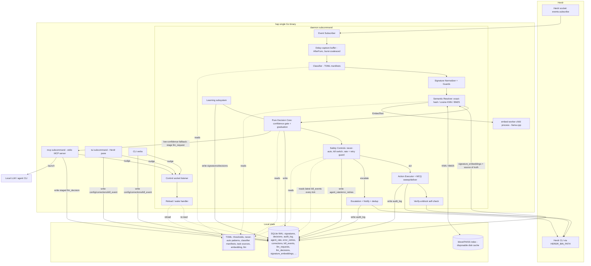
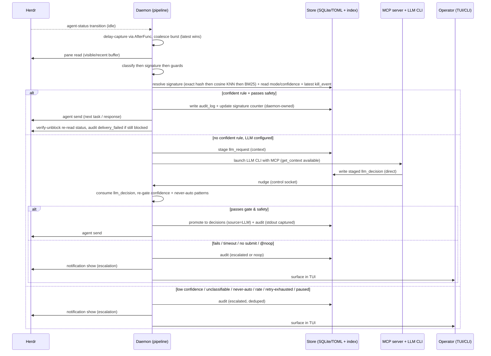
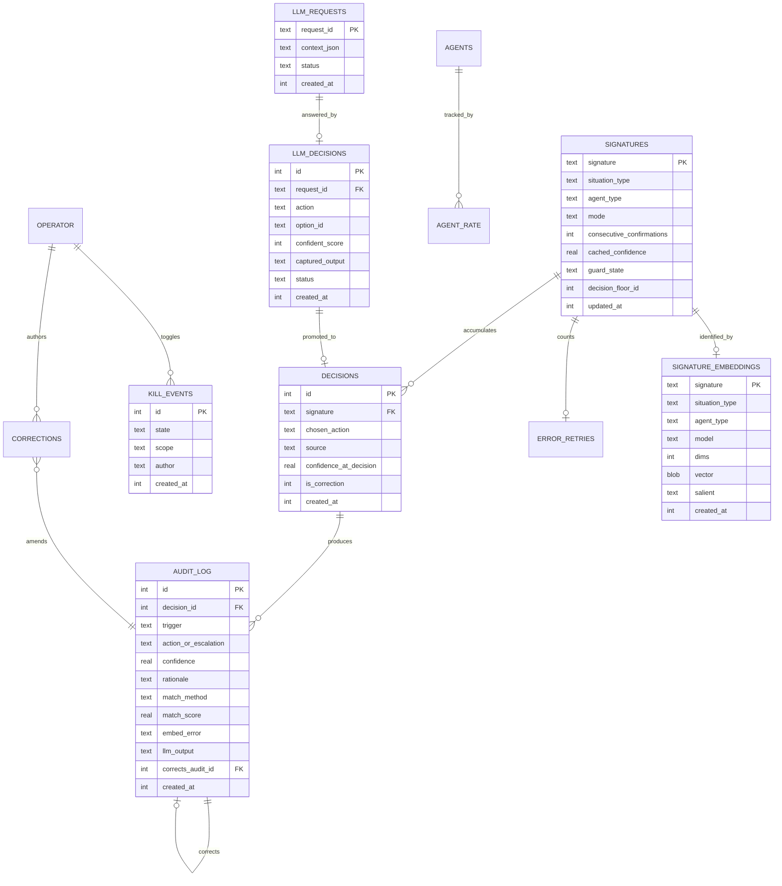

# Architecture — Herd Auto Prompter (hap)

> **Single source of truth** for the Herd Auto Prompter Herdr plugin's design.
> Consolidated from the original constitution, requirements, and solution specs
> (now removed) and **reconciled against the shipped code** (module
> `github.com/0xGosu/herdr-auto-pilot`, manifest `herd-auto-prompter` v0.4.24,
> `min_herdr_version` 0.7.0). This document is the authoritative single-page view
> of *what the system is and why it is built this way*, current to the code, and
> still carries the requirement ids (FR/NFR/DR/IR) that code comments reference.
>
> Where the implementation evolved past the original specs, this doc follows the
> code and flags the addition inline (chiefly: the semantic-matching stack, the
> out-of-process embed worker, the daemon-resilience packages, delay-captured
> events, escalation dedup, post-action verify-unblock, and the expanded MCP
> review surface).

## 1. Purpose & Vision

Operators who run many coding agents inside [Herdr](https://herdr.dev) must
babysit every pane: an agent finishes a step and idles, blocks on an approval,
asks a multiple-choice question, or stalls on an error — and nothing progresses
until a human responds. Across a herd of parallel agents this manual attention
is the bottleneck.

**Herd Auto Prompter (hap)** is a Herdr plugin that monitors every agent
session, detects when an agent needs input, and supplies the next prompt or the
correct response — choosing actions *the way this operator would*, learned from
their own past decisions. It advances agents unattended when confident and
escalates to the human when not, so the operator's judgment scales across the
fleet without being replaced by it.

**Target user:** a single operator (engineer / solution architect) driving
multiple agents concurrently, who wants hands-free progress while retaining full
control and auditability.

## 2. Guiding Principles

These principles are load-bearing — every design decision below traces to one.

1. **Learned, not guessed.** Every automated choice is traceable to the
   operator's own observed decisions or explicitly declared preferences.
2. **Confidence-gated autonomy.** The plugin acts automatically only when
   learned confidence exceeds a configured threshold; below it, it escalates.
3. **Safety over throughput.** When a safety rule and an automation opportunity
   conflict, safety wins — always.
4. **Total auditability.** Every automatic decision is recorded with its
   trigger, action, confidence, match method, and rationale.
5. **Fail-safe by construction.** On any uncertainty or error the daemon
   degrades to "do nothing and escalate" — never crash a pane, never take an
   action it cannot explain. *Every optional subsystem (semantic matching, LLM
   fallback, task generation) degrades rather than blocks.*
6. **Local and private by default.** Learning data, history, and audit logs stay
   on the operator's machine. No telemetry. Data leaves only through the local
   LLM CLI the operator explicitly configures.
7. **Reversible and interruptible.** A global pause/kill switch halts all
   automation instantly; irreversible operations are never automated.
8. **Host-respecting integration.** Herdr owns the host surface; the plugin uses
   the documented plugin/CLI/socket API and pins `min_herdr_version`.

## 3. Scope — the Four Situations

hap classifies each attention-requiring transition into exactly one of four
in-scope situations, or `unclassifiable` (which escalates):

| Situation | Trigger | Automated behavior |
|---|---|---|
| **Idle / finished** | Agent completed a step and is idle | Prompt toward the next task (declared task source → explicit structured todo in pane history → optional LLM/generator → escalate) |
| **Approval / permission** | Agent awaits a yes/no or permission confirm | Send learned yes/no when confident and not never-auto |
| **Multiple-choice** | Agent asks the operator to pick an option | Select the learned option; unfamiliar option set → escalate |
| **Error / retry** | Agent stalled on an error | Learned retry / skip / escalate, capped at 2 automated retries per error signature |

Single **Operator** role; multi-user access is explicitly out of scope.

## 4. Technology Constraints

| Concern | Choice | Rationale |
|---|---|---|
| Language / distribution | **Go**, single static binary; subcommands `daemon` / `tui` / `mcp` / `embed-worker` / CLI verbs | No runtime dependency; strong concurrency for the monitor loop |
| Herdr events | **Raw socket** `events.subscribe` (JSON) | Long-lived agent-status subscription |
| Herdr actions | **CLI via `HERDR_BIN_PATH`** (`agent send`, `pane read`, `pane send-keys`, `pane get`, `pane zoom`, `agent list`, `notification show`) | Portable across Unix socket / Windows named pipe |
| History / audit | **Embedded SQLite (WAL)** | Transactional, corruption-safe concurrent access, queryable |
| Operator config / rules | **TOML** in the plugin config dir | Hand-editable thresholds, never-auto patterns, classifier manifests, task sources, embedding tuning |
| Daemon coordination | **Unix-domain control socket** (named pipe on Windows) | Sub-second reload propagation, no idle polling |
| Semantic matching | **llama.cpp embedder** (`all-minilm-l6-v2-q8_0.gguf`) + **bleve/FAISS** vector index | Paraphrases of a learned situation match the same rule; degrades to BM25 then exact-hash |
| LLM fallback | **Local LLM/agent CLI** launched with an attached **stdio MCP server** | Agent-native; the model submits its decision via MCP tools, not parsed stdout |
| Classification | **TOML regex/keyword manifests per agent type** | Deterministic, golden-testable |
| TUI | Go TUI framework (Bubble Tea) run as a Herdr pane | Primary control surface; CLI mirrors every capability |

**Build tags.** The native semantic stack is gated so a tag-free build still
works (BM25/exact-hash only): **`cpu`** selects the CGO llama.cpp embedder
engine (`engine_cpu.go`; `engine_stub.go` is the no-CGO fallback), and
**`vectors`** enables bleve's FAISS-backed KNN (`knn_vectors.go`;
`knn_novectors.go` degrades to BM25). Production/CI builds and test with
`-tags "vectors cpu"`.

**Platform.** Linux + macOS first; Windows is a follow-up. The control channel
abstracts Unix socket vs. named pipe so no platform-locked API sits on the
daemon/action path.

## 5. High-Level Architecture

The daemon runs an event pipeline:
**subscribe → (delay-capture) → classify → signature → resolve (semantic) →
decide (gate + safety) → (act | escalate) → log → verify-unblock.**

The decision/learning **domain is pure and Herdr-agnostic** (`internal/domain`)
— it imports nothing from Herdr, SQLite, or the LLM; `TestDomainPurity` enforces
this. All side effects live behind ports, with adapters at the edges. Optional
host capabilities are **optional interfaces** type-asserted at the call site, so
a missing capability degrades gracefully rather than breaking every fake.

### Decision sequence (idle agent, with LLM fallback)

## 6. System Modules

Layered as `cmd → domain (pure) → adapters`, with `internal/daemon` the pipeline
spine (`daemon.go`, `semantic.go`, `sweep.go`).

### Ports (adapter boundary — `internal/ports`)

The domain depends only on interfaces. **Core ports:** `HerdrPort` (send/read),
`EventPort` (event subscription), `StorePort` (persistence), `LLMPort`,
`NotifyPort`. **Optional capabilities** (type-asserted, degrade if absent):
`LocatorPort` (workspaces/tabs), `InspectorPort` (pane info/cwd), `FocusPort`
(focus a pane), `EmbedderPort` (semantic embeddings), `TaskGeneratorPort`
(generate a next task via CLI). Each has fakes for unit tests
(`internal/fakeherdr`).

### Pipeline (daemon)

- **Event Subscriber** *(`EventPort`, inbound — `internal/herdr`)* — maintains the
  raw-socket `events.subscribe` connection, delivers `AgentTransition` into the
  pipeline, tracks the monitored-agent set, reconnects with exponential backoff.
  Never sends input while disconnected.
- **Delay-capture** *(daemon)* — an attention transition is **not** classified
  immediately: a per-pane `time.AfterFunc` waits `capture_delay` (default ~10 s
  on an agent's first event, ~2 s after) then re-enters the main loop via
  `delayedTr`, so the agent TUI has painted and event bursts coalesce (latest
  wins, one capture per burst).
- **Classifier** *(`internal/classify`, config-driven)* — classifies pane content
  into `idle | approval | choice | error | unclassifiable` using per-agent-type
  TOML regex/keyword manifests. No match or parse error → `unclassifiable`.
- **Signature Normalizer** *(pure — `internal/domain`)* — produces a stable
  *situation signature* and applies guards (§7).
- **Semantic Resolver** *(`daemon.resolveSignature` + `internal/match`,
  `internal/embedder`, `internal/reembed`)* — maps the freshly computed signature
  onto a learned key via embedding + vector search, falling back to BM25 then
  exact hash (§7). Degrades, never blocks.
- **Decision Core** *(pure — `internal/domain`)* — computes confidence, enforces
  thresholds and graduation, applies per-situation resolvers, decides
  `act | escalate | consult-LLM` (§8).
- **Safety Controls** *(pure + config — `internal/domain`)* — never-auto matcher,
  suspected-irreversible heuristic, kill switch, runaway guard, per-error retry
  ceiling. Any control can veto any action (§9).
- **Action Executor** *(`HerdrPort`, outbound — `internal/herdr`)* — delivers
  decided input via `agent send` + `pane send-keys enter`, reads panes, emits
  notifications. For multi-tab MCQ forms it uses the **sweep** (`sweep.go`,
  Right-arrow protocol) to capture every tab and `internal/mcqdeliver` to press
  the answer series **adaptively** (digit → re-read → Enter only if the answer
  didn't commit), because a digit commits on plain option lists but only moves
  the caret on preview forms. Never acts without a durably-committed audit record.
- **Verify-unblock** *(`internal/verifyunblock`)* — after delivering a reply to a
  blocked agent, re-queries status a moment later (`verify_unblock_ms`); if still
  blocked, appends a `delivery_failed` diagnostic audit row.
- **Escalation** *(daemon)* — routes uncertain paths to escalate + audit + notify,
  with a **dedup window** (`escalation_dedup_window_seconds` + jitter,
  `domain.NormalizeForDedup`) so a re-fired identical situation doesn't spam the
  operator; a resolved-window dedup gates on a *delivered* answer.

### Learning Subsystem *(domain, daemon-owned writer)*

Records confirmations/corrections, updates graduation counters, keeps graduation
permanent (a correction records a decision but never auto-demotes a graduated
signature), maintains correction lineage. Operator *correction records* are
written directly by front-ends; the daemon **re-derives** the affected
signature's counters from those records on reload. The sole exception is an
explicit operator **reset**, which writes a graduated signature back to shadow
directly (and stamps a `decision_floor_id`).

### Semantic stack *(`internal/embedder`, `internal/match`, `internal/reembed`)*

- **Embedder** — adapts llama.cpp bindings to `EmbedderPort`, loading the bundled
  MiniLM GGUF **CPU-only**. The production embedder runs the CGO engine in an
  **out-of-process `hap embed-worker` child** over a framed pipe: a native
  `GGML_ASSERT → SIGABRT` is uncatchable in Go, so isolating it in a child turns
  a crash into a transport error instead of killing the daemon (fix for #60). It
  **latches a degraded mode after 3 consecutive failures** (fast-fails
  `ErrDegraded` thereafter), is **stall-guarded** (2 s warm / 30 s cold-load
  timeouts, raced via `select`), truncates input to the model context window to
  avoid a position-embedding SIGABRT, and L2-normalizes vectors. `Dims()` stays 0
  until the first successful embed, keeping the daemon select loop off the cold
  model load.
- **Matcher** — a **bleve v2** index (disk-backed under the state dir) providing
  scoped KNN (FAISS via the `vectors` tag) and BM25 text search. **SQLite
  `signature_embeddings` is the source of truth; the index is a disposable cache**
  rebuilt from SQLite at daemon start and on model change (mem-only scorch does
  not serve KNN, so it must stay disk-backed). Rebuild happens off-lock into a
  generation dir, then swaps.
- **Reembed** — reconciles persisted `signature_embeddings` with the currently
  configured model (re-embeds rows whose model/dims drift), shared by
  `initSemantic` and the `hap signatures reembed` maintenance path; a newer
  generation can abort a stale pass.

### MCP LLM Adapter *(`LLMPort` — `internal/llm`, `internal/mcpserver`)*

For low-confidence situations with an LLM configured, the daemon stages an
`llm_request` (context) and launches the operator's LLM/agent CLI with an
attached stdio MCP server (the `mcp` subcommand) exposing `get_context` and
`submit_decision`. The submitted decision is staged as an `llm_decision`, then
**re-gated by the same confidence + never-auto controls** before it can act.
Stdout/stderr are captured for audit only. No submit / timeout → escalate.

### Resilience *(`internal/daemonlock`, `internal/daemonhealth`, `internal/crashguard`)*

- **daemonlock** — a file lock guaranteeing a single monitoring daemon per state
  directory, recording holder pid + version so `hap daemon --ensure` can replace
  a daemon spawned by an older binary.
- **daemonhealth** — a persisted heartbeat the live daemon refreshes, so
  out-of-process commands (`hap status`, TUI) can tell a healthy daemon from a
  hung/degraded one (a flock alone can't reveal a wedged process).
- **crashguard** — turns a crash-loop into a graceful self-limiting degrade:
  records each boot, and when boots cluster too tightly it auto-disables the
  embedder (latching) or stops respawning.

### TUI / CLI / shared frontend *(`internal/tui`, `internal/cli`, `internal/frontend`)*

`internal/frontend` is the **shared view/command layer** both front-ends use, so
TUI and CLI have identical functionality (FR-022): monitored agents, pending
escalations, audit log + corrections, tasks, threshold/rule editing, pause/kill
and its history. Operator-owned mutations are written directly to the DB/TOML in
a transaction, then the daemon is nudged to reload. Front-ends never write
daemon-owned hot-path rows.

## 7. Situation Signatures, Guards & Semantic Resolution

### Signature construction

A **situation signature** is the normalized fingerprint used to match a live
situation against past decisions (`domain.ComputeSignatureN`). It retains:

- The **situation type** and **agent type** — signatures are scoped per agent
  type, so one agent's habits never leak into another's.
- The **salient decision content** — the normalized option set (multiple-choice),
  or the permission verb/action **plus** the normalized option set (approval).
  Folding options into approvals keeps different screens that share a verb (a
  plan approval and a command approval both phrased "…to proceed?") from
  colliding into one rule. *(Exception: the remote-environment picker is exempt —
  its environment labels are the learned action.)*
- **Masked volatile tokens** — absolute paths, hashes, line numbers, timestamps,
  UUIDs, and similar spans become typed placeholders, so prompts differing only
  in volatile tokens collapse to one signature.

`SignatureResult.Raw` is the never-remapped literal content hash; `.Signature`
is the (possibly remapped) learning key; `.Salient` is the masked salient text.

Two guards keep signatures honest:

- **Variance guard.** If decisions under one signature show high disagreement, it
  is treated as low-confidence and escalated until the operator disambiguates.
- **Over-masking floor.** If normalization masks away most salient content, the
  situation is `unclassifiable` and escalated rather than matched on a degenerate
  signature.

### Semantic resolution chain *(`daemon.resolveSignature`)*

Because operators phrase and agents render the "same" situation many ways, the
daemon resolves a fresh signature to a learned key through a **degrade-never-block**
fallback chain (each step stamps a `match_method` recorded in the audit log):

1. **Pass-through** — if the signature is empty, `embedding.disabled`, or the
   index isn't ready yet → keep the hash key (`match_method = exact`).
2. **Exact-hash fast path** — if the raw hash is already a known signature → reuse
   it without ever calling the embedder (`exact`).
3. **Cosine vector search** — embed the salient text, KNN within the
   `(situation_type, agent_type)` scope; a hit at cosine ≥ `similarity_threshold`
   (default **0.90**) remaps onto the learned key (`cosine`). Approvals
   additionally require compatible option sets (`ApprovalRemapCompatible`,
   issue #155) so a shared verb can't merge different screens.
4. **BM25 text fallback** — when no embedding is available (embedder degraded,
   errored, or a `!vectors` build), normalized-BM25 text match at score ≥
   `bm25_min_score` (default **0.35**) remaps (`bm25`).
5. **Mint new** — no match keeps the raw hash as a new key and persists its
   semantic identity (`signature_embeddings` row: salient always, vector when
   available) so later paraphrases can match it. Write/index failures only cost
   *future* matching; the decision continues on the hash key.

Any embed/match error is recorded (`embed_error`) so an escalation can explain
why it fell back. The whole chain never panics and never stalls the select loop.

## 8. Learning & Decision Model

**Modes (per signature).** *Shadow* — the plugin suggests, the operator
confirms/corrects, no autonomous action. *Autonomous* — the plugin acts
automatically when confidence clears the threshold.

**Confidence** is a recency-weighted agreement ratio over a signature's decision
history (recent decisions weigh more). An explicit **operator confirmation**
weighs more than a passive auto-send or an aging vote (`learning.confirmation_weight`,
default 3×); corrections are not boosted.

**Graduation (shadow → autonomous)** requires BOTH (a) **N consecutive
consistent confirmations** (`learning.graduation_n`, default 2) AND (b)
confidence above the applicable threshold.

**Graduation is permanent.** Once autonomous, the confirmation count is frozen; a
later correction is still recorded (so confidence and the gate reflect it, and a
run of corrections can drop confidence below threshold and force escalation) but
the mode never auto-reverts. The only path back to shadow is an **explicit
operator reset**, which zeroes the count and stamps a `decision_floor_id`
(pre-reset decisions become history-only, excluded from confidence and
graduation, so the score reads a fresh 1.0) while still surfacing the learned
answer as the suggestion — trust is re-earned by re-confirming.

**Per-situation thresholds.** Each situation type (idle, approval, choice, error)
has its own operator-configurable confidence threshold.

**Per-situation resolvers:**

- **Idle** — next-task resolution in priority order: (1) operator-declared task
  source (next unchecked item); (2) fallback inference from an agent-emitted
  explicit structured signal (todo/checklist/numbered plan) — gated only by the
  variance-guard **minimum-agreement floor** (`confidence_thresholds.minimum`),
  not the
  higher idle threshold; (3) optionally a configured **task generator**
  (`TaskGeneratorPort`, `task_generate_command`) or the LLM. Free-form prose is
  *not* inferable. If nothing confident is available → escalate; never synthesize
  an arbitrary "continue".
- **Approval / choice** — learned yes/no or learned option match; unfamiliar
  option set → escalate.
- **Error** — learned retry/skip/escalate, bounded by the daemon-owned
  per-error-signature retry ceiling (`limits.max_error_retries`, default 2); on
  exhaustion → force escalate.

**`@noop` decisions.** An explicit "no reply needed" answer (from the LLM or a
learned rule) is audited and learned like any decision — the runaway counter
advances — but nothing is sent to the pane, breaking the LLM↔agent nudge loop on
idle/done status reports. A `@noop` still keys the resume-dedup so a self-flapping
agent can't silently re-fire it forever.

**Hybrid LLM fallback.** When no confident learned rule applies and an LLM is
configured, the plugin may consult it — but any LLM-derived action re-enters the
same confidence gate and safety controls. On LLM unavailability, timeout, or
unparseable output → escalate.

## 9. Safety Controls

Safety controls are first-class components on the action path; each can veto any
automated action.

- **Never-auto allowlist.** Regex/keyword patterns for irreversible operations
  (force-push, destructive filesystem ops, deploy/publish, credential changes).
  Any match is escalated regardless of confidence or mode. A default seed set
  ships; the operator extends it via TOML (`safety.never_auto_rules`).
- **Corpus regression gate.** Seed patterns are validated against a maintained
  corpus of known irreversible-op prompts
  (`internal/domain/testdata/irreversible_corpus.txt`); CI fails if any entry
  goes unmatched.
- **Suspected-irreversible heuristic.** A prompt showing destructive indicators
  (`safety.indicator_rules`) but matching no allowlist pattern biases toward
  escalation.
- **Global pause/kill switch.** Instantly halts all automated prompting across the
  herd, from either the TUI or CLI. Implemented as an **append-only event table**
  — the daemon reads the *latest row every pipeline tick*, so a kill takes effect
  immediately even before the reload nudge arrives, while every toggle is
  preserved for audit.
- **Runaway-loop guard.** Per agent: no more than **10 consecutive** automated
  prompts without intervening human interaction, and no more than **5 per
  minute** (`limits.max_consecutive_auto_prompts` default 10,
  `max_auto_prompts_per_minute` default 5). On either ceiling, automation for
  that agent pauses and escalates.
- **Escalation on uncertainty.** Every uncertain path routes to escalate + audit
  + notify — never a silent drop.

## 10. Data Model

Persistence is **SQLite (WAL)** (`internal/store`, schema is one embedded Go
string plus additive `ALTER TABLE` migrations) for history/audit, **TOML** for
operator-editable config, and a **disposable bleve index** cache on disk.

**Tables (`internal/store/store.go`).**

| Table | Role |
|---|---|
| **signatures** | Per-signature learning state: mode, confirmations, cached confidence, guard state, `decision_floor_id` (operator reset) |
| **decisions** | Every learned/observed decision (operator/rule/LLM), incl. corrections; feeds confidence and lineage |
| **audit_log** | Append-only trail; records `match_method`/`match_score`/`embed_error` (resolution provenance), `llm_output`, and `corrects_audit_id` lineage |
| **agent_rate** | Per-agent consecutive/windowed counters + pause flag for the runaway guard |
| **error_retries** | Daemon-owned per-error-signature retry counter; reset on resolution/correction |
| **corrections** | Front-end-written correction records amending an audit entry; consumed by the daemon |
| **kill_events** | Append-only pause/kill/resume log; latest row = current effective state |
| **llm_requests** | Daemon-staged LLM context (`get_context` reads these) |
| **llm_decisions** | `mcp`-written LLM submission (`submit_decision`); consumed, re-gated, promoted into `decisions` |
| **llm_retries** | Queue of audit rows to re-ask the LLM about |
| **signature_embeddings** | **Semantic source of truth** — vector + salient per signature, scoped by situation/agent type |
| **signature_snapshots** | Pane-excerpt provenance per signature (inspection/debugging) |
| **agent_names** | Friendly short-name mapping + per-agent disabled flag + terminal id |
| **operator** | Single operator identity row anchoring correction/kill authorship |

TOML config (not in SQLite): per-situation `confidence_thresholds` (+ the
minimum-agreement floor is `confidence_thresholds.minimum`), `learning`
(graduation N, confirmation
weight), `limits` (error-retry ceiling, rate ceilings, escalation-dedup window +
jitter), `safety` (never-auto + indicator rules, seed toggles), classifier
manifests, `capture_delay`, `verify_unblock_ms`, `task_sources` (+ generate
command), `embedding` (model_path, similarity/BM25 thresholds, gpu_layers,
context window, disabled), `llm` (argv template + timeout, optional
rewrite-action review), and `tui` palette.

## 11. Concurrency & Durability

Two concerns are kept separate:

1. **Corruption safety** is guaranteed by **SQLite WAL + `busy_timeout` + strict
   transactions**. All processes run on the same host/filesystem; under WAL,
   concurrent writers are serialized and readers proceed concurrently. Multiple
   processes writing the same file does **not** corrupt it — no application-level
   command inbox is needed.
2. **Logical correctness** (no lost updates on hot rows) is solved by
   **write-ownership partitioning**:
   - **Daemon-exclusive (hot path):** `signatures` counters/mode, `agent_rate`,
     `error_retries`, `signature_embeddings`, daemon-emitted `audit_log` /
     `decisions`, and consumed-then-promoted `llm_requests`/`llm_decisions`. No
     other process writes these, so the daemon's read-modify-write is race-free.
   - **Front-end direct (operator-owned):** TOML config/rules, `corrections`,
     `kill_events` — append-only inserts or independent rows.
   - **`mcp` staged:** `llm_decisions` inserts only; the daemon consumes these and
     derives any hot-path effect itself.
   - **`agent_names`** sits outside the partition: insert-if-absent from both
     daemon and front-ends (concurrent inserts converge; renames front-end-owned).

**Propagation without polling.** After a direct/staged write, the writer sends a
payload-free **nudge** over the daemon's control socket (`internal/control`); the
daemon reloads TOML and re-reads operator/staged rows — sub-second, no idle poll.
The pause/kill switch is the exception that is *not* nudge-dependent: the daemon
reads the latest `kill_events` row every tick, so a kill halts automation
immediately even if the nudge is delayed.

## 12. Protocol Surfaces

**Herdr (external, consumed).**
- Events (raw socket): `events.subscribe` for agent-status transitions.
- Actions (CLI via `HERDR_BIN_PATH`): `agent send` (writes text without Enter —
  follow with `pane send-keys <pane> enter`), `pane read` (`--source
  visible|recent`), `pane get` (cwd/ids), `pane zoom`, `agent list`,
  `notification show`. *(Agent status is driven off the events socket, not a
  `wait agent-status` CLI call.)*

**Daemon control socket (internal).** Unix-domain socket (named pipe on Windows)
in the plugin state dir. Messages: `{ "kind": "reload" | "wake" }` — no domain
payload, idempotent and debounced.

**MCP tool surface (internal, exposed to the LLM agent — `internal/mcpserver`).**
Exactly two tools:
- `get_context(request_id?)` → the staged situation: `situation_type`,
  `agent_type`, options / permission verb, history summary, and (for pre-send
  reviews) an optional `proposed_task` / `proposed_action`.
- `submit_decision(request_id?, recommend_action?, select_options?,
  confident_score, rationale)` — writes a `pending` `llm_decision` row and nudges
  the daemon, which re-gates it before promoting/acting. **`confident_score`
  (0–100) is required** — the daemon auto-acts only when it meets the operator's
  threshold, else it surfaces the decision for confirmation. Per-situation
  contract (enforced with a tool error so the model self-corrects): menu-bearing
  `approval`/`choice` (incl. multi-tab forms) answer via `select_options`
  (1-based option numbers; **one entry per tab in order, Submit included**; a
  **multi-select** tab takes a nested array of numbers to toggle, e.g.
  `[1, [1, 3], 2]`); menu-less approval/choice and `idle`/`error` answer via
  `recommend_action` literal text. *(A legacy `action` alias for `recommend_action`
  is still accepted.)*
- **Sentinels** (valid `recommend_action` values): `@noop` (do nothing);
  `@next_task:declared` (send the reviewed `proposed_task` verbatim);
  `@proposed_action:send` (send the reviewed learned reply unchanged). Free text
  like "do nothing" is NOT normalized to `@noop`.
- Multi-tab MCQ delivery is one digit keystroke per tab (the form advances
  itself); a length mismatch between the answer series and `tab_count` is rejected
  rather than partially delivered.

**Escalation error codes** — every rejected/failed path resolves to
**escalate + audit**, never a silent drop: `unclassifiable`, `below_threshold`,
`variance_guard`, `over_masked`, `never_auto_match`, `suspected_irreversible`,
`rate_limited`, `retry_exhausted`, `daemon_paused`, `llm_timeout`,
`llm_no_submit`, `herdr_unreachable`, `persistence_failed`.

## 13. Security & Privacy

- **Single operator, no network auth surface.** The plugin runs as the operator's
  user per Herdr's trust model and adds no listeners beyond the local control
  socket, the MCP stdio channel, and the Herdr socket it consumes.
- **Untrusted pane content.** Pane text is masked during signature generation and
  scanned by never-auto/heuristic controls before any auto-action; MCP arguments
  and control-socket messages are validated and re-gated. Malformed input fails
  safe to escalation.
- **Fully local, no telemetry.** No pane content leaves the machine except to the
  operator-configured local LLM CLI (the embedder is fully local). SQLite/TOML/
  index live in the plugin's config/state dir with normal user permissions; the
  control socket is owner-only; the operator can clear/reset learned and audit
  data (`hap clear-data`). A dedicated no-egress test (`internal/privacy`) asserts
  NFR-007.

## 14. Key Design Decisions

- **WAL DB with partitioned write ownership** *(vs. a polling command inbox).*
  SQLite WAL already makes concurrent multi-process writes corruption-safe, so an
  inbox is unnecessary; the real hazard (read-modify-write on hot rows) is solved
  by daemon-exclusive ownership of those rows while front-ends write
  operator-owned data directly. Lower latency, simpler model.
- **Semantic matching that degrades, never blocks** *(added post-spec).* Embedding
  + vector KNN over masked salient content lets a rule learned for one phrasing
  auto-answer a paraphrase, falling back to BM25 then exact hash. SQLite is the
  source of truth; the bleve/FAISS index is a disposable disk cache. Every embed
  call is stall-guarded and latches degraded after repeated failures.
- **Out-of-process embed worker** *(fix for #60).* The llama.cpp engine runs in a
  `hap embed-worker` child so an uncatchable native `SIGABRT` becomes a Go
  transport error instead of crashing the daemon.
- **Staged `llm_requests`/`llm_decisions` promoted by the daemon** *(vs. the `mcp`
  process writing `decisions` directly).* Keeps the LLM submission subject to the
  same confidence + never-auto controls before it becomes authoritative, and keeps
  the daemon the sole writer of learning state.
- **Append-only pause/kill event log** *(vs. a single mutable flag row).* Gives
  the daemon an instant, always-readable current state (latest row per tick) plus
  a full historical audit of every toggle.
- **Control-socket nudge + always-read latest kill row** *(vs. OS signals /
  config-version polling).* Immediate, payload-free reloads with no idle cost;
  safety never depends on nudge delivery.
- **Delay-captured, burst-coalesced events** *(added post-spec).* A per-pane
  `AfterFunc` waits for the agent TUI to paint and coalesces event bursts, so one
  capture per burst is classified against settled content.
- **Adaptive MCQ delivery** *(added post-spec).* Because a digit commits on plain
  option lists but only moves the caret on preview forms, delivery presses the
  digit, re-reads, and presses Enter only if the answer didn't commit — never a
  blind keystroke series.
- **MCP-mediated LLM contract** *(vs. JSON-over-stdout).* Agent-native: the model
  calls `submit_decision`/`get_context`, stdout is captured for audit only, and
  the submission is re-gated so the LLM never bypasses safety controls.
- **Deterministic TOML classification manifests** *(vs. an LLM classifier).*
  Transparent, golden-testable, zero-dependency; the LLM assists decisions only.
- **Layered pure decision core with ports/adapters + optional interfaces.**
  Satisfies the Herdr-agnostic pure-core rule and lets optional host capabilities
  degrade gracefully without breaking every fake.

## 15. Testing Strategy (architecture-level)

- **Unit (mandatory):** the pure decision core — confidence math,
  threshold/graduation/reset, per-situation resolvers — table-driven.
- **Golden:** classifier + signature normalization over recorded pane transcripts
  (all situation types), incl. volatile-token masking and guard trips
  (`internal/classify/testdata`).
- **Safety-invariant (mandatory, non-negotiable):** never-auto patterns block the
  maintained corpus (CI-enforced); the kill switch halts all action on the next
  tick even without a nudge; the confidence gate blocks low-confidence auto-acts;
  the suspected-irreversible heuristic escalates unmatched destructive prompts;
  the error retry ceiling forces escalation on exhaustion.
- **Concurrency:** WAL under concurrent daemon + front-end + `mcp` writes shows no
  lost updates on partitioned ownership; nudge-driven reload propagates within
  budget; the latest kill event is honored under a delayed nudge.
- **Semantic:** with the real MiniLM model + FAISS index, a rule learned for one
  approval auto-answers a paraphrase (cosine ≥ 0.90) and leaves an unrelated one
  alone; degraded-latch and BM25/exact-hash fallbacks are exercised. Model-gated
  cases skip when the GGUF is absent.
- **Integration:** the full monitor → decide → act loop against a faked Herdr
  (`internal/fakeherdr`), plus MCP staging → re-gating → promotion and
  timeout → escalate, plus per-adapter panic injection. A separate
  `test/integration/` suite (build-tagged) drives a **real** herdr and optionally
  a real Claude CLI, skipping when a dependency is absent.
- **Portability:** build + integration suite on Linux and macOS; the control
  channel abstracts Unix socket vs. named pipe so a Windows build stays achievable.

## Appendix A — Requirements Reference (FR / NFR / DR / IR)

The requirement ids below are referenced throughout this document and in code
comments. They are preserved here from the original requirements spec (now
consolidated into this doc). Success criteria (SC-1…8) are called out inline in
the sections they gate.

### Functional Requirements

| Id | Title | Requirement (the plugin SHALL…) |
|---|---|---|
| **FR-001** | Continuous herd monitoring | Continuously monitor all agent sessions and react to agent-status transitions without polling; the monitored set updates automatically as agents start/stop. |
| **FR-002** | Situation classification | Classify each attention-requiring transition into exactly one of the four in-scope situations, or `unclassifiable` (which triggers escalation). |
| **FR-003** | Situation signature generation | Derive a stable signature retaining situation type, agent type, and salient content (option set, or permission verb + option set), masking volatile tokens, scoped per agent type. |
| **FR-003a** | Signature collision / over-generalization guard | Escalate over-general signatures (high decision variance) until disambiguated, and treat over-masked prompts as `unclassifiable` rather than matching on a degenerate signature. |
| **FR-004** | Shadow-mode observation | In shadow mode for a signature, present a suggested action and record the operator's confirmation or correction as a learning event. |
| **FR-005** | Confidence computation | Compute confidence as a recency-weighted agreement ratio over a signature's decisions; an operator confirmation weighs more than a passive auto-send or aging vote (configurable, default 3×). |
| **FR-006** | Shadow-to-autonomous graduation | Graduate a signature to autonomous only when BOTH N consecutive consistent confirmations (`learning.graduation_n`, default 2) AND confidence above the applicable threshold hold. |
| **FR-007** | Permanent graduation; operator reset | Keep graduation permanent (a correction is recorded but never auto-demotes); the only path back to shadow is an explicit operator reset, which zeroes the count and stamps a decision-id floor excluding pre-reset decisions from confidence/graduation. |
| **FR-008** | Confidence-gated autonomous action | Auto-execute the learned action only when confidence exceeds the per-situation threshold and no safety control blocks; otherwise escalate. |
| **FR-009** | Per-situation-type thresholds | Support a distinct, operator-configurable (TOML) confidence threshold per situation type (idle, approval, choice, error). |
| **FR-010** | Hybrid decision with LLM fallback | Optionally consult a configured local LLM/agent CLI when no confident rule applies; any LLM-derived action is re-gated by the confidence gate + safety controls, and on LLM unavailability escalate. |
| **FR-011** | Idle / finished behavior | Prompt the next task via (1) operator-declared task source, else (2) an explicit structured pane-history todo gated by the minimum-agreement floor; if neither is sufficiently confident, escalate — never synthesize an arbitrary "continue". |
| **FR-012** | Approval / permission behavior | Select the learned yes/no response when confident and not blocked by the never-auto allowlist. |
| **FR-013** | Multiple-choice behavior | Select the learned option matching the choice signature; if the option set is unfamiliar, escalate. |
| **FR-014** | Error / retry behavior | Choose the learned retry/skip/escalate action, bounded to a max of 2 automated retries per error signature, after which force escalation. |
| **FR-015** | Never-auto allowlist | Escalate any situation whose prompt content matches a never-auto (irreversible-op) allowlist entry, regardless of confidence or mode; never auto-execute it. |
| **FR-016** | Allowlist seeding, extension & coverage safety | Ship a corpus-validated seed allowlist, allow operator extension via TOML regex/keyword patterns, and bias toward escalation on destructive-looking prompts that match no pattern (suspected-irreversible heuristic). |
| **FR-017** | Global pause / kill switch | Provide a global pause/kill switch (TUI + CLI) that instantly halts all automated prompting across the herd within a small bounded delay. |
| **FR-018** | Escalation on uncertainty | Take no action and notify the operator whenever a situation is unclassifiable, below threshold, guard-tripped, suspected-irreversible, or otherwise ineligible for autonomous action. |
| **FR-019** | Runaway-loop guard | Bound automated prompting per agent to ≤ `max_consecutive_auto_prompts` consecutive auto-prompts without intervening human interaction AND ≤ `max_auto_prompts_per_minute` per minute (defaults 10 and 5); on either ceiling, pause automation for that agent and escalate. |
| **FR-020** | Full audit log | Record every automated decision and escalation with its trigger, situation type, chosen action (or escalation), confidence, rationale (rule/LLM), and timestamp. |
| **FR-021** | Post-hoc correction | Let the operator review the audit log and correct any past automated decision, feeding the correction back into learning (per FR-007) and recording it in the audit trail. |
| **FR-022** | Equivalent TUI and CLI | Expose a TUI (Herdr pane) and a CLI with identical functionality; mutations from either surface propagate promptly to the running daemon. |
| **FR-023** | Herdr unreachable | If the Herdr socket/CLI is unreachable or a pane read fails, take no automated action, log the condition, and reconnect with backoff. |
| **FR-024** | Persistence failure | If writing the audit/history/config store fails, do not proceed to auto-act and surface the failure via notification. |

### Non-Functional Requirements

| Id | Title | Target (the plugin SHALL…) |
|---|---|---|
| **NFR-001** | Decision latency | Reach a decision within p95 ≤ 1 s on the rules-only path (LLM fallback excluded — governed by its own timeout; the embed call is stall-guarded to 2 s warm). |
| **NFR-002** | Supported herd size | Sustain the NFR-001 latency budget while monitoring up to **25 concurrent agents** on a typical workstation. |
| **NFR-003** | Low idle overhead | Impose near-zero CPU when idle and small steady-state memory, so it runs continuously alongside the herd. |
| **NFR-004** | Fail-safe reliability | Never crash a pane or the herd; handle every error (escalate/log) with zero unhandled daemon panics — native embedder crashes are isolated in a child process. |
| **NFR-005** | Auditability completeness | Represent 100% of automated decisions and escalations in the audit log (1:1 action-to-record ratio); no autonomous action without a corresponding record. |
| **NFR-005a** | Allowlist corpus regression | Maintain and CI-regression-test the irreversible-op corpus so seed patterns match 100% of it; a corpus miss fails the build. |
| **NFR-006** | LLM fallback timeout | Bound LLM consultation by a configurable timeout; on timeout / missing / unparseable output, fail safe and escalate. |
| **NFR-007** | Privacy / no telemetry | Keep all data local; make no outbound calls beyond the Herdr socket and the configured local LLM CLI; emit no telemetry. |
| **NFR-008** | Portability | Run on Linux and macOS, avoiding design that precludes a future Windows build. |
| **NFR-009** | Control-mutation propagation | Reflect a control mutation (esp. pause/kill) issued from TUI/CLI in daemon behavior within a small bounded delay (target ≤ 1 s). |

### Data Requirements

| Id | Title | Requirement (the plugin SHALL…) |
|---|---|---|
| **DR-001** | Learned decision history | Persist decision records: signature, situation type, agent type, chosen/corrected action, source (operator/rule/LLM), confidence at decision time, consecutive-confirmation count, and timestamp. |
| **DR-002** | Audit log | Persist an append-only audit trail of every automated decision and escalation with the FR-020 fields. |
| **DR-003** | Rules & configuration | Persist operator-editable config: per-situation thresholds (+ minimum-agreement floor), graduation N, never-auto patterns, per-agent/workspace task-source references, LLM CLI config + timeout, rate/consecutive ceilings, and pause/kill state — in hand-editable form. |
| **DR-004** | Data locality & retention | Keep all persisted data on the operator's machine; allow the operator to clear/reset learned history and audit data; no pane content leaves the machine except, when configured, to the local LLM CLI. |
| **DR-005** | Correction lineage | Record corrections so the relationship between an original automated decision and its correction is preserved for audit. |

### Integration Requirements

| Id | Title | Requirement (the plugin SHALL…) |
|---|---|---|
| **IR-001** | Herdr event subscription | Subscribe to Herdr agent-status transition events (raw socket `events.subscribe`) to drive monitoring without polling. |
| **IR-002** | Herdr control actions | Send prompts/responses to agents and read pane content via Herdr's documented CLI commands (`agent send`, `pane read`, `pane get`, `pane send-keys`, `agent list`, `notification show`). |
| **IR-003** | Herdr notifications | Surface escalations and critical failures via Herdr notifications in addition to the TUI. |
| **IR-004** | Herdr plugin manifest | Package as a Herdr plugin declaring id/version, pinned `min_herdr_version`, the TUI pane command, event hooks, and build steps in `herdr-plugin.toml`. |
| **IR-005** | Local LLM CLI | Integrate an optional, operator-configured local LLM/agent CLI for the hybrid decision fallback, treating its absence or failure as an escalation trigger. |

