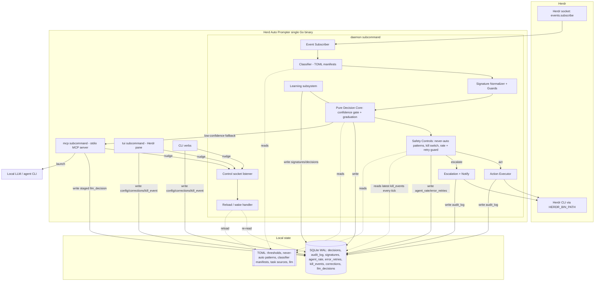
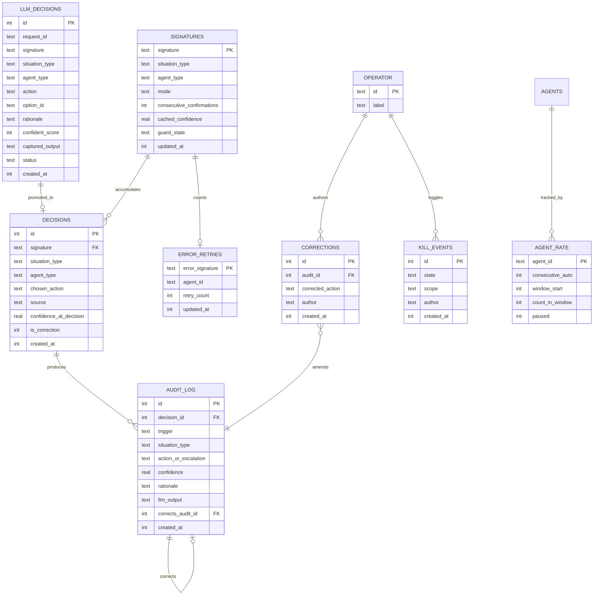

# Solution — Herd Auto Prompter

## Overview

### Description

Herd Auto Prompter is a Herdr plugin that keeps coding agents unblocked hands-free. A single Go binary provides several roles via subcommands — a long-running **daemon** that monitors the herd and decides/acts, a **TUI** control surface (run as a Herdr pane), an equivalent **CLI**, and an **mcp** server used for the LLM fallback. The daemon subscribes to Herdr agent-status transitions, classifies each attention-requiring situation into one of four types (idle, approval, choice, error), derives a normalized *situation signature*, and consults a pure decision core that either auto-acts (when a learned rule clears the confidence gate and all safety controls) or escalates to the operator. Learning is supervised shadow mode: the plugin suggests, the operator confirms/corrects, and signatures graduate to autonomy after sustained agreement. Every decision and escalation is audited.

This solution realizes the requirements within the constitution's constraints: Go single static binary; raw socket for `events.subscribe` + Herdr CLI via `HERDR_BIN_PATH` for actions; SQLite for history/audit + TOML for operator-editable config; local LLM via shell-out (an MCP-mediated contract); event pipeline with a pure, Herdr-agnostic decision core.

### Technology Stack

| Concern | Choice | Rationale |
|---|---|---|
| Language / distribution | **Go**, single static binary, subcommands `daemon` / `tui` / `mcp` / CLI verbs | Constitution mandate; no runtime dependency; strong concurrency for the monitor loop. |
| Herdr events | **Raw socket** `events.subscribe` (JSON) | Long-lived agent-status subscription (constitution). |
| Herdr actions | **CLI via `HERDR_BIN_PATH`** (`agent send`, `pane read`, `agent list`, `wait agent-status`, `notification show`) | Portable across Unix socket / Windows pipe (constitution). |
| History / audit | **Embedded SQLite (WAL)** | Transactional; corruption-safe concurrent access; queryable audit. |
| Operator config / rules | **TOML** in the plugin config dir | Hand-editable thresholds, never-auto patterns, classifier manifests, task sources. |
| Daemon coordination | **Unix-domain control socket** (named pipe on Windows) — reload/wake nudge | Sub-second propagation (NFR-009), no idle polling (NFR-003). |
| LLM fallback | **Local LLM/agent CLI** launched with an attached **stdio MCP server** (`mcp` subcommand) | Agent-native; the model submits its decision via MCP tools rather than parsed stdout. |
| Classification | **TOML regex/keyword manifests per agent type** | Deterministic, golden-testable; mirrors Herdr's own screen manifests. |
| TUI | Go TUI framework (e.g. Bubble Tea) run as a Herdr pane | Primary control surface; CLI mirrors every capability. |

### Design Decisions Summary

- **WAL-based concurrent DB, no polling inbox** — corruption safety comes from **SQLite WAL + `busy_timeout` + transaction discipline**, which serialize concurrent multi-process writes safely; an application-level command inbox is *not* required to keep the file valid.
- **Direct writes + control-socket nudge** — TUI/CLI/`mcp` write *operator-owned* / *staged* data directly to the DB (in transactions) and then nudge the daemon over a Unix-domain control socket to reload. This removes poll latency and meets NFR-009 with no idle cost.
- **Write-ownership split** — the daemon is the **exclusive writer of hot-path rows** (signature graduation/mode counters, `agent_rate` runaway counters, `error_retries` per-error-signature counters, and the `audit_log`/`decisions` it emits); front-ends write *operator-owned* data (TOML config/rules, correction records, pause/kill events), and the `mcp` process writes *staged* `llm_decision` rows the daemon consumes. This prevents read-modify-write races on hot rows without forbidding concurrent DB access.
- **Instant kill switch with full history** — pause/kill is an **append-only event table** (one row per toggle, with author, scope, and timestamp); the daemon reads the **latest row every pipeline tick** to determine current state, so a kill takes effect even before the reload nudge is processed, and every pause/resume/kill is preserved for audit.
- **Deterministic classification** — TOML manifests classify pane content; unknown shapes yield `unclassifiable` → escalate (fail-safe).
- **Pure decision core** — layered `cmd → domain (pure) → adapters`; the domain imports nothing from Herdr, SQLite, or the LLM. Side effects live behind ports (HerdrPort, StorePort, LLMPort, NotifyPort).
- **MCP-mediated LLM** — a per-invocation stdio MCP server exposes `get_context` and `submit_decision`; the submitted decision re-enters the same confidence gate + never-auto patterns before any action; no submit / timeout → escalate, with captured stdout retained for audit only.

## High-Level Architecture Design

The daemon runs an event pipeline: **subscribe → classify → signature → decide (gate + safety) → (act | escalate) → log**. The decision/learning domain is pure; Herdr, storage, LLM, and notifications are adapters behind ports. Front-ends write operator-owned data directly to the DB and nudge the daemon to reload; the daemon exclusively owns hot-path counters.



Because the design has 3+ interacting modules (Herdr, daemon pipeline, LLM/MCP), the following sequence shows an idle-agent auto-prompt with an LLM fallback path.

```mermaid
sequenceDiagram
    participant H as Herdr
    participant D as Daemon (pipeline)
    participant S as Store (SQLite/TOML)
    participant M as MCP server + LLM CLI
    participant O as Operator (TUI/CLI)

    H-->>D: agent-status transition (idle)
    D->>H: pane read (recent buffer)
    D->>D: classify -> signature -> guards
    D->>S: read signature confidence/mode; read latest kill_event
    alt confident rule + passes safety
        D->>S: write audit_log + update signature counter (daemon-owned)
        D->>H: agent send (next task / response)
    else no confident rule, LLM configured
        D->>M: launch LLM CLI with MCP (get_context available)
        M->>S: write staged llm_decision (direct)
        M->>D: nudge (control socket)
        D->>D: consume llm_decision; re-gate: confidence + never-auto patterns
        alt passes gate & safety
            D->>S: promote to decisions (source=LLM) + audit (stdout captured)
            D->>H: agent send
        else fails / timeout / no submit
            D->>S: audit (escalated)
            D->>H: notification show (escalation)
            D->>O: surface in TUI
        end
    else low confidence / unclassifiable / never-auto / rate / retry-exhausted / daemon-paused
        D->>S: audit (escalated)
        D->>H: notification show (escalation)
        D->>O: surface in TUI
    end
```

## System Modules

### Event Subscriber (adapter: HerdrPort — inbound)

**Responsibilities.** Maintain the raw-socket `events.subscribe` connection; deliver agent-status transitions into the pipeline; reconnect with backoff on failure (FR-023).
**Key Components.** Socket client, event decoder, backoff/reconnect controller, monitored-agent set tracker (FR-001).
**Key Interfaces.** Emits `AgentTransition{agentID, agentType, status, paneRef}`; `Subscribe(ctx)` lifecycle.
**Data Models.** In-memory monitored-agent map; no direct persistence.
**Dependencies.** Herdr socket.
**Error Handling.** On socket loss: halt actions, log, exponential backoff reconnect; never send input while disconnected.

### Control Socket Listener (daemon)

**Responsibilities.** Accept lightweight nudges (`reload`, `wake`) over a Unix-domain socket (named pipe on Windows) from TUI/CLI/`mcp` after they write operator-owned or staged data; trigger config/TOML reload and re-read of operator/staged rows (FR-017/FR-022, NFR-009). Carries no domain payload — the data is already committed to the DB.
**Key Components.** Socket/pipe server, nudge dispatcher, debounce.
**Key Interfaces.** `nudge(kind)`; internal `Reload()`.
**Data Models.** None; triggers re-reads of SQLite/TOML.
**Dependencies.** StorePort, config loader.
**Error Handling.** Malformed nudge ignored + logged; the latest kill event is *also* read each tick (see Safety Controls) so a kill never depends on the nudge arriving.

### Classifier (config-driven)

**Responsibilities.** Read pane content (via HerdrPort `pane read`) and classify into `idle | approval | choice | error | unclassifiable` (FR-002) using per-agent-type TOML regex/keyword manifests.
**Key Components.** Manifest loader, rule matcher, agent-type resolver.
**Key Interfaces.** `Classify(agentType, paneSnapshot) -> SituationType`.
**Data Models.** Classifier manifests (TOML).
**Dependencies.** HerdrPort (pane read), TOML config.
**Error Handling.** No manifest match → `unclassifiable` → escalate. Manifest parse error → log + treat as unclassifiable (fail-safe).

### Signature Normalizer (pure domain)

**Responsibilities.** Produce a stable signature (FR-003) and apply guards (FR-003a).
**Key Components.** Volatile-token masker (paths, hashes, line numbers, timestamps, UUIDs → typed placeholders), salient-content extractor (option set / permission verb + option set for approvals, remote-env picker exempt), per-agent-type scoping, hasher; variance guard and over-masking floor.
**Key Interfaces.** `Signature(situation) -> (sig, guardVerdict)`.
**Data Models.** Consumes classified situation; produces signature string.
**Dependencies.** None external (pure).
**Error Handling.** Over-masked → `unclassifiable`; high-variance signature → force escalate until disambiguated.

### Decision Core (pure domain)

**Responsibilities.** Compute recency-weighted agreement ratio (FR-005), enforce per-situation thresholds (FR-009) and graduation N (FR-006), apply per-situation resolution (FR-011–FR-014), decide `act | escalate | consult-LLM`.
**Key Components.**
- Confidence calculator (with operator-confirmation boost, FR-005); permanent-graduation state machine + operator reset (FR-006/FR-007).
- **Idle resolver (FR-011)** — two-tier next-task resolution: (1) operator-declared task source (next unchecked item); (2) fallback pane-history inference **only** from an explicit structured signal (agent-emitted todo/checklist/numbered plan) — a trustworthy signal, so gated only by the **minimum-agreement floor**, not the higher idle threshold; free-form prose is not inferable; if neither yields a sufficiently-confident next task → escalate.
- **Approval / choice resolvers (FR-012/FR-013)** — learned yes/no or learned option match; unfamiliar option set → escalate.
- **Error resolver (FR-014)** — learned retry/skip/escalate bounded by the per-error-signature retry ceiling (default 2), read from the daemon-owned `error_retries` counter; on exhaustion → force escalate.
**Key Interfaces.** `Decide(signature, history, thresholds, retryCount) -> Decision`.
**Data Models.** Reads `decisions`/`signatures`/`error_retries`; emits `Decision{action, source, confidence, rationale}`.
**Dependencies.** StorePort (read), no Herdr/LLM imports.
**Error Handling.** Any ambiguity → escalate. Below threshold → escalate or consult LLM per config.

### Safety Controls (pure domain + config)

**Responsibilities.** Enforce never-auto patterns (FR-015/FR-016) incl. seed-corpus-validated patterns + suspected-irreversible heuristic, global pause/kill (FR-017), runaway-loop guard (FR-019), per-error-signature retry ceiling (FR-014), escalation-on-uncertainty (FR-018).
**Key Components.** Never-auto matcher (regex/keyword), suspected-irreversible indicator scanner, **kill-switch reader that reads the latest row of the append-only `kill_events` table every pipeline tick**, per-agent rate/consecutive counters (`agent_rate`, daemon-owned), **per-error-signature retry counters (`error_retries`, daemon-owned)**.
**Key Interfaces.** `Vet(decision, agentState) -> Allow | Escalate`.
**Data Models.** Never-auto patterns (TOML), `kill_events` (latest row = current state), `agent_rate` counters, `error_retries` counters.
**Dependencies.** StorePort, TOML.
**Error Handling.** Any match/uncertainty/ceiling → escalate; an active latest kill event overrides everything, immediately, without waiting for a reload nudge.

### Action Executor (adapter: HerdrPort — outbound)

**Responsibilities.** Deliver decided input to the target pane (`agent send`), read panes, emit notifications (IR-002/003).
**Key Components.** CLI invoker (`HERDR_BIN_PATH`), notification emitter.
**Key Interfaces.** `Send(paneRef, input)`, `Notify(escalation)`.
**Data Models.** Writes `audit_log` (daemon-owned).
**Dependencies.** Herdr CLI.
**Error Handling.** CLI failure → log + escalate; never apply an action without an audit record (FR-024).

### Learning Subsystem (domain, daemon-owned writer)

**Responsibilities.** Record confirmations/corrections (FR-004), update graduation counters, keep graduation permanent — a correction records a decision but never auto-demotes a graduated signature (FR-007) — and maintain correction lineage (DR-005). Operator *correction records* are written directly by front-ends; the daemon **re-derives** the affected signature's counters from those records on reload — front-ends never write signature counters on the learning hot path. The sole exception is an explicit operator **reset** command, which writes a graduated signature back to shadow (mode + zero count) directly from the front-end.
**Key Components.** Decision recorder, graduation counter updater, correction re-deriver, operator reset.
**Key Interfaces.** `Observe(signature, chosen, source)`, `ApplyCorrection(record)`, `ResetGraduation(signature)`.
**Data Models.** `decisions`, `signatures` (daemon-written), `corrections` (front-end-written records).
**Dependencies.** StorePort.
**Error Handling.** Persistence failure → block auto-act (FR-024), notify.

### MCP LLM Adapter (adapter: LLMPort)

**Responsibilities.** For low-confidence situations with an LLM configured, launch the operator's LLM/agent CLI with an attached stdio MCP server (`mcp` subcommand) exposing `get_context` and `submit_decision`; capture stdout/stderr for audit only (FR-010, NFR-006).
**Key Components.** `mcp` subcommand server, argv template expander, request/timeout controller, correlation id.
**Key Interfaces.** MCP tools `get_context(request_id)` and `submit_decision(request_id, recommend_action, select_options?, confident_score?, rationale)` → the `mcp` process writes a **staged `llm_decisions` row** directly to the DB and nudges the daemon.
**Data Models.** `llm_decisions` (staged submission; consumed and re-gated by the daemon, then promoted into `decisions` with `source=LLM` on acceptance), audit fields (captured output).
**Dependencies.** Local LLM CLI, StorePort.
**Error Handling.** No `submit_decision` or timeout → escalate (staged row marked `expired`); the submitted decision is re-gated by the confidence gate + never-auto patterns before acting; unparseable tool args → escalate.

### TUI / CLI (front-ends, direct writers of operator data)

**Responsibilities.** Provide identical functionality (FR-022): monitored agents, pending escalations, audit log + corrections, thresholds/rules editing, pause/kill (and its history). Operator-owned mutations are written **directly** to the DB/TOML in a transaction, then the daemon is nudged over the control socket to reload. Front-ends never write daemon-owned hot-path rows.
**Key Components.** TUI (pane) and CLI verbs sharing a view/command layer; control-socket client.
**Key Interfaces.** direct `write(config|correction|kill_event)`, `nudge(reload)`, read queries.
**Data Models.** All tables (read), `corrections` / `kill_events` / TOML (write).
**Dependencies.** StorePort, control socket.
**Error Handling.** Write/nudge failure surfaced to operator; a stuck daemon still honors the latest kill event on its next tick.

## Data Model



**Write ownership (see Concurrency & Durability Model).**
- **Daemon-exclusive writers:** `SIGNATURES` (mode/counters), `AGENT_RATE`, `ERROR_RETRIES`, the `AUDIT_LOG` rows the daemon emits, and daemon-authored `DECISIONS` (including LLM decisions promoted from `LLM_DECISIONS`).
- **Front-end (direct) writers:** `CORRECTIONS` records, `KILL_EVENTS` (append-only toggles), and TOML config/rules. The daemon re-derives affected `SIGNATURES` counters from `CORRECTIONS` on reload. `AGENT_NAMES` sits outside this partition: it is insert-if-absent from both the daemon and front-ends (concurrent inserts converge; renames are front-end-owned), so it carries no read-modify-write hazard.
- **`mcp` (staged) writer:** `LLM_DECISIONS` rows only; the daemon consumes, re-gates, and promotes them — the `mcp` process never writes `DECISIONS`/`SIGNATURES` directly.

**Entities.**
- **SIGNATURES** — per-signature learning state: mode (shadow/autonomous), consecutive confirmations, cached confidence, guard state (FR-005/006/007).
- **DECISIONS** — every learned/observed decision (operator/rule/LLM), incl. corrections, feeding confidence and lineage (DR-001/DR-005).
- **AUDIT_LOG** — append-only trail (FR-020); `corrects_audit_id`/`CORRECTIONS` preserve correction lineage; `llm_output` stores captured stdout for audit only.
- **AGENT_RATE** — per-agent consecutive/windowed counters + pause flag for the runaway guard (FR-019).
- **ERROR_RETRIES** — **daemon-owned, per-error-signature retry counter** backing FR-014's "max 2 automated retries per error signature" ceiling (distinct from the per-agent `AGENT_RATE`); reset when the error signature is resolved or corrected.
- **CORRECTIONS** — front-end-written correction records amending an `AUDIT_LOG` entry; consumed by the daemon to re-derive signature state (DR-005).
- **KILL_EVENTS** — **append-only** pause/kill/resume event log (FR-017), authored by the OPERATOR. Each toggle inserts a new row with `state` (e.g. `active`/`resumed`), `scope`, `author`, and `created_at`; the **latest row by `id`/`created_at` is the current effective state**. This gives the daemon an instant, always-available flag (read every tick) *and* a full historical audit of every pause/kill.
- **LLM_DECISIONS** — **staged LLM submission** written by the `mcp` process via `submit_decision`. The daemon consumes it, re-gates it (confidence + never-auto patterns), and on acceptance promotes it into `DECISIONS` (`source=LLM`) and `AUDIT_LOG` (`llm_output` = captured stdout); `status` tracks `pending`/`accepted`/`rejected`/`expired`.
- **OPERATOR** — the single operator actor; present in the model to anchor `CORRECTIONS` and `KILL_EVENTS` authorship for audit.

TOML config (not in SQLite): per-situation thresholds (an inferred task is gated by the minimum-agreement floor, no dedicated bar), graduation N, error-retry ceiling, never-auto patterns + seed, classifier manifests, next-task source references, LLM argv template + timeout, rate ceilings.

## Concurrency & Durability Model

This section makes the coordination model explicit so the single-writer question cannot recur.

**Two separate concerns.**
1. **Corruption safety (file stays structurally valid).** Guaranteed by **SQLite in WAL mode** with a set `busy_timeout` and strict use of transactions (never raw file writes). All processes run on the same host and filesystem, which WAL requires. Under WAL, concurrent writers are *serialized* by SQLite's locking and readers proceed concurrently with the active writer. **Multiple processes writing the same SQLite file therefore does not corrupt it** — an application-level inbox is not needed for this.
2. **Logical correctness (no lost updates on hot rows).** The real hazard is a read-modify-write race on rows both the daemon and a front-end might update — chiefly `SIGNATURES.consecutive_confirmations`, `AGENT_RATE`, and `ERROR_RETRIES`. This is solved by **write-ownership partitioning**, not by routing every write through one process.

**Write-ownership partition.**
- **Daemon-exclusive (hot path):** `SIGNATURES` counters/mode, `AGENT_RATE`, `ERROR_RETRIES`, daemon-emitted `AUDIT_LOG`/`DECISIONS`. No other process writes these rows, so the daemon's read-modify-write is race-free without cross-process locks.
- **Front-end direct (operator-owned):** TOML config/rules/never-auto patterns, `CORRECTIONS` records, `KILL_EVENTS` inserts. These are **append-only inserts or independent rows** with no concurrent daemon writer contending on the same row.
- **`mcp` staged:** `LLM_DECISIONS` inserts only. The daemon consumes these read-only and derives any hot-path effect itself (promotion into `DECISIONS`, counter updates).

**Propagation (NFR-009) without polling (NFR-003).** After a direct/staged write, the writer sends a nudge over the daemon's **Unix-domain control socket** (named pipe on Windows). The daemon reloads TOML and re-reads operator/staged rows on nudge — sub-second, no idle poll. The **pause/kill switch is the one exception that is not nudge-dependent**: the daemon reads the **latest `KILL_EVENTS` row on every pipeline tick**, so a kill halts automation immediately even if the nudge is delayed or the socket is momentarily unavailable — while still recording a complete pause/kill history.

**Transaction discipline.** All writers wrap mutations in transactions and honor `busy_timeout`; writes are small and short. `AUDIT_LOG` and `KILL_EVENTS` are append-only. Because ownership is partitioned, WAL write-serialization only ever contends briefly between the daemon and an occasional operator/`mcp` action, well within latency budgets.

## API / Protocol Design

### Herdr integration (external, consumed)

- **Events (raw socket):** `events.subscribe` for agent-status transitions (IR-001).
- **Actions (CLI via `HERDR_BIN_PATH`):** `agent send`, `pane read`, `agent list`, `wait agent-status`, `notification show` (IR-002/003).

### Daemon control socket (internal)

- Transport: Unix-domain socket (named pipe on Windows) at a path in the plugin state dir.
- Messages: `{ "kind": "reload" | "wake" }` — no domain payload (data is already committed to the DB). Nudges are idempotent and debounced.

### MCP tool surface (internal, exposed to the LLM agent)

- `get_context(request_id) -> { situation_type, agent_type, options?, permission_verb?, history_summary }`.
- `submit_decision(request_id, recommend_action, select_options?, confident_score?, rationale)` — the `mcp` process writes an `LLM_DECISIONS` row (`status=pending`) and nudges the daemon; the daemon re-gates it (confidence + never-auto patterns) before promoting it into `DECISIONS` and acting. Per-situation input contract, enforced with a tool error so the LLM can self-correct: `approval`/`choice` whose context lists options (or a multi-tab form) MUST answer via `select_options` (1-based option numbers), while a menu-less approval/choice (e.g. a bare y/n prompt) takes `recommend_action` literal text; `idle`/`error` MUST answer via `recommend_action` (literal reply text) and reject `select_options`; an explicit `@noop` is a valid answer to any situation type.
- `action: "@noop"` (sentinel; `noop`/`no_op`/`no-op` normalize to it) — an explicit "no reply needed" decision: promoted like any other submission (audit `action=noop`, learned as `@noop`, runaway counter advanced) but nothing is ever sent to the pane. Breaks the LLM↔agent nudge loop on idle/done status reports. Free text such as "do nothing" is NOT normalized — it stays a literal reply.
- Multi-tab MCQ forms (Claude AskUserQuestion / plan-mode): the daemon sweeps every tab (Right-arrow protocol, reset with a fixed Left-arrow burst) and the consult context carries the aggregated questions plus `tab_count` and `answer_format`. The LLM answers with `select_options` — one integer per tab INCLUDING the final Submit tab (e.g. `[1, 2, 3, 2, 1]`), which the `mcp` process stages as the space-separated digit series (`"1 2 3 2 1"`) the daemon's length gate checks; a length mismatch is rejected — a partial answer is never delivered. Delivery is one digit keystroke per tab (the form advances itself), never literal text.

### Error Codes / semantics

Every rejected/failed path resolves to **escalate + audit**, never silent drop: `unclassifiable`, `below_threshold`, `variance_guard`, `over_masked`, `never_auto_match` (formerly `allowlist_match`), `suspected_irreversible`, `rate_limited`, `retry_exhausted`, `daemon_paused` (formerly `killed`), `llm_timeout`, `llm_no_submit`, `herdr_unreachable`, `persistence_failed`.

## Security Architecture

**Authentication & Authorization.** Single Operator role; no network auth surface. The plugin runs as the operator's user per Herdr's trust model and adds no listeners beyond the local control socket and the MCP stdio channel, plus the Herdr socket it consumes.
**Input Validation.** Pane content is treated as untrusted text: volatile-token masking during signature generation; never-auto/heuristic scanning before any auto-action; MCP tool arguments and control-socket messages validated and re-gated. Malformed input fails safe to escalation.
**Data Protection.** Fully local, no telemetry (NFR-007). No pane content leaves the machine except to the operator-configured local LLM CLI. SQLite/TOML live in the plugin's config/state directory with normal user-file permissions; the control socket/named pipe is created with owner-only access; operator can clear/reset learned + audit data (DR-004).

## Deployment & Operations

**Infrastructure Layout.** One Go static binary installed as a Herdr plugin. `herdr-plugin.toml` declares: pinned `min_herdr_version`; a **daemon** long-running entrypoint (started via event hook on session/agent lifecycle); a **panes** entry for the TUI; **actions** for common CLI ops (pause, resume, review, correct); and Go **build** steps. The `mcp` subcommand is launched on demand by the LLM adapter.
**Scaling Strategy.** Vertical only — one daemon per Herdr session monitoring up to ~25 concurrent agents (NFR-002). Concurrency per the Concurrency & Durability Model: WAL DB with partitioned write ownership; per-agent work bounded by the runaway guard.
**Configuration.** TOML in the plugin config dir; a `reload` nudge applies edits without restart; thresholds, never-auto patterns, classifier manifests, task sources, and LLM argv/timeout are all hand-editable.

## Observability

Structured logging via `slog`; every automated decision/escalation emits a machine-readable audit record (FR-020) also persisted in `audit_log`. Operator-visible state (monitored agents, escalations, rate/pause status, pause/kill history, recent decisions) is surfaced in the TUI and queryable via CLI. Critical failures (Herdr unreachable, persistence failure, LLM timeout) raise Herdr notifications.

## Testing Strategy

- **Unit (mandatory):** decision core — confidence math, threshold/graduation/demotion, per-situation resolvers (incl. the two-tier idle resolver and the per-error-signature retry ceiling) — table-driven.
- **Golden:** classifier + signature normalization over recorded pane transcripts (idle/approval/choice/error/unclassifiable), including volatile-token masking and guard trips.
- **Safety-invariant (mandatory):** never-auto patterns blocks the maintained irreversible-op corpus (NFR-005a, CI-enforced); kill switch (latest `kill_events` row read every tick) halts all action even without a reload nudge; confidence gate blocks low-confidence auto-acts; suspected-irreversible heuristic escalates unmatched destructive prompts; error retry ceiling forces escalation on exhaustion.
- **Concurrency:** WAL under concurrent daemon + front-end + `mcp` writes shows no lost updates on partitioned ownership (`signatures`/`agent_rate`/`error_retries`); nudge-driven reload propagates within budget; latest kill event honored on next tick under a delayed nudge; pause/kill history preserved across toggles.
- **Integration:** full monitor→decide→act loop against a faked Herdr (socket + CLI), plus MCP `submit_decision` staging → re-gating → promotion and timeout→escalate.
- **Portability:** build + integration suite run on Linux and macOS; no platform-locked API on the daemon/action path (control channel abstracts Unix socket vs. named pipe) so a Windows build stays achievable.

## Success Criteria

- **SC-1 (NFR-001/002):** p95 rules-only decision latency ≤ 1 s while monitoring ≥ 25 concurrent agents.
- **SC-2 (NFR-009/003):** pause/kill and config mutations reflected in daemon behavior ≤ 1 s of issuance (kill honored on next tick regardless of nudge), at near-zero idle CPU.
- **SC-3 (NFR-005/005a):** 100% of automated actions carry an audit record; 100% of the irreversible-op corpus matched by seed patterns in CI.
- **SC-4 (NFR-004):** zero unhandled daemon panics across the integration suite; every error path resolves to escalate/log.
- **SC-5 (NFR-006):** every LLM timeout / no-submit / unparseable result escalates within the configured bound.
- **SC-6 (NFR-007):** no outbound network calls beyond the Herdr socket and the configured local LLM CLI.
- **SC-7 (concurrency):** no lost updates on hot-path rows (`signatures`/`agent_rate`/`error_retries`) under concurrent access; complete pause/kill history retained.
- **SC-8 (NFR-008):** builds and passes the integration suite on Linux and macOS; no platform-locked APIs on the daemon/action path, so a Windows build remains achievable.

## Key Solution Decisions

- **WAL DB with partitioned write ownership** (vs. polling command inbox / dedicated daemon-only socket writer). *Chosen* after the corruption question was clarified: SQLite WAL already makes concurrent multi-process writes corruption-safe, so the inbox was unnecessary; the real hazard (read-modify-write on hot rows) is solved by giving the daemon exclusive ownership of those rows while front-ends write operator-owned data directly and `mcp` writes only staged rows. This lowers latency (no poll) and simplifies the model. *Alternatives* — a polling inbox (adds latency), a daemon-only control socket that also owns all DB writes (more surface, no corruption benefit over WAL) — were rejected.
- **Staged `LLM_DECISIONS` promoted by the daemon** (vs. the `mcp` process writing `DECISIONS` directly). *Chosen* so the LLM submission is always re-gated by the same confidence + never-auto controls before it becomes an authoritative decision, keeping the daemon the sole writer of learning state.
- **Dedicated `ERROR_RETRIES` counter** (vs. overloading `AGENT_RATE`). *Chosen* to give FR-014's per-error-signature ceiling an explicit daemon-owned home, distinct from the per-agent runaway guard.
- **Append-only pause/kill event log** (vs. single mutable flag row). *Chosen* so the daemon still gets an instant, always-readable current state (latest row read each tick) while retaining a full historical audit of every pause/resume/kill. *Alternative* single-row flag was rejected because it discards that history.
- **Control-socket nudge + always-read latest kill row** (vs. OS signals / config-version poll). *Chosen* for immediate, payload-free reloads (NFR-009) with no idle cost (NFR-003); the kill state is read every tick so safety never depends on nudge delivery.
- **MCP-mediated LLM contract** (vs. JSON-over-stdout). *Chosen* because it is agent-native: the model calls `submit_decision`/`get_context`, stdout is captured for audit only, and the submitted decision is re-gated by the same safety controls, so the LLM never bypasses the never-auto patterns or confidence gate.
- **Deterministic TOML classification manifests** (vs. LLM/heuristic classifier). *Chosen* for transparency, golden-testability, and zero-dependency operation; the LLM assists decisions only, never classification authority.
- **Layered pure decision core with ports/adapters** (`cmd → domain → adapters`). *Chosen* to satisfy the constitution's Herdr-agnostic pure-core rule and enable the mandatory unit/safety tests without a live Herdr or LLM.
